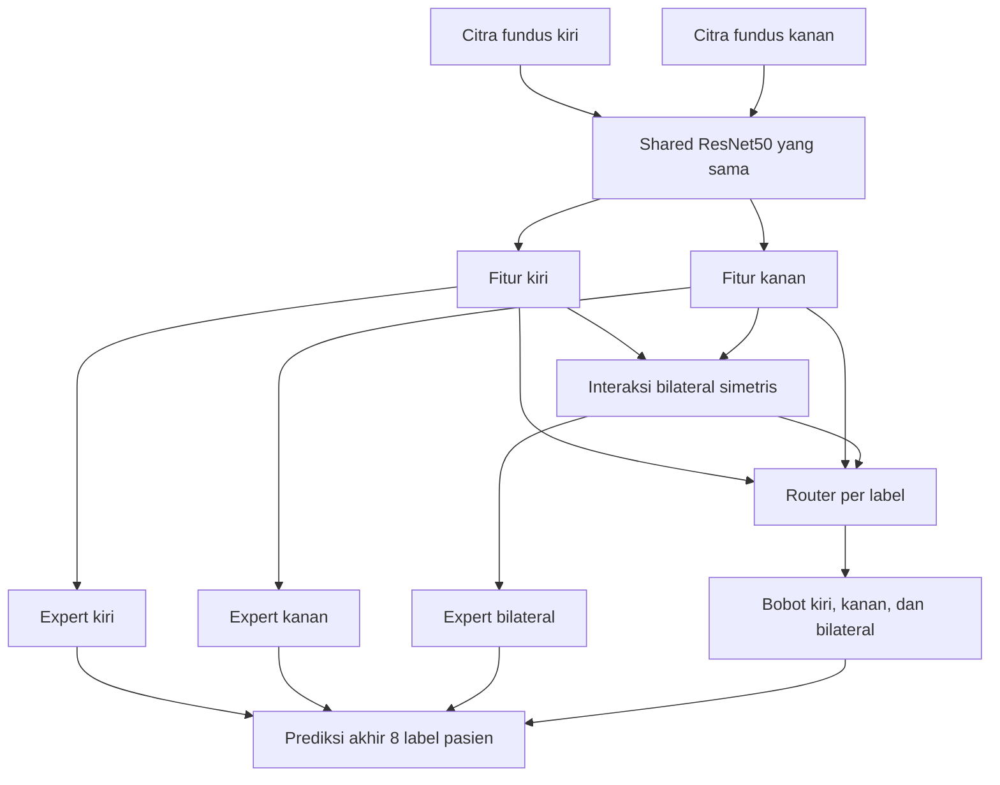

# Arah Penelitian LEBER pada ODIR-5K

## Ringkasan arah penelitian

Penelitian ini tidak lagi berhenti pada perbandingan fungsi *loss*. Eksperimen Binary Cross-Entropy (BCE), Weighted BCE, Focal Loss, Asymmetric Loss (ASL), dan PolyLoss ditempatkan sebagai studi pendahuluan. Hasilnya digunakan untuk memilih konfigurasi optimasi yang akan dipakai dalam pengembangan metode utama.

Metode utama yang diusulkan adalah **Label-wise Exchange-Equivariant Bilateral Evidence Routing (LEBER)**. Metode ini dirancang untuk mengolah pasangan citra fundus mata kiri dan kanan, memisahkan sumber bukti dari masing-masing mata dan hubungan bilateral, kemudian menghasilkan diagnosis multi-label pada tingkat pasien.

> Inti penelitian: mengembangkan model yang dapat menentukan, untuk setiap label penyakit, seberapa besar bukti berasal dari mata kiri, mata kanan, dan hubungan kedua mata, sekaligus menjaga agar prediksi pasien konsisten ketika urutan kedua mata ditukar.

## Alur besar penelitian

```mermaid
flowchart LR
    A[ODIR-5K: citra kiri dan kanan] --> B[Studi awal fungsi loss]
    B --> C[BCE, Weighted BCE, Focal, ASL, PolyLoss]
    C --> D[Pilih konfigurasi loss utama]
    D --> E[Kembangkan LEBER]
    E --> F[Ablasi A0-A6]
    F --> G[Pengujian beberapa seed]
    G --> H[Evaluasi performa dan konsistensi swap]
    H --> I[Analisis Layer-CAM]
    I --> J[Kesimpulan]
```



## Posisi eksperimen fungsi loss

Studi pendahuluan pada resolusi 224 x 224 telah selesai untuk seed 42, 52, dan 62. Ringkasan Test Macro-F1 tiga seed adalah sebagai berikut.

| Fungsi loss | Rata-rata Test Macro-F1 ± SD |
|---|---:|
| BCE | 0,5877 ± 0,0071 |
| Weighted BCE | 0,5791 ± 0,0094 |
| Focal Loss | 0,5802 ± 0,0193 |
| ASL | **0,5909 ± 0,0115** |
| PolyLoss | 0,5868 ± 0,0111 |

ASL memperoleh rata-rata tertinggi, tetapi selisihnya terhadap BCE dan PolyLoss kurang dari 0,005. Karena protokol utama beralih ke 512 x 512, BCE, ASL, dan PolyLoss dikonfirmasi kembali pada baseline bilateral. BCE 512 seed 42 telah selesai dengan Test Macro-F1 0,6122; ASL 512 seed 42 sedang berjalan; PolyLoss 512 seed 42 belum dijalankan.

## Masalah pada struktur data ODIR-5K

Setiap pasien mempunyai dua masukan:

1. citra fundus mata kiri;
2. citra fundus mata kanan.

Citra fundus adalah foto bagian belakang mata yang memperlihatkan retina, pembuluh darah, makula, dan cakram optik. Model menerima kedua citra tersebut dan menghasilkan satu kumpulan diagnosis pada tingkat pasien. Keluaran model bukan diagnosis final yang terpisah untuk setiap mata.

Delapan label ODIR-5K adalah:

| Kode | Diagnosis |
|---|---|
| N | Normal |
| D | Diabetes |
| G | Glaukoma |
| C | Katarak |
| A | *Age-related macular degeneration* |
| H | Hipertensi |
| M | Myopia patologis |
| O | Penyakit atau kelainan lain |

Satu pasien dapat mempunyai lebih dari satu label. Kondisi ini disebut klasifikasi multi-label.

```text
Citra mata kiri  ─┐
                  ├──> model ───> delapan probabilitas diagnosis pasien
Citra mata kanan ─┘
```

Pendekatan penggabungan biasa dapat menghasilkan prediksi, tetapi belum menjelaskan apakah keputusan berasal dari mata kiri, mata kanan, atau hubungan keduanya. Pendekatan tersebut juga belum menjamin bahwa prediksi tetap konsisten apabila urutan kedua mata ditukar.

## Cara kerja LEBER

LEBER dapat dipahami sebagai sistem yang meminta tiga sumber informasi untuk memberikan pendapat sebelum menetapkan diagnosis pasien. Sumber pertama hanya melihat mata kiri, sumber kedua hanya melihat mata kanan, dan sumber ketiga membandingkan kedua mata. Setelah itu, sebuah router menentukan sumber mana yang lebih penting untuk setiap label penyakit.

```text
Sepasang citra pasien
        |
        +-- citra mata kiri
        +-- citra mata kanan
                |
                v
       ResNet50 mengekstrak fitur
                |
                +-- bukti mata kiri
                +-- bukti mata kanan
                +-- bukti hubungan kedua mata
                              |
                              v
                 Router memberi bobot per label
                              |
                              v
              Delapan probabilitas diagnosis pasien
```

Untuk satu pasien, model menerima dua citra, misalnya `1_left.jpg` dan `1_right.jpg`. Pada protokol utama terbaru, kedua citra diubah menjadi tensor berukuran $3\times512\times512$. Angka 3 menunjukkan kanal warna merah, hijau, dan biru.

ResNet50 tidak langsung menentukan penyakit dari piksel mentah. Backbone ini mengubah setiap citra menjadi fitur, yaitu sekumpulan angka yang merangkum pola visual penting. Fitur dapat mewakili bentuk cakram optik, susunan pembuluh darah, warna retina, dan pola lain yang dipelajari saat training. Fitur belum merupakan diagnosis.

Cabang kiri dan kanan juga tidak menghasilkan diagnosis final per mata. Keduanya hanya menyediakan bukti antara. LEBER menggabungkan semua bukti menjadi satu prediksi pada tingkat pasien karena ODIR-5K juga memberikan label pada tingkat pasien.



### 1. Ekstraksi fitur dengan shared ResNet50

Kedua citra diproses oleh ResNet50 dengan bobot yang sama:

$$
f_L=E(x_L), \qquad f_R=E(x_R)
$$

Keterangan:

- $x_L$ dan $x_R$ adalah citra mata kiri dan kanan;
- $E$ adalah ResNet50 sebagai pengekstrak fitur;
- $f_L$ dan $f_R$ adalah ringkasan informasi visual kedua mata.

Penggunaan bobot yang sama membuat kedua mata dianalisis dengan aturan visual yang konsisten.

Istilah *shared* berarti satu ResNet50 yang sama dipakai untuk kedua mata. Model tidak membuat dua backbone dengan aturan pengenal pola yang berbeda.

```text
1_left.jpg  --> ResNet50 yang sama --> fitur kiri  (f_L)
1_right.jpg --> ResNet50 yang sama --> fitur kanan (f_R)
```

Karena parameternya sama, fitur kiri dan kanan dapat dibandingkan secara adil. Pada tahap ini model baru mempunyai dua ringkasan visual dan belum membuat keputusan akhir.

### 2. Pembentukan bukti bilateral

Hubungan antara kedua mata dibentuk dengan:

$$
f_B=[f_L+f_R,\ |f_L-f_R|,\ f_L\odot f_R]
$$

Makna setiap bagian:

- $f_L+f_R$: informasi keseluruhan dari kedua mata;
- $|f_L-f_R|$: perbedaan kondisi mata kiri dan kanan;
- $f_L\odot f_R$: pola yang kuat pada keduanya.

Operasi tersebut bersifat simetris sehingga hasil interaksi bilateral tidak berubah ketika posisi mata ditukar.

Kata **bilateral** berarti menggunakan informasi dari kedua mata. Ketiga operasi mempunyai fungsi yang berbeda:

1. $f_L+f_R$ merangkum informasi keseluruhan dari kedua mata.
2. $|f_L-f_R|$ menunjukkan besar perbedaan kondisi antarmata. Nilai mutlak membuat hasilnya tidak bergantung pada urutan mata.
3. $f_L\odot f_R$ menonjolkan pola yang sama-sama kuat pada kedua mata.

Sebagai ilustrasi sederhana, misalkan satu unsur fitur kiri bernilai 2 dan fitur kanan bernilai 5. Jumlahnya adalah 7, perbedaannya 3, dan hasil perkaliannya 10. Jika urutannya ditukar menjadi 5 dan 2, ketiga hasil itu tetap sama. Karena itu, bukti bilateral tidak berubah hanya akibat pertukaran posisi input.

### 3. Tiga sumber bukti

LEBER mempunyai tiga cabang atau *expert*:

- *expert* kiri memproses bukti dari mata kiri;
- *expert* kanan memproses bukti dari mata kanan;
- *expert* bilateral memproses hubungan kedua mata.

Istilah *expert* mengacu pada cabang jaringan, bukan dokter atau model klinis terpisah. Setiap expert menghasilkan logit untuk delapan label. Logit adalah nilai mentah sebelum diubah menjadi probabilitas.

| Expert | Informasi yang digunakan | Pertanyaan yang dijawab |
|---|---|---|
| Expert kiri | Fitur mata kiri | Seberapa kuat bukti penyakit pada mata kiri? |
| Expert kanan | Fitur mata kanan | Seberapa kuat bukti penyakit pada mata kanan? |
| Expert bilateral | Hubungan kedua fitur | Apa yang dapat disimpulkan dari hubungan kedua mata? |

Masing-masing expert menghasilkan delapan logit untuk N, D, G, C, A, H, M, dan O. Fungsi sigmoid mengubah logit menjadi nilai antara 0 dan 1. Karena tugasnya multi-label, setiap probabilitas dihitung secara mandiri. Model dapat memprediksi lebih dari satu penyakit pada pasien yang sama.

### 4. Router per label

Untuk label ke-$c$, router menghasilkan tiga bobot:

$$
w_{L,c}+w_{R,c}+w_{B,c}=1
$$

Prediksi gabungannya dihitung dengan:

$$
z_c=w_{L,c}z_{L,c}+w_{R,c}z_{R,c}+w_{B,c}z_{B,c}
$$

Dengan demikian, setiap penyakit dapat menggunakan pembagian bukti yang berbeda. Sebagai contoh ilustratif, glaukoma dapat lebih banyak menggunakan bukti bilateral, sedangkan katarak yang dominan pada salah satu mata dapat lebih banyak menggunakan bukti mata tersebut. Angka bobot yang sebenarnya harus diperoleh dari hasil eksperimen dan tidak ditentukan secara manual.

Router bertindak sebagai pengatur porsi pendapat. Router tidak menentukan diagnosis secara langsung. Router menentukan kontribusi expert kiri, kanan, dan bilateral untuk setiap label.

Contoh berikut hanya menjelaskan perhitungan dan **bukan hasil eksperimen**. Untuk glaukoma, misalkan expert kiri menghasilkan logit 0,40 dengan bobot 0,20; expert kanan menghasilkan 0,60 dengan bobot 0,20; dan expert bilateral menghasilkan 1,20 dengan bobot 0,60. Logit gabungannya adalah:

$$
z_G=(0{,}20\times0{,}40)+(0{,}20\times0{,}60)+(0{,}60\times1{,}20)=0{,}92
$$

Sigmoid mengubah logit 0,92 menjadi probabilitas sekitar 0,715. Jika ambang yang ditetapkan melalui validation set adalah 0,50, model memprediksi glaukoma sebagai positif. Perhitungan yang sama dilakukan untuk kedelapan label. Karena router bersifat *label-wise*, bobot untuk glaukoma tidak harus sama dengan bobot untuk katarak, diabetes, atau label lain.

### 5. Pembentukan prediksi akhir pasien

Setelah seluruh logit digabungkan, sigmoid menghasilkan delapan probabilitas:

```text
[P(N), P(D), P(G), P(C), P(A), P(H), P(M), P(O)]
```

Sebagai ilustrasi, keluaran `[0.08, 0.82, 0.71, 0.10, 0.06, 0.12, 0.09, 0.18]` menghasilkan label D dan G jika ambangnya 0,50. Tanda titik dipakai sebagai pemisah desimal dalam representasi vektor agar tidak tertukar dengan koma pemisah antarlabel. Keluaran tersebut adalah satu vektor diagnosis pasien, bukan dua diagnosis terpisah untuk mata kiri dan kanan.

### 6. Cara model belajar

Saat training, model membandingkan prediksi dengan label pasien yang sebenarnya. Fungsi loss menghitung besar kesalahan. Melalui *backpropagation*, model memakai nilai kesalahan itu untuk memperbarui ResNet50, ketiga expert, dan router.

```text
Citra kiri dan kanan
        |
Prediksi expert dan bobot router
        |
Prediksi akhir pasien
        |
Dibandingkan dengan label sebenarnya
        |
Loss menghitung kesalahan
        |
Seluruh parameter model diperbarui
```

ASL, BCE, dan PolyLoss menjadi kandidat pada protokol 512. Satu loss baru dikunci setelah perbandingan validation dan konfirmasi seed. Loss mengatur penalti kesalahan, sedangkan LEBER mengatur pembentukan dan penggabungan bukti kiri, kanan, serta bilateral.

### 7. Ringkasan aliran satu pasien

1. Model menerima citra fundus kiri dan kanan.
2. ResNet50 yang sama mengubah kedua citra menjadi fitur.
3. Model membentuk fitur bilateral yang simetris dari fitur kiri dan kanan.
4. Tiga expert menghasilkan delapan pendapat awal.
5. Router memberi tiga bobot untuk setiap label.
6. Model menggabungkan pendapat ketiga expert berdasarkan bobot tersebut.
7. Sigmoid mengubah hasil gabungan menjadi delapan probabilitas diagnosis pasien.
8. Saat training, seluruh komponen dipelajari bersama berdasarkan nilai loss.
9. Saat evaluasi, posisi kedua mata ditukar untuk memeriksa konsistensi prediksi.

## Konsistensi pertukaran mata

Diagnosis pasien seharusnya tidak berubah hanya karena urutan input ditukar:

```text
[mata kiri, mata kanan] → prediksi pasien
[mata kanan, mata kiri] → prediksi pasien yang sama
```

Ketika citra ditukar, bobot expert kiri dan kanan seharusnya ikut bertukar, bobot bilateral tetap, dan prediksi akhir pasien tetap sama. Selisih prediksi diukur dengan:

$$
\Delta p=\operatorname{mean}\left|p(x_L,x_R)-p(x_R,x_L)\right|
$$

Nilai $\Delta p$ yang semakin kecil menunjukkan model semakin konsisten terhadap pertukaran mata. Sifat ini tidak hanya mengandalkan augmentasi, tetapi ditanamkan dalam struktur model.

## Rencana ablation study

| Kode | Konfigurasi | Tujuan pengujian |
|---|---|---|
| A0 | Shared ResNet50 dan penggabungan biasa | Menetapkan baseline arsitektur |
| A1 | Menambahkan fitur interaksi simetris | Menguji manfaat hubungan kedua mata |
| A2 | Tiga expert dengan bobot tetap | Mengontrol kemungkinan peningkatan karena kapasitas tambahan |
| A3 | Tiga expert dengan router global | Menguji manfaat bobot yang dipelajari |
| A4 | Router per label | Menguji kebutuhan penggabungan yang berbeda untuk setiap penyakit |
| A5 | A4 dan pengawasan kualitas expert | Memastikan setiap expert mempelajari sumber buktinya |
| A6 | LEBER lengkap dengan exchange equivariance | Menguji kontribusi konsistensi pertukaran mata |

Ablation study diperlukan agar peningkatan tidak hanya dilaporkan sebagai hasil metode lengkap. Pengujian ini menunjukkan komponen mana yang benar-benar memberikan kontribusi.

## Evaluasi

Metrik utama adalah Macro-F1 karena semua label diberi kepentingan yang sama, termasuk label yang jarang muncul. Evaluasi pendukung meliputi:

- Micro-F1;
- precision, recall, dan F1 setiap label;
- AUROC dan mAP;
- Hamming loss;
- selisih probabilitas setelah pertukaran mata ($\Delta p$);
- konsistensi bobot router setelah pertukaran mata ($\Delta w$);
- jumlah parameter serta waktu pelatihan dan inferensi.

A0 dan A6 minimal diuji menggunakan seed 42, 52, dan 62. Hasil dilaporkan sebagai rata-rata dan simpangan baku. Data test digunakan setelah konfigurasi dikunci berdasarkan validation set.

## Peran Layer-CAM

Layer-CAM digunakan untuk melihat area citra yang berpengaruh terhadap prediksi pada cabang kiri, kanan, dan bilateral. Metode ini berfungsi sebagai analisis interpretabilitas, bukan komponen utama peningkatan prediksi.

Peta Layer-CAM tidak boleh diklaim sebagai lokasi lesi klinis yang pasti karena ODIR-5K tidak menyediakan anotasi lesi yang diperlukan untuk memvalidasi klaim tersebut.

## Status penelitian

| Tahap | Status |
|---|---|
| Persiapan dataset dan pemisahan tingkat pasien | Selesai |
| Eksperimen lima fungsi loss 224 dengan tiga seed | Selesai |
| Konfirmasi BCE/ASL/PolyLoss pada 512 | Berjalan; BCE seed 42 selesai |
| Loss utama LEBER | Belum dikunci |
| Implementasi LEBER | Setelah konfirmasi loss 512 |
| Ablasi A0-A6 | Belum dilakukan |
| Pengujian beberapa seed | Belum dilakukan |
| Pengujian final dan analisis Layer-CAM | Belum dilakukan |

## Rumusan arah akhir

Penelitian diarahkan untuk mengembangkan model klasifikasi multi-label tingkat pasien yang memisahkan bukti mata kiri, mata kanan, dan hubungan bilateral untuk setiap penyakit, serta menjaga konsistensi prediksi ketika urutan kedua mata ditukar. Eksperimen fungsi loss menjadi dasar pemilihan optimasi, sedangkan kontribusi utama penelitian terletak pada rancangan LEBER dan pembuktian manfaat setiap komponennya.

Judul sementara yang sesuai dengan arah ini adalah:

**Label-wise Exchange-Equivariant Bilateral Evidence Routing untuk Klasifikasi Multi-Label Penyakit Mata pada ODIR-5K**
