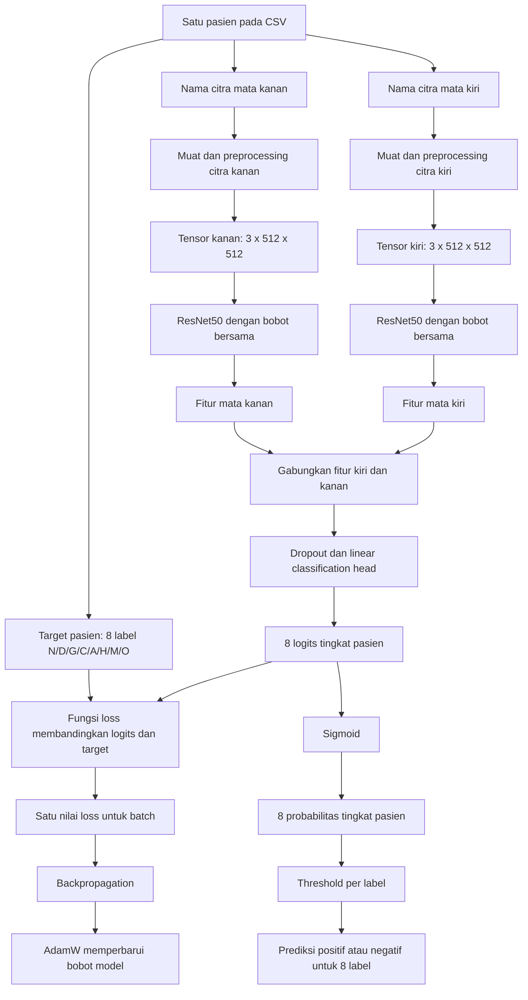
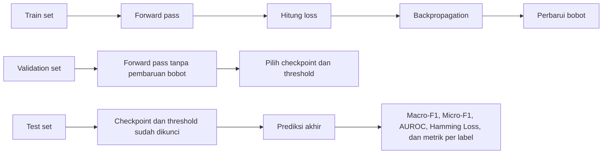

# Pipeline Model dan Cara Kerja Fungsi Loss

## Cara kerja fungsi loss dalam penelitian

Model menerima citra fundus mata kiri dan kanan dari satu pasien. Shared ResNet50 mengekstrak fitur kedua citra, lalu model menggabungkan fitur tersebut dan menghasilkan delapan nilai mentah yang disebut logits. Setiap logit mewakili label N, D, G, C, A, H, M, atau O. Fungsi sigmoid mengubah logits menjadi probabilitas antara 0 dan 1.

### Ilustrasi alur model dan fungsi loss

Diagram tersebut memiliki dua jalur setelah logits. Pada jalur training, logits dan target masuk ke fungsi loss untuk memperbarui bobot. Pada jalur prediksi, sigmoid mengubah logits menjadi probabilitas, kemudian threshold mengubah probabilitas menjadi keputusan positif atau negatif. Delapan keluaran tetap menunjukkan kondisi pasien dan tidak menentukan mata mana yang mengalami kondisi tersebut.

### Perbedaan proses train, validation, dan test

Train set mengajarkan model melalui pembaruan bobot. Validation set membantu memilih konfigurasi tanpa memperbarui bobot. Test set hanya mengukur performa akhir setelah checkpoint dan threshold dikunci.
Saat training, fungsi loss membandingkan delapan prediksi dengan delapan label sebenarnya. Kesalahan seluruh label dan pasien dalam satu batch diringkas menjadi satu nilai loss. Backpropagation menghitung arah perubahan bobot berdasarkan nilai tersebut, kemudian AdamW memperbarui bobot model. Karena setiap fungsi loss memberi tekanan yang berbeda terhadap jenis kesalahan, model yang memakai data dan arsitektur sama dapat menghasilkan precision, recall, serta F1 yang berbeda.

Secara konsep, BCE menghitung kesalahan positif sebagai `-log(p)` dan kesalahan negatif sebagai `-log(1-p)`, dengan `p` sebagai probabilitas prediksi. Contohnya, jika label sebenarnya positif tetapi model memberi probabilitas 0,10, loss menjadi besar. Jika probabilitasnya 0,90, loss menjadi kecil. Implementasi menggunakan logits secara langsung agar perhitungannya lebih stabil secara numerik.

| Fungsi loss | Cara memberikan tekanan | Tujuan | Risiko utama |
|---|---|---|---|
| BCE | Semua label memakai aturan dasar yang sama | Menjadi baseline sederhana | Label langka dapat kurang diperhatikan |
| Weighted BCE | Kesalahan positif diberi `pos_weight` berdasarkan rasio negatif terhadap positif pada train set | Meningkatkan perhatian pada kelas minoritas | False positive dapat meningkat |
| Focal Loss | Mengurangi pengaruh contoh yang sudah mudah diprediksi melalui faktor fokus | Memusatkan pembelajaran pada contoh sulit | Prediksi positif dapat menjadi terlalu agresif |
| ASL | Memberi tingkat fokus berbeda pada positif dan negatif serta mengurangi pengaruh negatif yang mudah | Mengatasi positive-negative imbalance pada multi-label | Hasil dipengaruhi pengaturan gamma dan clipping |
| PolyLoss | Menambahkan koreksi polinomial pada loss dasar berdasarkan keyakinan prediksi | Mengubah tekanan pada prediksi yang masih salah atau ragu | Tidak secara khusus memberi bobot berdasarkan kelangkaan label |

Weighted BCE dalam eksperimen ini menghitung `pos_weight` hanya dari train set. Label H memperoleh bobot terbesar karena memiliki 72 contoh positif dan 2.378 contoh negatif. Kesalahan ketika melewatkan H mendapat tekanan besar, tetapi tekanan tersebut juga dapat membuat model terlalu sering memprediksi H sebagai positif.

Focal Loss menggunakan `alpha=0,25` dan `gamma=2`. Faktor fokus menjadi sangat kecil untuk prediksi yang sudah mudah dan tetap besar untuk prediksi yang sulit. ASL menggunakan `gamma_neg=4`, `gamma_pos=1`, dan `clip=0,05`, sehingga negatif yang mudah dikurangi pengaruhnya lebih kuat daripada positif. PolyLoss menggunakan `epsilon=1` untuk menambahkan koreksi yang lebih besar ketika probabilitas terhadap jawaban benar masih rendah.

Fungsi loss memperbarui model hanya pada train set. Pada validation set, loss dan metrik dapat dihitung, tetapi bobot tidak diperbarui. Validation set digunakan untuk memilih checkpoint serta threshold setiap label. Test set dipakai setelah konfigurasi dikunci untuk mengukur performa akhir, bukan untuk memperbaiki model.

## Posisi pipeline dalam arah penelitian terkini

Pipeline lima fungsi loss 224 merupakan studi pendahuluan dengan arsitektur concatenation yang sama dan telah dijalankan pada tiga seed. Sebelum A0-A6, BCE, ASL, dan PolyLoss dikonfirmasi pada baseline bilateral 512. Pipeline LEBER kemudian mempertahankan protokol 512 yang sudah dikunci dan mengganti bagian penggabungan fitur secara bertahap. Rincian eksperimen utama terdapat pada [Rencana eksperimen LEBER](06_rencana_eksperimen_leber.md).
