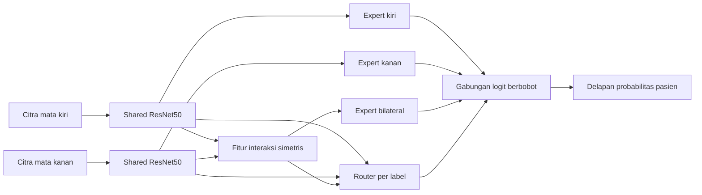

# Rencana Eksperimen LEBER

## Tujuan

Eksperimen ini menguji Label-wise Exchange-Equivariant Bilateral Evidence Routing atau LEBER sebagai metode utama klasifikasi multi-label tingkat pasien pada ODIR-5K. Studi lima loss 224 pada tiga seed menyaring BCE, ASL, dan PolyLoss. Ketiganya dikonfirmasi pada baseline bilateral 512 sebelum loss utama dikunci.

## Input dan keluaran

Satu sampel berisi citra mata kiri, citra mata kanan, dan vektor delapan label tingkat pasien. Shared ResNet50 mengubah setiap citra menjadi fitur. Model menghasilkan delapan probabilitas diagnosis pasien dan tidak menghasilkan diagnosis eye-level.

## Arsitektur

$$
f_L=E(x_L), \qquad f_R=E(x_R)
$$

Representasi interaksi menggunakan operasi simetris:

$$
f_B=[f_L+f_R,\ |f_L-f_R|,\ f_L\odot f_R]
$$

Tiga expert menghasilkan logit kiri, kanan, dan bilateral untuk setiap label. Router menghasilkan tiga bobot yang jumlahnya satu:

$$
w_{L,c}+w_{R,c}+w_{B,c}=1
$$

Logit pasien dihitung dengan:

$$
z_c=w_{L,c}z_{L,c}+w_{R,c}z_{R,c}+w_{B,c}z_{B,c}
$$

Router dibangun menggunakan shared eye scorer dan konteks simetris. Ketika kedua mata ditukar, bobot kiri dan kanan harus ikut bertukar, sedangkan bobot interaksi dan probabilitas pasien tetap sama.

## Alur data

## Ablation study

| ID | Konfigurasi | Pertanyaan yang diuji |
|---|---|---|
| A0 | Shared ResNet50, concatenation, loss 512 terpilih | Baseline arsitektur |
| A1 | Shared ResNet50 dan symmetric interaction features | Apakah representasi simetris membantu? |
| A2 | Tiga expert dengan bobot rata-rata | Apakah penambahan sumber bukti saja membantu? |
| A3 | Tiga expert dengan global gate | Apakah adaptive gating global membantu? |
| A4 | Tiga expert dengan label-wise router | Apakah routing per label lebih baik daripada global gate? |
| A5 | A4 dengan supervisi kualitas expert | Apakah sinyal kualitas memperbaiki router? |
| A6 | A5 dengan exchange-equivariant construction | Apakah metode lengkap meningkatkan performa dan konsistensi? |

A2 diperlukan sebagai kontrol kapasitas. Tanpa A2, peningkatan model penuh dapat disebabkan oleh jumlah parameter atau cabang tambahan.

## Pengujian pertukaran input

Setiap pasangan test dihitung dalam urutan asli dan urutan terbalik.

$$
\Delta_p=\operatorname{mean}|p(x_L,x_R)-p(x_R,x_L)|
$$

$$
\Delta_w=\operatorname{mean}|w_L(x_L,x_R)-w_R(x_R,x_L)|
$$

Nilai yang lebih kecil menunjukkan konsistensi lebih baik. Pada konstruksi invariant yang deterministik, selisih ideal mendekati error numerik.

## Protokol yang dipertahankan

- Patient-level split 70/15/15 yang sama dengan studi pendahuluan.
- Input 512 x 512, normalisasi ImageNet, color jitter ringan pada train, dan tanpa augmentasi geometris independen untuk pasangan mata.
- Optimizer, scheduler, batch size 16, dan prosedur threshold dipertahankan kecuali ada alasan teknis yang didokumentasikan.
- Test set tidak digunakan untuk memilih arsitektur, hyperparameter, atau threshold.
- Baseline utama dan metode lengkap dijalankan minimal pada seed 42, 52, dan 62.
- Hasil dilaporkan sebagai rata-rata dan standar deviasi.

## Metrik

Macro-F1 delapan label menjadi metrik utama. Metrik pendukung meliputi Micro-F1, AUROC, mAP, Hamming Loss, precision, recall, F1 per label, jumlah parameter, durasi training, dan waktu inference. Nilai konsistensi pertukaran dilaporkan bersama performa klasifikasi.

## Interpretabilitas

Bobot router diringkas per label untuk menunjukkan kecenderungan penggunaan expert kiri, kanan, atau bilateral. Layer-CAM dibuat untuk setiap cabang pada prediksi benar dan salah yang dipilih dengan aturan tetap. Heatmap digunakan sebagai interpretasi kualitatif dan tidak dianggap sebagai validasi klinis lokasi lesi.

## Kriteria keberhasilan

Metode dinilai berhasil apabila A6 meningkatkan Macro-F1 secara konsisten terhadap A0 pada beberapa seed, memiliki nilai perubahan prediksi akibat swap yang lebih kecil, dan ablation study menunjukkan bahwa peningkatan tidak hanya berasal dari penambahan parameter. Jika performa tidak meningkat, hasil tetap dilaporkan dan metode tidak dinyatakan lebih baik.

## Urutan pekerjaan

1. Konfirmasi BCE, ASL, dan PolyLoss pada baseline bilateral 512 seed 42.
2. Pilih dua kandidat dari validation, lalu konfirmasi seed 52 dan 62.
3. Kunci satu loss untuk seluruh ablation arsitektur.
4. Implementasi dan unit test symmetric feature construction.
5. Implementasi A0 sampai A4 serta verifikasi gradient flow dan patient split.
6. Implementasi supervisi kualitas dan konstruksi exchange-equivariant A5-A6.
7. Ablation study dan pengulangan seed untuk konfigurasi utama.
8. Evaluasi test setelah keputusan arsitektur dikunci.
9. Analisis bobot router dan Layer-CAM.
