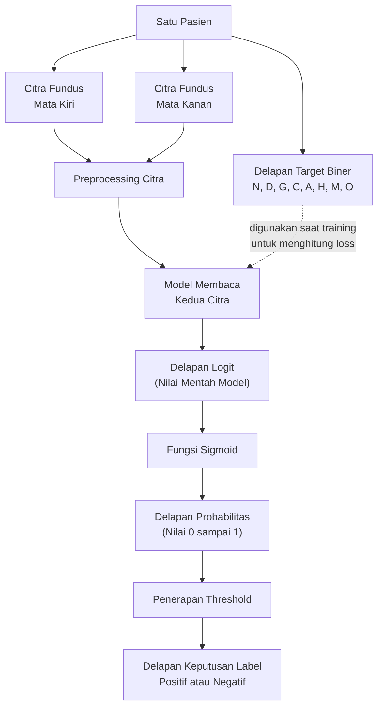
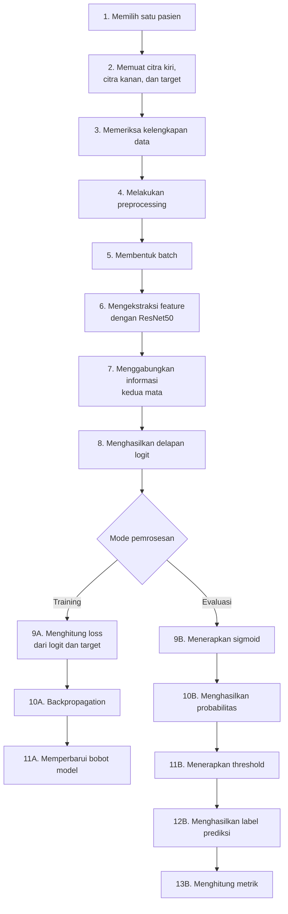
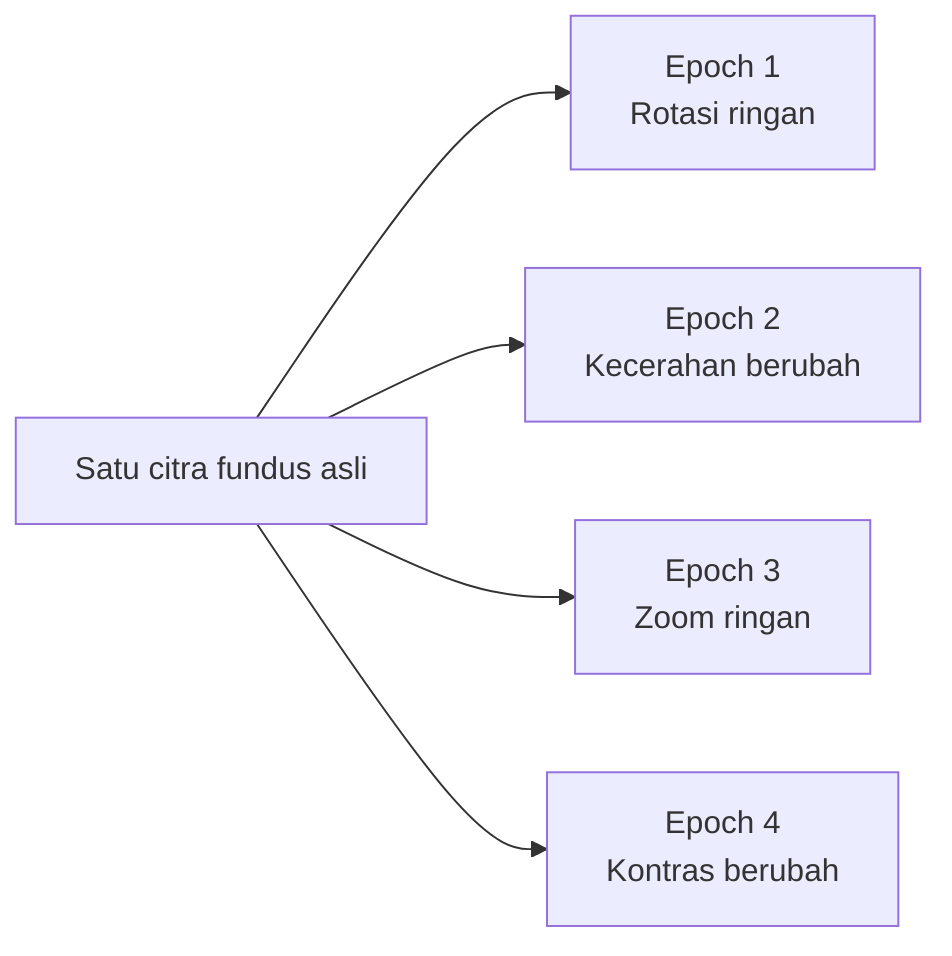
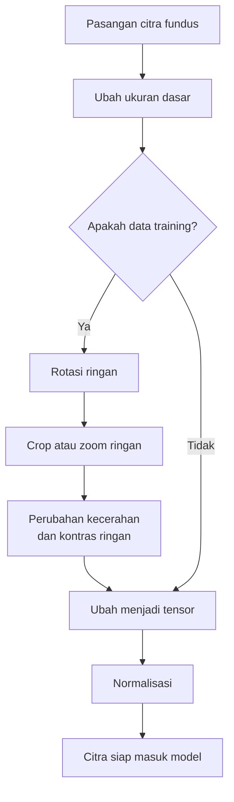
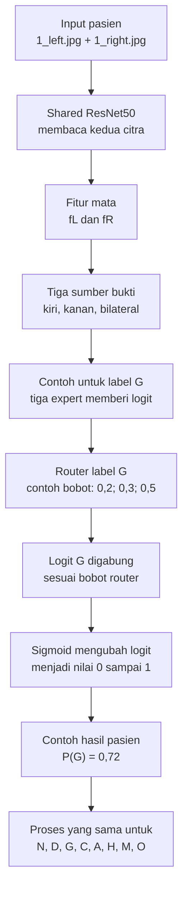

# Daftar Isi Catatan Pribadi

Klik judul untuk menuju bagian yang ingin dibaca. Tautan ini memakai format heading internal Obsidian. Dalam mode Edit, gunakan `Ctrl+klik`; dalam mode Reading, cukup klik.

- [[#1. Dasar dan Konteks Penelitian|1. Dasar dan Konteks Penelitian]]
  - [[#A. Topik penelitian|A. Topik penelitian]]
  - [[#B. Apa itu Citra Fundus?|B. Apa itu Citra Fundus?]]
  - [[#C. Apa itu klasifikasi?|C. Apa itu klasifikasi?]]
  - [[#D. Apa itu klasifikasi multi-label?|D. Apa itu klasifikasi multi-label?]]
- [[#2. Dataset, Target, dan Masalah Data|2. Dataset, Target, dan Masalah Data]]
  - [[#A. Apa itu ODIR-5K?|A. Apa itu ODIR-5K?]]
  - [[#B. Apa arti delapan label?|B. Apa arti delapan label?]]
  - [[#C. Apa yang dimaksud tingkat pasien?|C. Apa yang dimaksud tingkat pasien?]]
  - [[#D. Distribusi label pada data training|D. Distribusi label pada data training]]
  - [[#E. Pembagian data dan data leakage|E. Pembagian data dan data leakage]]
  - [[#F. Weak supervision pada tingkat pasien|F. Weak supervision pada tingkat pasien]]
  - [[#G. Masalah pertukaran urutan mata|G. Masalah pertukaran urutan mata]]
  - [[#H. Ringkasan masalah data dan respons penelitian|H. Ringkasan masalah data dan respons penelitian]]
- [[#3. Alur Model Baseline dan Proses Training|3. Alur Model Baseline dan Proses Training]]
  - [[#A. Alur data penelitian|A. Alur data penelitian]]
  - [[#B. Mengapa memakai kedua mata?|B. Mengapa memakai kedua mata?]]
  - [[#C. Apa yang sebenarnya dipelajari model?|C. Apa yang sebenarnya dipelajari model?]]
  - [[#D. Batasan pernyataan ilmiah|D. Batasan pernyataan ilmiah]]
- [[#4. Fungsi Loss dan Ketimpangan Label|4. Fungsi Loss dan Ketimpangan Label]]
  - [[#A. Apa itu fungsi loss?|A. Apa itu fungsi loss?]]
  - [[#B. Binary Cross-Entropy (BCE)|B. Binary Cross-Entropy (BCE)]]
  - [[#C. Weighted BCE|C. Weighted BCE]]
  - [[#D. Focal Loss|D. Focal Loss]]
  - [[#E. Asymmetric Loss (ASL)|E. Asymmetric Loss (ASL)]]
  - [[#F. PolyLoss|F. PolyLoss]]
  - [[#G. Perbandingan hasil lima fungsi loss|G. Perbandingan hasil lima fungsi loss]]
  - [[#H. Kesimpulan dan posisi loss untuk LEBER|H. Kesimpulan dan posisi loss untuk LEBER]]
- [[#5. Penelitian Terdahulu, Research Gap, dan Kebaruan|5. Penelitian Terdahulu, Research Gap, dan Kebaruan]]
  - [[#A. Mengapa penelitian terdahulu perlu dibahas?|A. Mengapa penelitian terdahulu perlu dibahas?]]
  - [[#B. Apa yang sudah dilakukan penelitian terdahulu?|B. Apa yang sudah dilakukan penelitian terdahulu?]]
  - [[#C. Masalah yang masih layak diuji|C. Masalah yang masih layak diuji]]
  - [[#D. Rumusan research gap yang hati-hati|D. Rumusan research gap yang hati-hati]]
  - [[#E. Perbedaan LEBER dan pembanding terdekat|E. Perbedaan LEBER dan pembanding terdekat]]
    - [[#Contoh sederhana: tiga pengamat dan satu pengatur porsi|Contoh sederhana: tiga pengamat dan satu pengatur porsi]]
  - [[#F. Cara membuktikan kontribusi dan batas klaim|F. Cara membuktikan kontribusi dan batas klaim]]
- [[#6. Cara Kerja Arsitektur LEBER|6. Cara Kerja Arsitektur LEBER]]
  - [[#A. Apa tujuan LEBER?|A. Apa tujuan LEBER?]]
  - [[#B. Gambaran alur satu pasien|B. Gambaran alur satu pasien]]
  - [[#C. Tahap 1: ResNet50 membaca kedua citra|C. Tahap 1: ResNet50 membaca kedua citra]]
  - [[#D. Tahap 2: Membentuk informasi hubungan kedua mata|D. Tahap 2: Membentuk informasi hubungan kedua mata]]
  - [[#E. Tahap 3: Tigas expert menghasilkan pendapat awal|E. Tahap 3: Tigas expert menghasilkan pendapat awal]]
  - [[#F. Tahap 4: Router menentukan porsi per label|F. Tahap 4: Router menentukan porsi per label]]
  - [[#G. Tahap 5: Menghasilkan prediksi pasien|G. Tahap 5: Menghasilkan prediksi pasien]]
  - [[#H. Apa yang terjadi jika urutannya citra ditukar?|H. Apa yang terjadi jika urutannya citra ditukar?]]
  - [[#I. Bagaimana model belajar?|I. Bagaimana model belajar?]]
  - [[#J. Bagaimana membuktikan LEBER berguna?|J. Bagaimana membuktikan LEBER berguna?]]
- [[#7. Rancangan Pengujian LEBER|7. Rancangan Pengujian LEBER]]
  - [[#A. Apa yang menjadi pembanding?|A. Apa yang menjadi pembanding?]]
  - [[#B. Apa itu ablation study?|B. Apa itu ablation study?]]
  - [[#C. Apa yang harus dijaga tetap sama?|C. Apa yang harus dijaga tetap sama?]]
  - [[#D. Apa fungsi train, validation, dan test pada tahap ini?|D. Apa fungsi train, validation, dan test pada tahap ini?]]
  - [[#E. Bagaimana menguji pertukaran mata?|E. Bagaimana menguji pertukaran mata?]]
  - [[#F. Metrik apa yang dipakai?|F. Metrik apa yang dipakai?]]
  - [[#G. Mengapa perlu beberapa seed?|G. Mengapa perlu beberapa seed?]]
  - [[#H. Kapan LEBER boleh disebut berhasil?|H. Kapan LEBER boleh disebut berhasil?]]
- [[#8. Cara membaca hasil eksperimen|8. Cara membaca hasil eksperimen]]
  - [[#A. Tiga kelompok hasil yang perlu diperiksa|A. Tiga kelompok hasil yang perlu diperiksa]]
  - [[#B. Mengapa Macro-F1 menjadi metrik utama?|B. Mengapa Macro-F1 menjadi metrik utama?]]
  - [[#C. Memahami precision, recall, dan F1|C. Memahami precision, recall, dan F1]]
  - [[#D. Contoh membaca trade-off|D. Contoh membaca trade-off]]
  - [[#E. Mengapa hasil setiap label harus diperiksa?|E. Mengapa hasil setiap label harus diperiksa?]]
  - [[#F. Apa fungsi Micro-F1?|F. Apa fungsi Micro-F1?]]
  - [[#G. Apa arti AUROC dan Macro-AUROC?|G. Apa arti AUROC dan Macro-AUROC?]]
  - [[#H. Apa arti Hamming loss?|H. Apa arti Hamming loss?]]
  - [[#H1. Apa arti Subset Accuracy? (Prinsip Gembok 8 Digit / Exact Match)|H1. Apa arti Subset Accuracy? (Prinsip Gembok 8 Digit / Exact Match)]]
  - [[#I. Bagaimana membaca konsistensi prediksi melalui Delta p?|I. Bagaimana membaca konsistensi prediksi melalui Delta p?]]
  - [[#J. Bagaimana membaca konsistensi router melalui Delta w?|J. Bagaimana membaca konsistensi router melalui Delta w?]]
  - [[#K. Bagaimana membaca bobot router?|K. Bagaimana membaca bobot router?]]
  - [[#L. Bagaimana membaca hasil ablation study?|L. Bagaimana membaca hasil ablation study?]]
  - [[#M. Bagaimana membaca hasil beberapa seed?|M. Bagaimana membaca hasil beberapa seed?]]
  - [[#N. Apakah selisih kecil berarti penting?|N. Apakah selisih kecil berarti penting?]]
  - [[#O. Mengapa biaya komputasi perlu dilaporkan?|O. Mengapa biaya komputasi perlu dilaporkan?]]
  - [[#P. Empat kemungkinan kesimpulan hasil LEBER|P. Empat kemungkinan kesimpulan hasil LEBER]]
  - [[#Q. Kesalahan yang harus dihindari saat membaca hasil|Q. Kesalahan yang harus dihindari saat membaca hasil]]
  - [[#R. Contoh cara menulis kesimpulan hasil|R. Contoh cara menulis kesimpulan hasil]]
  - [[#S. Jawaban singkat untuk dosen|S. Jawaban singkat untuk dosen]]
  - [[#T. Hasil baseline bilateral BCE ResNet50 512 seed 42|T. Hasil baseline bilateral BCE ResNet50 512 seed 42]]
  - [[#U. Perbandingan Hasil Ablasi A0, A1, A2, dan A3|U. Perbandingan Hasil Ablasi A0, A1, A2, dan A3]]
- [[#9. Layer-CAM dan Interpretasi Model|9. Layer-CAM dan Interpretasi Model]]
  - [[#A. Mengapa interpretasi model diperlukan?|A. Mengapa interpretasi model diperlukan?]]
  - [[#B. Apa itu Layer-CAM?|B. Apa itu Layer-CAM?]]
  - [[#C. Bagaimana cara kerja Layer-CAM?|C. Bagaimana cara kerja Layer-CAM?]]
  - [[#D. Mengapa memilih Layer-CAM?|D. Mengapa memilih Layer-CAM?]]
  - [[#E. Apa hubungan Layer-CAM dengan LEBER?|E. Apa hubungan Layer-CAM dengan LEBER?]]
  - [[#F. Apa keluaran analisis Layer-CAM?|F. Apa keluaran analisis Layer-CAM?]]
  - [[#G. Sampel apa yang perlu dianalisis?|G. Sampel apa yang perlu dianalisis?]]
  - [[#H. Bagaimana membaca heatmap?|H. Bagaimana membaca heatmap?]]
  - [[#I. Bagaimana membandingkan citra kiri dan kanan?|I. Bagaimana membandingkan citra kiri dan kanan?]]
  - [[#J. Bagaimana menguji Layer-CAM setelah pertukaran mata?|J. Bagaimana menguji Layer-CAM setelah pertukaran mata?]]
  - [[#K. Apa yang boleh dan tidak boleh disimpulkan?|K. Apa yang boleh dan tidak boleh disimpulkan?]]
  - [[#L. Keterbatasan Layer-CAM pada penelitian ini|L. Keterbatasan Layer-CAM pada penelitian ini]]
  - [[#M. Jawaban singkat untuk dosen tentang Layer-CAM|M. Jawaban singkat untuk dosen tentang Layer-CAM]]
- [[#10. Rangkuman Arah Penelitian dan Persiapan Menjelaskan kepada Dosen|10. Rangkuman Arah Penelitian dan Persiapan Menjelaskan kepada Dosen]]
  - [[#A. Penelitian ini sebenarnya membahas apa?|A. Penelitian ini sebenarnya membahas apa?]]
  - [[#B. Masalah apa yang ingin diselesaikan?|B. Masalah apa yang ingin diselesaikan?]]
  - [[#C. Apa pertanyaan penelitian yang diuji?|C. Apa pertanyaan penelitian yang diuji?]]
  - [[#D. Apa hipotesis penelitian?|D. Apa hipotesis penelitian?]]
  - [[#E. Apa kontribusi penelitian?|E. Apa kontribusi penelitian?]]
  - [[#F. Apa yang bukan kebaruan penelitian?|F. Apa yang bukan kebaruan penelitian?]]
  - [[#G. Apa keluaran akhir penelitian?|G. Apa keluaran akhir penelitian?]]
  - [[#H. Apa batasan utama penelitian?|H. Apa batasan utama penelitian?]]
  - [[#I. Kapan hipotesis didukung atau ditolak?|I. Kapan hipotesis didukung atau ditolak?]]
  - [[#J. Urutan menjelaskan penelitian kepada dosen|J. Urutan menjelaskan penelitian kepada dosen]]
  - [[#K. Naskah penjelasan singkat|K. Naskah penjelasan singkat]]
  - [[#L. Pertanyaan kritis yang mungkin diajukan dosen|L. Pertanyaan kritis yang mungkin diajukan dosen]]
  - [[#M. Checklist sebelum rancangan penelitian dikunci|M. Checklist sebelum rancangan penelitian dikunci]]
  - [[#N. Kesimpulan akhir seluruh catatan|N. Kesimpulan akhir seluruh catatan]]

---

## 1. Dasar dan Konteks Penelitian

### A. Topik penelitian
Penelitian ini membahas klasifikasi multi-label penyakit mata pada tingkat pasien artinya *"==proses memprediksi satu atau beberapa kondisi secara bersamaan untuk seorang pasien dengan menggunakan informasi dari citra fundus mata kiri dan kanan,=="* dengan menggunakan pasangan citra fundus mata kiri dan kanan dari dataset ODIR-5K.

Komponen utama penelitian ini meliputi:
1. Citra fundus sebagai sumber data.
2. Pasangan mata kiri dan kanan sebagai input.
3. Delapan label kondisi mata sebagai target.
4. Klasifikasi multi-label pada tingkat pasien.
5. Model deep learning untuk mempelajari pola visual.
6. Penggabungan informasi dari kedua mata.

### B. Apa itu Citra Fundus?

#### 1. Pengertian citra fundus
Citra fundus adalah foto bagian dalam belakang mata yang diambil mengguanakn kamera fundus. "*==Kamera fundus adalah alat khusus yang digunakan untuk memotret bagian dalam belakang mata melalui pupil. Hasilnya berupa citra fundus yang memperlihatkan retina, pembuluh darah, makula, dan cakram optik untuk membantu mengamati tanda-tanda kelainan mata.==*" Bagian belakang mata tersebut disebut fundus. Foto ini dapat memperlihatkan beberapa struktur penting, seperti:

| Struktur       | Penjelasan sederhana                                     |
| -------------- | -------------------------------------------------------- |
| Retina         | Lapisan di belakang mata yang menerima cahaya            |
| Pembuluh Darah | Saluran darah yang terlihat pada permukaan retina        |
| Makula         | Bagian pusat retina yang membantu penglihatan detail     |
| Cakram optik   | Tempat saraf optik dan pembuluh darah keluar dari retina |
| Saraf optik    | Bagian yang membawa informasi visual ke otak             |
#### 2. Mengapa citra fundus dapat digunakan?
Citra fundus dapat digunakan sebagai sumber data karena memperlihatkan beberapa struktur penting pada bagian belakang mata, seperti retina, pembuluh darah retina, makula, dan kepala saraf optik. Beberapa penyakit mata dan kondisi sistemik yaitu "==*penyakit atau gangguan yeng memengaruhi tubuh secara luas, bukan hanya satu organ tertentu*==", seperti diabetes dan hipertensi dapat menimbulkan perubahan yang terlibat pada struktur di bagian belakang mata.

- Retinopatik diabetik dapat memengaruhi pembuluh darah retina (National Eye Institute, 2025).
- Glaukoma dapat berkaitan dengan perubahan bentuk cakram optik (National Eye Institute, 2026).
- Degenerasi makula memengaruhi area makula. (National Eye Institute, 2021).
- Hipertensi dapat menimbulkan perubahan pada pembuluh darah retina (American Heart Association, 2024).
- Miopia tertentu dapat disertai perubahan pada bentuk dan struktur retina (Ohno-Matsui et al., 2021).

Model deep learning mencoba mempelajari pola visual tersebut dari data yang sudah memiliki label diagnosis.

#### 3. Hal yang perlu dibatasi
Model tidak mencari penyebab penyakit. Model hanya mencari hubungan antara pola visual dalam citra dan label yang tersedia.
Istilahnya "*==Model mempelajari bukti visual yang berkaitan dengan label diagnosis==*". Hubungan yang dipelajari model bersifat prediktif, bukan sebab-akibat.

#### 4. Penjelasan singkat
"Citra fundus adalah foto bagian dalam belakang mata yang memperlihatkan retina, oembuluh darah, makula, dan cakram optik. Struktur tersebut dapat mengalami perubahan visual ketika terdapat kondisi tertentu. Karena itu, citra fundus dapat digunakan sebagai sumber data untuk melatih model klasifikasi penyakit mata."

### C. Apa itu klasifikasi?
Klasifikasi adalah proses menentukan kategori berdasarkan suatu input.
Dalam penelitian ini:
`Input:`
`Citra fundus mata kiri dan kanan`

`Proses:`
`Model membaca dan mengolah pola visual`

`Output:`
`Probabilitas delapan label diagnosis pasien`

Misalnya, model menghasilkan:

| Label | Probabilitas |
| ----- | ------------ |
| N     | 0,10         |
| D     | 0,82         |
| G     | 0,71         |
| C     | 0,06         |
| A     | 0,12         |
| H     | 0,30         |
| M     | 0,08         |
| O     | 0,25         |
Jika threshold/ambang batas adalah"*==nilai yang digunakan untuk mengubah probabilitas keluaran model menjadi keputusan positif atau negatif==*", yang digunakan adalah 0,5,  model akan menetapkan D dan G sebagai label positif. Hasil tersebut berarti model menilai bahwa pasien kemungkinan memiliki kondisi yang berkaitan dengan diabetes dan glaukoma

#### Apa itu probabilitas?
Probabilitas adalah angka antara 0 dan 1 yang menunjukkan tingkat keyakinan model terhadap suatu label.
Contohnya:
- 0,10 berarti keyakinan rendah.
- 0,50 berada di sekitar batas keputusan.
- 0,90 berarti keyakinan tinggi.

"==*Probabilitas model bukan kepastian medis. Nilainya merupakan hasil perhitungan model berdasarkan pola yang dipelajari dari data.*=="

#### Apa itu threshold?
Threshold adalah batas yang digunakan untuk mengubah probabilitas menjadi keputusan positif atau negatif.
Jika threshold 0,5:
$Probabilitas ≥ 0,5 → positif$
$Probabilitas < 0,5 → negatif$

Threshold dapat ditentukan berdasarkan data validation. Threshold tidak boleh dipilih berdasarkan data test karena dapat membuat evaluasi akhir menjadi tidak netral

### D. Apa itu klasifikasi multi-label?
#### 1. Pengertian multi-label
Multi-label berarti satu objek dapat mempunyai lebih dari satu label pada waktu yang sama.
Dalam penelitian ini, satu pasien dapat memiliki beberapa kondisi secara bersamaan.

`Contoh:`
`[N, D, G, C, A, H, M, O]`
`[ 0, 1, 1, 0, 0, 0, 0, 0]`

Pasien tersebut memiliki label D dan G.

#### 2. Perbedaan multi-label dan multi-class

| Aspek                 | Multi-class          | Multi-label            |
| --------------------- | -------------------- | ---------------------- |
| Jumlah label keluaran | Satu                 | Bisa lebih dari satu   |
| Contoh                | Normal atau glaukoma | Diabetes dan glaukoma  |
| Hubungan antarkelas   | Saling menggantikan  | Dapat muncul bersamaan |
| Fungsi aktivasi umum  | Softmax              | Sigmoid                |
##### - Fungsi Aktivasi
Fungsi aktivasi adalah alat yang mengubah angka mentah dari model menjadi bentuk yang lebih berguna.
Contoh:
`Diabetes : 2,5`
`Glaukoma : 1,2`
`Katarak  : -1,8`

Angka tersebut disebut logit. Angka logit masih sulit dipahami karena bisa negatif, nol, atau lebih besar dari 1.
Fungsi aktivasi mengolah angka tersebut:
`Angka mentah model`
        `↓`
`Fungsi aktivasi`
        `↓`
`Nilai yang dapat digunakan`

Jika menggunakan sigmoid:
`Sebelum sigmoid:`
`Diabetes :  2,5`
`Glaukoma :  1,2`
`Katarak  : -1,8`

`Setelah sigmoid:`
`Diabetes : 0,92 atau 92%`
`Glaukoma : 0,77 atau 77%`
`Katarak  : 0,14 atau 14%`

Jadi fungsi aktivasi seperti penerjemah. Ia menerjemahkan angka mentah model menjadi nilai yang lebih mudah digunakan untuk membuat keputusan.
##### - Sigmoid
sigmoid mengubah setiap logit menjadi nilai antara 0 dan 1 secara terpisah, seperti memberikan pertanyaan "ya atau tidak" untuk setiap penyakit secara terpisah.
$\sigma(z)=\frac{1}{1+e^{-z}}$

Contoh keluaran model untuk tiga penyakit:
`Logit:`
`Diabetes = 2,0`
`Glaukoma = 1,2`
`Katarak  = -1,5`

`Setelah sigmoid:`
`Diabetes = 0,88`
`Glaukoma = 0,77`
`Katarak  = 0,18`

Jika threshold ditetapkan sebesar 0,5 hasilnya:
`Diabetes = positif`
`Glaukoma = positif`
`Katarak = negatif`

###### Apakah sigmoid berisiko menyebabkan vanishing gradient?

Sigmoid dapat mengalami saturasi ketika nilai logit sangat besar atau sangat kecil. Pada kondisi tersebut, turunannya mendekati nol:

$$
\sigma'(z)=\sigma(z)(1-\sigma(z))
$$

Namun, dalam penelitian ini sigmoid hanya digunakan pada lapisan keluaran, bukan pada seluruh hidden layer ResNet50. ResNet50 menggunakan ReLU dan residual connection untuk membantu aliran gradien.

Saat training menggunakan `BCEWithLogitsLoss`, sigmoid tidak diterapkan secara manual sebelum loss dihitung:

```python
logits = model(left_images, right_images)
loss = criterion(logits, targets)
```

`BCEWithLogitsLoss` menghitung sigmoid dan BCE dalam satu formulasi yang lebih stabil secara numerik. Sigmoid digunakan setelahnya ketika probabilitas diperlukan:

```python
probabilities = torch.sigmoid(logits)
```

Karena sigmoid hanya berada pada keluaran dan loss dihitung langsung dari logit, risiko vanishing gradient akibat sigmoid relatif terbatas. Hal yang lebih perlu diawasi adalah logit ekstrem, ketimpangan label, learning rate, dan kesalahan penerapan sigmoid dua kali.

##### - Softmax
Softmax mengubah seluruh logit menjadi distribusi probabilitas yang jumlahnya selalu 1, seperti menyuruh model memilih hanya satu jawaban dari beberapa pilihan.
Rumus untuk kelas ke-$i$:
`Normal   = 0,10`
`Glaukoma = 0,75`
`Katarak  = 0,15`

----------------
`Jumlah   = 1,00`

Softmax membuat kelas saling bersaing. Jika probabilitas nilai glaukoma meningkat, bagian probabillitas untuk kelas lain akan berkurang.

#### Perbedaan utama

| Aspek                 | Sigmoid               | Softmax              |
| --------------------- | --------------------- | -------------------- |
| Setiap label dihitung | Secara terpisah       | Secara bersama-sama  |
| Jumlah probabilitas   | Tidak harus 1         | Selalu 1             |
| Label positif         | Bisa lebih dari satu  | Biasanya satu        |
| Cocok untuk           | Multi-label           | Multi-class          |
| Contoh tugas          | Diabetes dan glaukoma | Normal atau glaukoma |

#### 3. Mengapa ODIR-5K diperlukan sebagai multi-label?
Karena satu pasien dapat memiliki lebih dari satu kondisi yang tercatat. Memaksa model memilih satu kelas saja akan menghilangkan informasi kondisi lainnya.
"Penelitian ini menggunakan klasifikasi multi-label karena satu pasien dapat memiliki beberapa kondisi secara bersamaan. Model tidak memilih satu kelas yang paling besar. tetapi menghasilkan probabilitas secara terpisah untuk setiap label."

## 2. Dataset, Target, dan Masalah Data

### A. Apa itu ODIR-5K?
ODIR-5K (Ocular Disease Intelligent Recognition/Pengenalan Cerdas Penyakit Mata) adalah dataset oftalmologi (merupakan cabang ilmu kedokteran yang mempelajari mata, fungsi penglihatan, penyakit mata, serta cara mendiagnosis dan menanganinya) yang memuat data pasien, citra fundus mata kiri dan kanan, serta label diagnosis.

Karakteristik yang penting bagi penelitian ini adalah:
- Terdapat citra mata kiri.
- Terdapat citra mata kanan.
- Diagnosis digunakan pada tingkat pasien.
- Satu pasien dapat memiliki lebih dari satu label.
- Distribusi label tidak seimbang.

Data kerja yang sudah disiapkan dalam penelitian ini terdiri atas:

| Bagian data | Jumlah pasien |
| ----------- | ------------- |
| Training    | 2.450         |
| Validation  | 525           |
| Testing     | 525           |
| Total       | 3.500         |
==*Pembagian dilakukan pada tingkat pasien*==. Artinya, seorang pasien tidak boleh muncul di training dan test sekaligus.
==*Hal ini penting karena jika citra dari pasien yang sama tersebar pada dua bagian, model mungkin mengenali ciri spesifik pasien tersebut. Hasil evaluasi kemudian dapat terlihat lebih tinggi daripada kemampuan sebenarnya.*==

### B. Apa arti delapan label?
Penelitian ini menggunakan delapan label berikut:

| Kode | Nama                             | Penjelasan sederhana                                                      |
| ---- | -------------------------------- | ------------------------------------------------------------------------- |
| N    | Normal                           | Tidak tercatat memiliki tujuh kategori kelainan lainnya                   |
| D    | Diabetes                         | Kondisi mata yang berkaitan dengan diabetes, seperti retinopatik diabetik |
| G    | Glaucoma                         | Kondisi yang berkaitan dengan kerusakan saraf optik                       |
| C    | Cataract                         | Kekeruhan pada lensa mata                                                 |
| A    | Age-related macular degeneration | Gangguan pada makula yang berkaitan dengan usia                           |
| H    | Hypertension                     | Tanda atau kondisi retina yang berkaitan dengan hipertensi                |
| M    | Myopia                           | Rabun jauh, terutama perubahan yang berkaitan dengan miopia               |
| O    | Other diseases                   | Penyakit atau kelainan lain di luar kategori utama                        |
#### Catatan penting tentang label N
N berarti normal dalam sistem label dataset. Label ini digunakan untuk menyatakan bahwa pasien tidak memiliki kategori kelainan yang dicatat sebagai label positif lainnya.

#### Catatan penting tentang label O
O bukan satu penyakit tertentu. Label O merupakan kelompok untuk berbagai kondisi lain yang tidak masuk kategori D,G,C,A,H, atau M.

Karena isinya beragam, label O lebih sulit dipelajari dan dijelaskan dibandingkan label yang mempunyai makna lebih spesifik.

Label O tetap dipertahankan karena:
- Merupakan bagian dari definis tugas ODIR-5K.
- Membuangnya akan mengubah protokol klasifikasi.
- Model perlu membedakan kondisi normal dari kelainan lain.
- Hasil penelitian perlu tetap dapat dibandingkan dengan penelitian ODIR-5K lainnya.

Analisis tambahan dapat melaporkan hasil untuk enam penyakit utama, tetapi eksperimen utama tetap menggunakan delapan label.

### C. Apa yang dimaksud tingkat pasien?
Ini merupakan salah satu konsep paling penting dalam penelitian.

Satu data pasien berisi:
Pasien
├── Citra fundus mata kiri
├── Citra fundus mata kanan
└── Delapan label diagnosis

Model menerima dua citra, tetapi menghasilkan satu set diagnosis untuk pasien.
Mata kiri ──┐
             ├──→ Model ──→ Diagnosis pasien
Mata kanan ─┘

Model tidak langsung menghasilkan:
==Diagnosis khusus mata kiri==
==Diagnosis khusus mata kanan==

Sebaliknya, model menghasilkan:
Diagnosis gabungan pada tingkat pasien

#### Mengapa hal ini menjadi penting?
Karena label pasien tidak selalu memberitahukan secara langsung mata mana yang mendukung diagnosisi tertentu.

Misalnya, seorang pasien memiliki label glaukoma. Dataset memberikan:
`Pasien X:`
`Mata kiri + mata kanan`
`Label pasien: Glaukoma`

Akan tetapi, label tersebut belum tentu menjelaskan:
- Apakah tanda glaukoma hanya terlihat pada mata kiri.
- Apakah hanya terlihat pada mata kanan.
- Apakah terlihat pada kedua mata.
- Seberapa besar bukti dari setiap mata.
Iniliah salah satu alasan mengapa penggabungan kedua mata perlu diteliti lebih dalam.

### D. Distribusi label pada data training

Distribusi label positif dan negatif pada 2.450 pasien dalam data training adalah:

| Label | Positif | Negatif | Rasio negatif terhadap positif |
| ----- | ------: | ------: | -----------------------------: |
| N     | 796     | 1.654   | 2,08                           |
| D     | 790     | 1.660   | 2,10                           |
| G     | 151     | 2.299   | 15,23                          |
| C     | 148     | 2.302   | 15,55                          |
| A     | 115     | 2.335   | 20,30                          |
| H     | 72      | 2.378   | 33,03                          |
| M     | 122     | 2.328   | 19,08                          |
| O     | 685     | 1.765   | 2,58                           |

Label positif terbanyak adalah N dengan 796 pasien, sedangkan label paling sedikit adalah H dengan 72 pasien.

$$
\frac{796}{72}\approx 11{,}06
$$

Artinya, jumlah positif label terbanyak sekitar sebelas kali jumlah positif label paling sedikit.

#### Dampak ketimpangan label

Ketimpangan label dapat membuat model lebih mudah mempelajari N, D, dan O karena ketiga label tersebut memiliki lebih banyak contoh positif. Sebaliknya, G, C, A, H, dan M mempunyai contoh positif yang jauh lebih sedikit.

Untuk label H, misalnya:

`Positif : 72 pasien`  
`Negatif : 2.378 pasien`

Jika model sering menjawab negatif, sebagian besar jawabannya dapat terlihat benar karena data negatif jauh lebih banyak. Akan tetapi, model dapat gagal menemukan pasien H yang sebenarnya positif. Akibatnya:

- Recall label langka dapat rendah.
- Model dapat terlalu sering menghasilkan prediksi negatif.
- Accuracy keseluruhan dapat memberikan gambaran yang menyesatkan.
- Evaluasi perlu menggunakan Macro-F1 dan metrik per label.
- Fungsi loss perlu diuji untuk mengatur sinyal pembelajaran pada data yang tidak seimbang.

#### Hubungan ketimpangan dengan eksperimen fungsi loss

Penelitian menguji BCE, Weighted BCE, Focal Loss, Asymmetric Loss, dan PolyLoss. Pengujian tersebut bertujuan mencari aturan pembelajaran yang sesuai dengan karakteristik multi-label dan ketimpangan data sebelum kontribusi arsitektur LEBER diuji.

Eksperimen fungsi loss merupakan studi pendahuluan dan variabel kontrol. Kebaruan utama penelitian tetap berada pada rancangan arsitektur LEBER.

### E. Pembagian data dan data leakage

Data dibagi pada tingkat pasien:

| Bagian | Jumlah pasien | Fungsi |
| ------ | -------------: | ------ |
| Training | 2.450 | Memperbarui parameter model |
| Validation | 525 | Memilih konfigurasi, threshold, dan checkpoint |
| Testing | 525 | Mengukur performa akhir setelah keputusan dikunci |

Data leakage adalah kondisi ketika informasi dari validation atau testing secara tidak sengaja masuk ke proses training.

Contoh yang harus dihindari:

`Mata kiri pasien X  → training`  
`Mata kanan pasien X → testing`

Kedua citra tersebut berasal dari pasien yang sama. Jika dipisahkan, model dapat melihat karakteristik pasien X selama training dan menemukannya kembali saat testing. Hasil testing kemudian dapat terlihat lebih baik daripada kemampuan generalisasi model yang sebenarnya.

Karena itu, citra kiri dan kanan milik pasien yang sama harus selalu berada pada split yang sama.

### F. Weak supervision pada tingkat pasien

ODIR-5K memberikan label untuk pasien, sedangkan input penelitian terdiri atas dua citra mata.

`Input  : mata kiri + mata kanan`  
`Target : delapan label pasien`

Target tersebut tidak selalu menjelaskan mata mana yang memperlihatkan bukti untuk suatu label. Model mengetahui diagnosis akhirnya, tetapi tidak memperoleh target khusus untuk mata kiri dan kanan.

Kondisi ini dapat disebut *patient-level weak supervision*. Kata *weak* tidak berarti bahwa kualitas dataset buruk. Istilah tersebut berarti bahwa label tersedia untuk pasangan citra secara keseluruhan, tetapi sumber atau lokasi bukti pada setiap mata tidak dijelaskan secara langsung.

Konsekuensinya, bobot expert atau router LEBER hanya dapat ditafsirkan sebagai kontribusi dalam keputusan model. Bobot tersebut bukan pengganti diagnosis per mata dan bukan bukti sebab-akibat medis.

### G. Masalah pertukaran urutan mata

Pasangan $(x_L,x_R)$ dan $(x_R,x_L)$ masih berasal dari pasien yang sama. Oleh karena itu, prediksi pada tingkat pasien seharusnya sama atau sangat dekat:

$$
p(x_L,x_R)\approx p(x_R,x_L)
$$

Baseline concatenation menggabungkan feature dalam urutan berikut:

$$
[f_L;f_R]
$$

Jika urutan mata ditukar, susunannya menjadi:

$$
[f_R;f_L]
$$

Kedua susunan tersebut tidak identik. Karena itu, concatenation biasa tidak memberikan jaminan struktural bahwa prediksi tetap konsisten setelah pertukaran mata. Masalah ini menjadi salah satu dasar pengembangan mekanisme *exchange-equivariant* pada LEBER.

### H. Ringkasan masalah data dan respons penelitian

| Masalah | Bukti atau alasan | Respons penelitian |
| ------- | ----------------- | ------------------ |
| Target multi-label | Satu pasien dapat mempunyai beberapa kondisi | Delapan keluaran sigmoid |
| Ketimpangan label | N memiliki 796 positif, sedangkan H hanya 72 | Pengujian lima fungsi loss |
| Dua citra dengan satu target | Diagnosis tersedia pada tingkat pasien | Arsitektur bilateral |
| Sumber bukti tidak dijelaskan | Tidak ada target terpisah kiri dan kanan | Tiga expert dan router per label |
| Urutan input dapat memengaruhi model | Concatenation berubah ketika mata ditukar | Mekanisme *exchange-equivariant* dan metrik swap |
| Label O bersifat heterogen | O mencakup berbagai kelainan lain | Evaluasi delapan label dan analisis tambahan enam penyakit |

## 3. Alur Model Baseline dan Proses Training

### A. Alur data penelitian
Alur dasarnya sebagai berikut:


Lebih lengkapnya:


##### Prosedur 1: Memilih satu pasien
Sistem mengambil satu baris data pasien dari file csv
Satu baris tersebut berisi:
- Identitas pasien
- Nama file citra mata kiri
- Nama file citra mata kanan
- Delapan target biner
- Informasi pembagian data

Contoh:
`patient_id  : 4`
`left_image  : 4_left.jpg`
`right_image : 4_right.jpg`
`target      : [0, 1, 0, 0, 0, 0, 0, 1]`
`split       : train`

Hasil tahap ini
`Satu identitas pasien`
`Dua nama file citra`
`Delapan label acuan`
##### Prosedur 2: Memuat citra dan target
Program menggunakan nama file pada csv untuk membuka citra dari folder dataset.
`4_left.jpg  → citra mata kiri`
`4_right.jpg → citra mata kanan`

Program juga mengambil delapan target.
`[N, D, G, C, A, H, M, O]`
`[0, 1, 0, 0, 0, 0, 0, 1]`

Citra berfungsi sebagai input model. Target berfungsi sebagai jawaban pembanding selama training dan evaluasi.

Taregt tidak digunakan sebagai bagian dari informasi visual yang masuk ke model.
Hasil tahap ini:
`Citra kiri + citra kanan + target pasien`

##### Prosedur 3: Memeriksa kelengkapan data
Sebelum model memproses data, program memeriksa apakah:
1. File citra kiri tersedia
2. File citra kanan tersedia
3. Citra dapat dibuka
4. Target berisi delapan nilai
5. Setiap target hanya berisi 0 atau 1
6. Pasien berada pada pembagian data yang benar

Jika salah satu citra hilang atau rusak, data tidak boleh langsung diproses tanpa aturan yang jelas.
Pemeriksaan ini mencegah model menerima data yang tidak lengkap.
`Hasil tahap ini:`
`Pasangan citra dan target dinyatakan valid`

##### Prosedur 4: Melakukan preprocessing
Kedua citra diproses dengan aturan yang sesuai.

Tahapannya:
###### 4.1 Mengubah citra menjadi RGB
Citra dipastikan mempunyai tiga saluran warna:
Merah, hijau, dan biru

###### 4.2 Mengubah ukuran citra
Setiap citra disesuaikan menjadi:
`224 × 224 piksel`
Model membutuhkan ukuran input yang sama untuk seluruh data.

###### 4.3 Melakukan augmentasi pada data training
Augmentasi adalah proses membuat variasi dari citra training tanpa mengubah label diagnosisnya.

Model tidak hanya melihat foto asli, tetapi juga beberapa versi yang sedikit diubah. Perubahan tersebut dilakukan secara acak setiap kali citra dibaca selama training.

Contoh sederhananya:
`Citra fundus asli`
       `│`
       `├── Diputar sedikit`
       `├── Diubah tingkat kecerahannya`
       `├── Diubah kontrasnya`
       `└── Dipotong atau diperbesar sedikit`
                `↓`
       `Variasi citra training`

Citra hasil augmentasi biasanya tidak disimpan sebagai file baru. Program membuatnya langsung di memori saat training.

- ==Mengapa augmentasi diperlukan?== Dataset training memiliki jumlah citra yang terbatas. jika model terus melihat foto yang sama dengan bentuk yang persisi sama, model dapat menghafal data training.
- Bagaimana augmentasi bekerja?
	Jadi, satu citra asli dapat terlihat berbeda pada setiap epoch
	


Contoh prosedur augmentasi



###### 4.4 Mengubah citra menjadi tensor
Citra diubah dari gambar menjadi kumpulan angka yang dapat diproses PyTorch. Karena model tidak dapat langsung membaca file JPG. Citra harus diubah menjadi tensor
Bentuk satu citra menjadi:
`[3, 224, 224]`
Artinya:
- 3 saluran warna, yaitu merah, hijau, dan biru
- Tinggi 224 piksel
- Lebar 224 piksel


###### 4.5 Melakukan normalisasi
Nilai piksel disesuaikan dengan distribusi yang digunakan oleh bobot awal ResNet50.

Hasil tahap ini:
`Tensor citra kiri  : [3, 224, 224]`
`Tensor citra kanan : [3, 224, 224]`
##### Prosedur 5: Membentuk batch
Data dari beberapa pasien dikumpulkan menjadi satu batch.

Jika terdapat batch berisi 16 pasien:
`Citra kiri  : [16, 3, 224, 224]`
`Citra kanan : [16, 3, 224, 224]`
`Target      : [16, 8]`

`[16, 3, 224, 224]`
  `│  │   │    │`
  `│  │   │    └── Lebar citra`
  `│  │   └─────── Tinggi citra`
  `│  └─────────── Jumlah saluran warna`
  `└────────────── Jumlah pasien dalam satu batch`

Artinya, dalam satu langkah model memproses:
`16 pasien`
`32 citra`
`128 keputusan label`

Jumlah 128 berasal dari:
$16\ \text{pasien} \times 8\ \text{label}=128$

Hasil tahap ini adalah satu kelompok data yang siap dimasukkan ke GPU.

##### Prosedur 6: Memindahkan data ke perangkat komputasi
Batch dipindahkan ke perangkat yang digunakan:
`GPU, jika tersedia`
`CPU, jika GPU tidak tersedia`

Pada Kaggle, eksperimen dijalankan menggunakan GPU T4.
Secara konsep:
`left_images = left_images.to(device)`
`right_images = right_images.to(device)`
`targets = targets.to(device)`

Citra dan target harus berada pada perangkat yang sama dengan model. Jika berbeda, program akan menghasilkan error.

##### Prosedur 7: Mengekstraksi feature dengan ResNet50
Citra kiri dan kanan dimasukkan ke shared ResNet50.
`Citra kiri  → ResNet50 → feature kiri`
`Citra kanan → ResNet50 → feature kanan`

==Shared berarti ResNet50 menggunakan bobot yang sama untuk membaca kedua mata== 

Secara sederhana:
$f_L=E(x_L)$
$f_R=E(x_R)$

Keterangan:
- $x_L$ adalah citra mata kiri.
- $x_R$ adalah citra mata kanan.
- $E$ adalah encoder ResNet50.
- $f_L$ adalah feature mata kiri.
- $f_R$ adalah feature mata kanan.

ResNet50 mengubah citra menjadi representasi numerik yang lebih ringkas. Representasi tersebut memuat pola visual yang dianggap berguna oleh model.

Hasil tahap ini:
`Feature mata kiri`
`Feature mata kanan`

##### Prosedur 8: Menggabungkan informasi kedua mata
Feature kiri dan kanan digabungkan untuk membentuk informasi pada tingkat pasien.

- Pada baseline
Baseline dapat menggunakan concatenation:
$f_{\text{gabungan}}=[f_L;f_R]$

Artinya, feature kiri dan kanan diletakkan secara berurutan menjadi satu feature yang lebih panjang.

- Pada LEBER
LEBER membentuk tiga sumber bukti:
`Feature kiri  → expert kiri`
`Feature kanan → expert kanan`
`Kombinasi keduanya → expert bilateral`

Feature bilateral dapat dibentuk dari:
$f_L+f_R$
$|f_L-f_R|$
$f_L\odot f_R$

Router kemudian memberi bobot kepada ketiga expert untuk setiap label:
$w_{L,c}+w_{R,c}+w_{B,c}=1$

Hasil penggabungan menjadi representasi atau bukti prediksi pasien.

##### Prosedur 9: Menghasilkan delapan logit
Classifier menggunakan feature gabungan untuk menghasilkan delapan nilai mentah.
`zN, zD, zG, zC, zA, zH, zM, zO`

Contohnya:
`[-2,1; 1,7; 0,3; -0,8; 1,2; -1,5; 0,1; 0,9]`

Setiap logit mewakili satu label.

Logit belum menjadi probabilitas karena nilainya dapat kecil lebih dari 0 atau lebih besar dari 1.

Pada tahap ini, proses akan berbeda antara training dan evaluasi.

#### Jalur A: Prosedur saat training
##### Prosedur 10A: Menghapus gradien lama
Sebelum menghitung perubahan bobot yang baru, program membersihkan gradien dari langkah sebelumnya.

`optimizer.zero_grad()`

PyTorch mengakumulasi gradien secara otomatis. Jika gradien lama tidak dibersihkan, nilainya akan bercampur dengan gradien batch berikutnya.

##### Prosedur 11A: Menghitung loss
Logit dibandingkan dengan target sebenarnya.

`loss = criterion(logits, targets)`

Jika menggunakan BCEWithLogitsLoss, jangan menjalankan sigmoid secara manual sebelum menghitung loss.

Fungsi tersebut menerima:
`Delapan logit model + Delapan target sebenarnya`

Kemudian menghasilkan satu nilai kesalahan.
Contohnya:
`Loss = 0,35`
Semakin kecil loss, semakin dekat prediksi model dengan target. Namun, loss training yang kecil belum menjamin performa pada data baru juga baik.

##### Prosedur 12A: Menjalankan backpropagation
Program menghitung kontribusi setiap parameter terhadap kesalahan.
`loss.backward()`

Proses ini disebut menjawab pertanyaan:
==*"Parameter mana yang ikut menyebabkan prediksi salah dan ke arah mana parameter tersebut perlu diperbaiki?"*==

Pada tahap ini, bobot belum berubah. Program baru menghitung gradien.

##### Prosedur 13A: Memperbarui bobot
Optimizer menggunakan gradien untuk memperbarui bobot model.

`optimizer.step()`

Dalam eksperimen, optimizer yang digunakan adalah AdamW.

Learning rate mengatur seberapa besar perubahan yang dilakukan.
- Learning rate terlalu besar dapat membuat pembelajaran tidak stabil.
- Learning rate terlalu kecil dapat membuat pembelajaran sangat lambat.

Setelah tahap ini, model telah belajar dari satu batch.

##### Prosedur 14A: Mengulangi seluruh batch
Prosedur training diulang untuk setiap batch:

`Batch 1 → prediksi → loss → perbaikan bobot`
`Batch 2 → prediksi → loss → perbaikan bobot`
`Batch 3 → prediksi → loss → perbaikan bobot`
`...`

Ketika seluruh batch training selesai diproses satu kali, model menyesuaikan satu epoch.

##### Prosedur 15A: Melakukan validation
Setelah satu epoch, model diuji menggunakan validation set.

Pada tahap validation:
`model.eval()`

dan tidak dilakukan pembaruan bobot.

Tujuannya untuk mengukur kemampuan model pada data yang tidak digunakan untuk memperbaiki parameter.

Metrik seperti Macro-F1 dihitung dari hasil validation.

Jika Macro-F1 membaik, checkpoint model disimpan.
`Epoch baru lebih baik`
        `↓`
`Simpan bobot model`

Jika tidak ada peningkatan selama sejumlah epoch, early stopping dapat menghentikan training.

#### Jalur B: Prosedur saat validation dan testing
##### Prosedur 10B: Menerapkan sigmoid
Delapan logit diubah menjadi probabilitas:
$p_c=\sigma(z_c)$

Dalam kode:
`probabilities = torch.sigmoid(logits)`

Contoh:
`Logit:`
`[-2,1; 1,7; 0,3; -0,8]`

`Probabilitas:`
`[0,11; 0,85; 0,57; 0,31]`

Sigmoid diterapkan secara terpisah untuk setiap label karena tugasnya multi-label.

##### Prosedur 11B: Menerapkan threshold
Probabilitas diubah menjadi keputusan biner.

Jika threshold 0,5:
`predictions = (probabilities >= 0.5).int()`

Contohnya:
`Probabilitas : [0,11; 0,85; 0,57; 0,31]`
`Prediksi     : [0; 1; 1; 0]`

Jika menggunakan threshold khusus per label, setiap probabilitas dibandingkan dengan batas yang berbeda.

Threshold harus ditentukan menggunakan validation set.

##### Prosedur 12B: Menghasilkan prediksi pasien
Setelah threshold, model menghasilkan delapan keputusan:
`[N, D, G, C, A, H, M, O]`
`[0, 1, 1, 0, 0, 0, 0, 0]`

Artinya model memprediksi label D dan G sebagai positif.

Prediksi tersebut berlaku pada tingkat pasien, bukan diagnosis terpisah untuk mata kiri dan kanan.

##### Prosedur 13B: Menghitung metrik
Prediksi model dibandingkan dengan target sebenarnya.
Metrik yang dapat dihitung meliputi:
- Precision
- Recall
- F1-score per label
- Macro-F1
- Micro-F1
- AUROC
- mAP
- Hamming loss

Macro-F1 menjadi metrik utama karena F1 setiap label secara terpisah, kemuidan merata-ratakannya. Dengan cara ini, label langka tetap diperhitungkan

#### Ringkasan prosedur lengkap
1. Memilih satu pasien.
2. Membaca nama file citra dan target dari CSV.
3. Memuat citra mata kiri dan kanan.
4. Memeriksa kelengkapan pasangan citra.
5. Mengubah citra menjadi RGB.
6. Mengubah ukuran citra menjadi 224 × 224.
7. Melakukan augmentasi pada data training.
8. Mengubah citra menjadi tensor.
9. Melakukan normalisasi.
10. Menggabungkan beberapa pasien menjadi batch.
11. Memindahkan batch ke GPU.
12. ResNet50 mengambil feature kedua mata.
13. Model menggabungkan feature kiri dan kanan.
14. Classifier menghasilkan delapan logit.

Saat training:
15. Logit dibandingkan dengan target.
16. Fungsi loss menghitung kesalahan.
17. Backpropagation menghitung gradien.
18. Optimizer memperbarui bobot.
19. Proses diulang untuk seluruh batch dan epoch.
20. Validation memilih checkpoint terbaik.

Saat evaluasi:
21. Sigmoid mengubah logit menjadi probabilitas.
22. Threshold mengubah probabilitas menjadi keputusan.
23. Prediksi dibandingkan dengan target.
24. Metrik performa dihitung.
25. Urutan mata ditukar untuk mengukur konsistensi.
26. Model terbaik dievaluasi satu kali pada test set.

### B. Mengapa memakai kedua mata?
Ada tiga alasan utama.

Pertama, struktur data ODIR-5K memang menyediakan citra kiri dan kanan untuk setiap pasien.

Kedua, label diagnosis diberikan pada tingkat pasien. Model perlu memanfaatkan informasi yang tersedia dari kedua mata agar sesuai dengan bentuk target tersebut.

Ketiga, kondisi pada kedua mata dapat memberikan informasi yang saling melengkapi. Suatu pola dapat terlihat jelas pada satu mata, muncul pada kedua mata, atau terlihat melalui perbedaan di antara keduanya.

Namun, menggunakan dua mata menimbulkan pertanyaan penelitian:
- Bagaimana model menggabungkan informasi kedua mata??
- Apakah model lebih bergantung pada satu mata?
- Apakah hubungan kedua mata juga digunakan?
- Apakah hasil berubah ketika urutan input ditukar?

Pertanyaan tersebut menjadi penghubung menuju masalah penelitian dan rancangan LEBER.

### C. Apa yang sebenarnya dipelajari model?
Model tidak menyimpan aturan medis dalam bentuk kalimat. Model mempelajari pola numerik dari citra.

Secara sederhana:
`Citra fundus`
      `↓`
`Pola warna, bentuk, tekstur, dan struktur`
      `↓`
`Representasi numerik atau feature`
      `↓`
`Hubungan dengan label diagnosis`

==Feature adalah representasi numerik dari informasi visual yang dianggap berguna oleh model.==

Contohnya, feature dapat mewakili pola yang berkaitan dengan:
- Bentuk cakram optik.
- Susunan pembuluh darah.
- Tekstur retina.
- Perubahan warna.
- Perbedaan antara kedua mata.

==Kita tidak boleh langsung menganggap semua feature yang dipelajari model pasti benar secara klinis. Model juga dapat mempelajari artefak, kualitas gambar, atau pola lain yang tidak berhubungan langsung dengan penyakit.==

Karena itu, evaluasi kuantitatif dan analisis visual tetap diperlukan.

### D. Batasan pernyataan ilmiah
Berikut perbedaan pernyataan yang aman dan kurang tepat..

| Kurang tepat                                         | Lebih tepat                                                                |
| ---------------------------------------------------- | -------------------------------------------------------------------------- |
| Model mengetahui penyakit pasien                     | Model memprediksi label berdasarkan pola visual                            |
| Model mencari penyebab penyakit                      | Model mempelajari bukti visual yang berkaitan dengan label                 |
| Mata kiri menyebabkan diagnosis                      | Citra mata kiri memberikan kontribusi terhadap prediksi                    |
| Probabilitas 90% berarti pasien pasti sakit          | Model memberikan skor probabilitas 0,90 untuk label tersebut               |
| Layer-CAM menunjukkan lokasi penyakit                | Layer-CAM menunjukkan arean yang memengaruhi prediksi model                |
| Bobot router menunjukkkan tingkat keparahan penyakit | Bobot router menunjukkan pembagian kepercayaan model terhadap sumber bukti |
Batasan bahasa ini penting agar penjelasan tidak menghasilkan klaim medis atau kausal yang tidak dibuktikan oleh penelitian.

## 4. Fungsi Loss dan Ketimpangan Label

### A. Apa itu fungsi loss?
Fungsi loss adalah rumus yang mengukur seberapa jauh prediksi model dari target yang sebenarnya.

Secara sederhana:
`Prediksi model + target sebenarnya`
                 `↓`
            `Fungsi loss`
                 `↓`
        `Nilai kesalahan model`

Contohnya, untuk label diabetes:
`Target sebenarnya    : 1`
`Probabilitas prediksi : 0,20`

Target 1 berarti pasien benar-benar memiliki label diabetes, tetapi model hanya memberikan probabilitas 0,20. Karena prediksi tersebut jauh dari target, fungsi loss memberikan nilai kesalahan yang relatif besar.

Sebaliknya:
`Target sebenarnya     : 1`
`Probabilitas prediksi : 0,90`

Prediksi model sudah dekat dengan target sehingga nilai loss lebih kecil.

#### 1. Apa fungsi loss dalam training?
Fungsi loss menjalankan tiga peran penting:
1. Membandingkan prediksi dengan target.
2. Mengukur besar kesalahan model.
3. Memberikan dasar untuk memperbaiki parameter model.
Alurnya:
`Citra kiri dan kanan`
          `↓`
        `Model`
          `↓`
    `Delapan logit`
          `↓`
       `Loss`
          `↓`
  `Backpropagation`
          `↓`
  `Pembaruan parameter`

Loss tidak memperbarui parameter secara langsung. Loss menghasilkan ukuran kesalahan. Backpropagation menghitung gradien berdasarkan kesalahan tersebut, kemudian optimizer memperbarui parameter model.

#### 2. Apa itu target?
Target adalah jawaban sebenarnya yang digunakan sebagai pembanding saat training. 

Contoh target satu pasien:
`[N, D, G, C, A, H, M, O]`
`[ 0, 1, 1, 0, 0, 0, 0, 0]`

Artinya:
- D positif
- G positif
- Enam label lainnya negatif

Model kemudian menghasilkan delapan predikis untuk dibandingkan dengan delapan target tersebut.

#### 3. Apa yang dihitung untuk setiap label?
Dalam klasifikasi multi-label, loss dihitung untuk setiap label secara terpisah.

Misalnya:

| Label | Target | Prediksi | Kondisi                 |
| ----- | ------ | -------- | ----------------------- |
| N     | 0      | 0,10     | Benar dan cukup yakin   |
| D     | 1      | 0,80     | Benar dan cukup yakin   |
| G     | 1      | 0,30     | Salah atau kurang yakin |
| C     | 0      | 0,70     | Salah dan terlalu yakin |
Kesalahan pada setiap label kemudian digabungkan menjadi loss untuk pasien tersebut.

Setelah itu, loss seluruh pasien dalam satu batch dirata-ratakan atau dijumlahkan secara implementasi.

`Loss setiap label`
       `↓`
`Loss setiap pasien`
       `↓`
`Loss satu batch`

#### 4. Apa hubungan loss dengan logit dan sigmoid??
Model menghasilkan logit, yaitu nilai mentah sebelum menjadi probabilitas.
`Model → logit → sigmoid → probabilitas`

Pada penggunaan BCEWithLogitsLoss, logit diberikan langsung kepada fungsi loss:
`logits = model(left_images, right_images)`
`loss = criterion(logits, targets)`

Sigmoid tidak perlu dijalankan secara manual karena BCEWithLogitsLoss sudah menggabungkan perhitungan sigmoid dan BCE dalam bentuk yang lebih stabil.

Ketika probabilitas dibutuhkan untuk evaluasi:
`probabilities = torch.sigmoid(logits)`

Dengan demikian:
`Saat training:`
`logit → BCEWithLogitsLoss`

`Saat evaluasi:`
`logit → sigmoid → probabilitas → threshold`

#### 5. Apa arti nilai loss?
Secara umum:
- Loss besar menunjukkan prediksi masih jauh dari target.
- Loss kecil menunjukkan prediksi semakin dekat dengan terget.

Contoh perkembangan training:
`Epoch 1  : train loss = 0,50`
`Epoch 5  : train loss = 0,28`
`Epoch 10 : train loss = 0,15`

Nilai tersebut menunjukkan bahwa model semakin mampu menyesuaikan prediksi pada data training.

 Namun, loss kecil tidak selalu berarti model bagus pada data baru.
 Contohnya:
 `Train loss : terus menurun`
 `Validation loss : mulai meningkat`
 
Kondisi tersebut dapat menunjukkan overfitting. Model semakin menghafal data training, tetapi kemampuannya pada data validation memburuk.

#### 6. Mengapa loss bukan metrik performa akhir?
Loss digunakan untuk mengharahkan pembelajaran, sedangkan metrik digunakan untuk menilai hasil prediksi.

| Komoponen | Fungsi                                           |
| --------- | ------------------------------------------------ |
| Loss      | Memberikan sinyal untuk memperbaiki model        |
| Macro-F1  | Menilai performa rata-rata seluruh label         |
| Precision | Menilai ketepatan prediksi positif               |
| Recall    | Menilai kemampuan menemukan kasus positif        |
| AUROC     | Menilai kemampuan membedakan positif dan negatif |
==Dua model dapat mempunyai nilai loss yang hampir sama, tetapi Macro-F1 yang berbeda. Hal ini dapat terjadi karena loss bekerja menggunakan nilai kontinu, sedangkan F1 dihitung setelah probabilias diubah menjadi keputusan menggunakan threshold.==

#### 7. Mengapa pemilihan fungsi loss berpengaruh?
Setiap fungsi loss mempunyai aturan berbeda dalam memberikan hukuman.
Misalnya:
- BCE memberikan hukuman dasar untuk setiap kesalahan.
- Weighted BCE memperbesar hukuman pada contoh positif yang langka.
- Focal Loss mengurangi pengaruh contoh yang mudah.
-  ASL memberikan perlakukan yang berbeda terhadap contoh positif dan negatif.
- PolyLoss menambahkan komponen koreksi pada bentuk loss dasar.

Karena aturan hukumannya berbeda, arah dan besar pembaruan parameter juga dapat berbeda.

`Fungsi loss berbeda`
         `↓`
`Sinyal gradien berbeda`
         `↓`
`Pembaruan parameter berbeda`
         `↓`
`Model yang dipelajari dapat berbeda`

Fungsi loss menjadi salah satu faktor yang memengaruhi performa model, tetapi bukan satu-satunya. Performa juga dipengaruhi oleh:
- Kualitas dan jumlah data
- Distribusi label
- Arsitektur model
- Augmentasi
- Learning rate
- Optimizer
- Threshold
- Seed eksperimen

#### 8. Mengapa fungsi loss perlu diuji dalam penelitian ini?
ODIR-5K memiliki distribusi label yang tidak seimbang. Pada data training:
`Label N positif : 796 pasien`
`Label H positif : 72 pasien`

Label terbannyak memiliki sekitar sebelas kali lebih banyak contoh positif dibandingkan label paling sedikit.

==Jika menggunakan aturan pembelajaran yang tidak sesuai, model dapat lebih mudah mempelajari label yang sering muncul dan terlalu sering memebrikan prediksi negatif untuk label langka.==

Karena itu, penelitian menguji lima fungsi loss untuk mngetahui cara pemberian hukuman yang paling sesuai:
1. BCE
2. Weighted BCE
3. Focal Loss
4. Asymmetric Loss
5. PolyLoss

Eksperimen ini bukan percobaan tanpa dasar. Variabel loss dipilih karena berhubungan langsung dengan klasifikasi multi-label dan ketimpangan distribusi label.
#### 9. Posisi eksperimen loss dalam penelitian
Eksperimen fungsi loss berperan sebagai studi pendahuluan.

Tujuannya:
- Menilai pengaruh cara pemberian hukuman terhadap performa
- Memilih loss yang sesuai untuk eksperimen arsitektur
- Menetapkan konfigurasi kontrol sebelum LEBER diuji
- Memastikan perubahan performa LEBER tidak sekedar berasal dari penggunaan loss yang berbeda.

Kebaruan utama penelitian bukan fungsi loss baru. Kontribusi utama tetap berada pada arsiterktur LEBER.

#### 10. Ilustrasi sederhana
Bayangkan model sebagai siswa dan fungsi loss sebagai pemeriksa jawaban.
`Model menjawab`
      `↓`
`Loss memeriksa kesalahan`
      `↓`
`Backpropagation mencari parameter`
`yang berkontribusi terhadap kesalahan`
      `↓`
`Optimizer memperbaiki parameter`
      `↓`
`Model mencoba kembali`

Perbedaan fungsi loss dapat dibayangkan sebagai perbedaan cara pemeriksa memberikan nilai:
-  BCE menilai seluruh jawaban dengan aturan dasar
- Weighted BCE memberi perhatian lebih pada soal yang jarang muncul
- Focal Loss memberi perhatian lebih pada soal sulit
- ASL membedakan perlakukan terhadap kesalahan positif dan negatif
- PolyLoss mengubah bentuk penilaian dengan komponen tambahan.

### B. Binary Cross-Entropy (BCE)
#### 1. Gagasan dasarnya 
BCE mengukur kesalahan untuk satu pertanyaan yang jawabannya hanya 0 atau 1.

Dalam penelitian kita, contohnya:
"Apakah pasien memiliki label galukoma?"

Target 1 jika positif dan 0 jika negatif. Model menghasilkan skor probabilitas p antara 0 dan 1. BCE memandingkan p dengan target tersebut.

Karena ada delapan label, proses inbi dilakukan untuk delapan pertanyaan pada setiap pasien.

#### 2. Bagaimana BCE memberi hukuman?
BCE memberi loss kecil ketika model yakin dan benar. BCE memberi loss besar ketika model yakin tetapi salah.

| Target | Prediksi model | Makna        | Loss BCE      |
| ------ | -------------- | ------------ | ------------- |
| 1      | 0,90           | Benar, yakin | sekitar 0,105 |
| 1      | 0,10           | Salah, yakin | sekitar 2,303 |
| 0      | 0,10           | Benar, yakin | sekitar 0,105 |
| 0      | 0,90           | Salah, yakin | sekitar 2,303 |
Perhatikan dua kasus yang salah. BCE memberi hukuman besar pada model yang mengatakan "hampir pasti negatif" padahal targetnya positif, atau sebaliknya.

#### 3. Rumus BCE
Untuk satu label:
$L_{\mathrm{BCE}}(y,p) = -\left[y\log(p)+(1-y)\log(1-p)\right]$

Keterangan:
- y: target yang sebenarnya, bernilai 0 atau 1.
- p: skor probabilitas model untuk label tersebut, bernilai antara 0 dan 1.
- L: nilai kesalahan.

Jika target positif ($y=1$), rumus menjadi $L=-\log(p)$. Semakin dekat $p$ ke 1, semakin kecil loss. Jika target negatif ($y=0$), rumus menjadi $L=-\log(1-p)$. Semakin dekat $p$ ke 0, semakin kecil loss.

#### 4. Bagaimana BCE dipakai untuk delapan label?

Model menghasilkan delapan logit untuk satu pasien. BCE menghitung kesalahan setiap label secara terpisah, kemudian menggabungkannya menjadi loss pasien atau batch sesuai pengaturan `reduction` dalam implementasi.

`Loss N + Loss D + Loss G + Loss C + Loss A + Loss H + Loss M + Loss O`  
`→ loss gabungan untuk pasien`

Jika satu batch berisi 16 pasien, perhitungan mencakup 16 × 8 = 128 keputusan label. Nilai loss yang dilaporkan dapat berupa rata-rata atas seluruh keputusan tersebut. Oleh karena itu, sebelum membandingkan angka loss, aturan penggabungan yang digunakan harus diketahui.

#### 5. Mengapa menggunakan BCEWithLogitsLoss?

Model menghasilkan logit, bukan probabilitas. `BCEWithLogitsLoss` menerima logit secara langsung dan menggabungkan operasi sigmoid dengan BCE dalam formulasi yang stabil secara numerik.

```python
logits = model(left_images, right_images)
loss = criterion(logits, targets)
```

Jangan menerapkan sigmoid sebelum memanggil `BCEWithLogitsLoss`, karena fungsi tersebut sudah menangani sigmoid di dalam perhitungan. Saat membutuhkan probabilitas untuk evaluasi, gunakan `torch.sigmoid(logits)`.

#### 6. Mengapa BCE menjadi baseline?

BCE cocok untuk tugas multi-label karena setiap label merupakan keputusan biner. BCE dijadikan titik acuan: apakah loss lain memperbaiki hasil dibandingkan aturan dasar ini ketika data, arsitektur, split, dan prosedur evaluasi dijaga sama? Baseline berarti pembanding awal, bukan metode yang pasti paling baik.

#### 7. Apa keterbatasan BCE dalam data penelitian?

BCE standar tidak secara khusus meningkatkan bobot positif pada label yang jarang muncul. Untuk H, data training berisi 72 positif dan 2.378 negatif. Banyaknya keputusan negatif dapat membuat model terlalu sering memprediksi H sebagai negatif.

Ini merupakan risiko, bukan bukti bahwa setiap model BCE pasti gagal. Pada eksperimen baseline, kelemahan tersebut diperiksa melalui recall dan F1 per label pada data test. BCE menemukan 3 dari 15 kasus H positif, sehingga recall H adalah 0,20. Di sisi lain, BCE memperoleh Hamming loss dan subset accuracy terbaik di antara lima loss yang diuji. Karena itu, penilaiannya tidak boleh hanya berdasarkan satu label.

#### 8. Loss berbeda dari threshold

BCE mengarahkan perubahan bobot model saat training. Threshold mengubah probabilitas menjadi keputusan positif atau negatif saat evaluasi. Mengganti threshold setelah training dapat mengubah precision, recall, dan F1, tetapi tidak mengubah bobot model yang sudah dilatih. Threshold dipilih menggunakan validation set, bukan test set.

**Inti BCE:** aturan dasar untuk menghukum kesalahan setiap label. BCE diperlukan sebagai pembanding, tetapi tidak secara khusus menangani kelangkaan label positif.

### C. Weighted BCE

#### 1. Apa yang berubah dari BCE?

Weighted BCE memakai dasar perhitungan BCE, tetapi memperbesar hukuman ketika model melewatkan contoh positif dari label yang jarang muncul. Pada eksperimen ini, bobot positif dihitung hanya dari data training:

$$
\text{pos\_weight}_c=\frac{n_{\text{negatif},c}}{n_{\text{positif},c}}
$$

Huruf $c$ menunjukkan label tertentu. Bobot untuk setiap label dapat berbeda karena jumlah positif dan negatifnya berbeda.

Sebagai gambaran, suku positif dalam BCE dikalikan bobot $w_c$:

$$
L_c=-\left[w_c y_c\log(p_c)+(1-y_c)\log(1-p_c)\right]
$$

#### 2. Contoh label H

Pada data training, H memiliki 72 positif dan 2.378 negatif, sehingga:

$$
\text{pos\_weight}_H=\frac{2378}{72}\approx33{,}03
$$

Bobot itu membuat kesalahan terhadap contoh H positif mendapat tekanan jauh lebih besar daripada pada BCE standar. Bobot 33,03 bukan berarti peluang pasien menderita H adalah 33 kali lebih besar. Angka tersebut hanya mengatur kekuatan hukuman selama training.

#### 3. Manfaat dan risikonya

Weighted BCE dapat membantu model menemukan lebih banyak kasus dari label langka. Akan tetapi, model juga bisa menjadi terlalu mudah memprediksi positif. Akibatnya, recall naik tetapi precision turun.

Dalam test set, Weighted BCE menemukan 7 dari 15 kasus H positif, sedangkan BCE menemukan 3. Namun, Weighted BCE menghasilkan 16 false positive H, sedangkan BCE hanya 1. Hasil ini menunjukkan trade-off yang nyata: lebih banyak kasus ditemukan, tetapi lebih banyak pula pasien negatif yang salah diberi label H.

#### 4. Kesimpulan Weighted BCE

Weighted BCE berguna jika perhatian utama adalah mengurangi kasus positif yang terlewat. Namun, penambahan bobot tidak otomatis memperbaiki Macro-F1 keseluruhan. Nilai loss mentah Weighted BCE juga tidak boleh dibandingkan langsung dengan BCE karena skala pembobotannya berbeda.

### D. Focal Loss

#### 1. Gagasan dasarnya

Focal Loss mengurangi pengaruh contoh yang sudah mudah diprediksi dan memusatkan pembelajaran pada contoh yang masih sulit atau sering salah. Model tidak perlu terus menerima tekanan besar dari ribuan contoh yang sudah dijawab dengan benar dan yakin.

Untuk bentuk dasar, faktor fokusnya adalah:

$$
L_{\text{focal}}=-\alpha_t(1-p_t)^\gamma\log(p_t)
$$

$p_t$ adalah probabilitas yang diberikan model pada jawaban yang benar. Jika $p_t$ mendekati 1, contoh mudah dan faktor $(1-p_t)^\gamma$ menjadi kecil. Jika $p_t$ rendah, contoh sulit dan faktor tersebut lebih besar. Parameter $\gamma$ mengatur kekuatan fokus; $\alpha_t$ dapat mengatur bobot menurut kelas atau target sesuai implementasi.

#### 2. Contoh sederhana

Jika $\gamma=2$:

| Probabilitas untuk jawaban benar ($p_t$) | Faktor fokus $(1-p_t)^2$ | Makna |
| ---: | ---: | --- |
| 0,90 | 0,01 | Contoh mudah, pengaruhnya sangat dikurangi |
| 0,20 | 0,64 | Contoh sulit, pengaruhnya relatif besar |

Tabel hanya menjelaskan faktor fokus, bukan nilai loss akhir. Loss akhir juga memuat komponen logaritma dan, bila digunakan, $\alpha_t$.

#### 3. Hubungannya dengan penelitian

Eksperimen Focal Loss menggunakan `alpha=0,25` dan `gamma=2`. Pada test set, Focal Loss memperoleh Macro-F1 delapan label 0,6012. Rata-rata recall tujuh label penyakit adalah 0,6298, tertinggi di antara lima loss. Artinya, model ini relatif lebih peka menemukan kasus penyakit. Namun, peningkatan sensitivitas juga disertai lebih banyak false positive pada beberapa label.

#### 4. Kesimpulan Focal Loss

Focal Loss tepat dipahami sebagai cara mengurangi dominasi contoh mudah, bukan jaminan bahwa penyakit langka selalu terdeteksi lebih baik. Efek akhirnya perlu diperiksa pada precision, recall, F1, dan false positive setiap label.

### E. Asymmetric Loss (ASL)

#### 1. Mengapa disebut asimetris?

ASL memberikan tingkat fokus berbeda untuk contoh positif dan negatif. Dalam klasifikasi multi-label, setiap pasien biasanya memiliki sedikit label positif dan banyak label negatif. Jika semua negatif yang mudah terus ikut memberikan tekanan, sinyal dari label positif dapat tertutup.

ASL memakai parameter fokus positif ($\gamma_{\text{pos}}$) dan fokus negatif ($\gamma_{\text{neg}}$), serta dapat menggunakan *probability clipping* pada sisi negatif. Clipping mengurangi pengaruh negatif yang sangat mudah, tetapi negatif yang sulit tetap dapat dihukum.

#### 2. Ilustrasi

Untuk label G pada seorang pasien:

`Target G = 0, prediksi G = 0,01`  
`→ negatif mudah; pengaruhnya dapat dikurangi`

`Target G = 0, prediksi G = 0,80`  
`→ negatif sulit atau salah; tetap perlu mendapat hukuman`

ASL tidak berarti semua contoh negatif diabaikan. Model tetap harus belajar menghindari false positive.

#### 3. Konfigurasi dan hasil eksperimen

Eksperimen menggunakan `gamma_neg=4`, `gamma_pos=1`, dan `clip=0,05`. Pada run seed 42 resolusi 224, ASL memperoleh validation Macro-F1 setelah tuning threshold 0,6156 dan test Macro-F1 delapan label 0,6034. Setelah seed 52 dan 62 ditambahkan, rata-rata Test Macro-F1 ASL menjadi 0,5909 ± 0,0115, tertinggi secara tipis di antara lima loss.

Namun, keunggulan test ASL terhadap Focal Loss hanya 0,0022 dan terhadap BCE 0,0079. Perbedaan ini kecil. ASL tidak unggul pada setiap label atau setiap metrik.

#### 4. Kesimpulan ASL

ASL tetap menjadi kandidat karena rata-rata Macro-F1 tiga seed paling tinggi. Namun, selisih terhadap BCE dan PolyLoss kurang dari 0,005. Kestabilan telah diperiksa dengan tiga seed, sedangkan signifikansi perbedaannya belum diuji. Karena protokol utama berubah ke 512, kandidat loss dikonfirmasi ulang sebelum LEBER.

### F. PolyLoss

#### 1. Gagasan dasarnya

PolyLoss mengubah bentuk loss dasar dengan menambahkan komponen polinomial. Dalam eksperimen ini yang digunakan adalah Poly-1 Loss berbasis BCE, dengan `epsilon=1`.

Gambaran sederhana untuk satu label:

$$
L_{\text{Poly-1}}=L_{\text{BCE}}+\epsilon(1-p_t)
$$

Di sini $p_t$ adalah probabilitas yang diberikan model pada jawaban yang benar. Jika $p_t$ rendah, komponen tambahan lebih besar. Jika model sudah yakin dan benar, komponen tersebut mengecil.

Rumus ini menjelaskan bentuk Poly-1 yang dipakai sebagai konsep. Penerapan tepatnya mengikuti kode eksperimen, terutama cara menghitung $p_t$ dan cara merata-ratakan loss.

#### 2. Apa bedanya dari Weighted BCE dan Focal Loss?

Weighted BCE memberikan bobot berdasarkan jumlah positif dan negatif setiap label. Focal Loss mengubah pengaruh contoh berdasarkan tingkat kesulitannya. Poly-1 menambahkan koreksi pada BCE berdasarkan probabilitas terhadap jawaban benar. Poly-1 tidak otomatis memberikan bobot lebih besar kepada label yang langka.

#### 3. Hasil eksperimen

PolyLoss memperoleh test Macro-F1 delapan label 0,5788. Namun, test Micro-F1 0,5888 dan Macro-AUROC 0,8596 adalah yang tertinggi di antara lima loss. Jadi, PolyLoss memiliki kekuatan pada metrik tertentu, walaupun rata-rata F1 per labelnya bukan yang terbaik.

### G. Perbandingan hasil lima fungsi loss

Tabel rinci pertama berasal dari run seed 42 resolusi 224. Tabel agregat berikut merangkum seed 42, 52, dan 62 pada protokol 224 yang sama.

| Fungsi loss | Test Macro-F1 rata-rata ± SD | Test Micro-F1 rata-rata ± SD | Macro-AUROC rata-rata ± SD | Hamming loss rata-rata ± SD |
| --- | ---: | ---: | ---: | ---: |
| BCE | 0,5877 ± 0,0071 | 0,5803 ± 0,0091 | 0,8454 ± 0,0170 | 0,1474 ± 0,0101 |
| Weighted BCE | 0,5791 ± 0,0094 | 0,5519 ± 0,0057 | 0,8446 ± 0,0118 | 0,1746 ± 0,0150 |
| Focal Loss | 0,5802 ± 0,0193 | 0,5643 ± 0,0118 | **0,8523 ± 0,0039** | 0,1610 ± 0,0093 |
| ASL | **0,5909 ± 0,0115** | 0,5675 ± 0,0171 | 0,8435 ± 0,0085 | 0,1569 ± 0,0183 |
| PolyLoss | 0,5868 ± 0,0111 | **0,5827 ± 0,0115** | 0,8460 ± 0,0142 | **0,1358 ± 0,0013** |

Tabel berikutnya dipertahankan untuk melihat detail run seed 42. Nilai lebih tinggi lebih baik untuk F1 dan AUROC, sedangkan Hamming loss lebih baik jika lebih rendah.

| Fungsi loss | Validation Macro-F1 setelah tuning | Test Macro-F1 | Test Micro-F1 | Macro-AUROC | Hamming loss |
| --- | ---: | ---: | ---: | ---: | ---: |
| BCE | 0,5943 | 0,5955 | 0,5827 | 0,8544 | 0,1357 |
| Weighted BCE | 0,6082 | 0,5802 | 0,5525 | 0,8374 | 0,1574 |
| Focal Loss | 0,5958 | 0,6012 | 0,5778 | 0,8520 | 0,1531 |
| ASL | 0,6156 | 0,6034 | 0,5867 | 0,8511 | 0,1395 |
| PolyLoss | 0,5796 | 0,5788 | 0,5888 | 0,8596 | 0,1367 |

Tabel menunjukkan bahwa tidak ada satu loss yang terbaik pada seluruh metrik. ASL tertinggi pada Macro-F1 utama. PolyLoss tertinggi pada Micro-F1 dan Macro-AUROC. BCE memiliki Hamming loss terendah. Weighted BCE lebih peka terhadap H, tetapi test Macro-F1 keseluruhannya lebih rendah daripada BCE.

#### Apa yang terjadi jika hanya enam penyakit spesifik dihitung?

Evaluasi utama tetap menggunakan delapan label. Analisis tambahan hanya merata-ratakan F1 untuk D, G, C, A, H, dan M. N tidak termasuk penyakit, sedangkan O adalah kelompok kelainan yang beragam.

| Fungsi loss | Test Macro-F1 enam penyakit |
| --- | ---: |
| BCE | 0,6066 |
| Weighted BCE | 0,6033 |
| Focal Loss | 0,6149 |
| ASL | 0,6121 |
| PolyLoss | 0,5854 |

Pada enam penyakit spesifik, Focal Loss memperoleh nilai tertinggi, bukan ASL. Selisihnya dari ASL hanya 0,0028. Ini menunjukkan bahwa kesimpulan tentang loss terbaik bergantung pada tujuan dan cakupan label yang dievaluasi. Analisis enam penyakit adalah pelengkap, bukan pengganti evaluasi utama delapan label. Model tidak dilatih ulang untuk analisis ini.

#### Contoh trade-off pada label H

Test set hanya memiliki 15 pasien positif H. BCE menemukan 3 dan melewatkan 12, sedangkan Weighted BCE menemukan 7 dan melewatkan 8. Weighted BCE lebih sensitif tetapi menghasilkan 16 false positive, dibandingkan 1 pada BCE. ASL menemukan 5 kasus dengan 7 false positive dan memperoleh F1 H tertinggi, yaitu 0,3704. Karena jumlah positif H sangat kecil, perbedaan satu pasien dapat mengubah recall H sekitar 0,0667. Jangan menarik kesimpulan besar dari selisih yang kecil pada satu label.

### H. Kesimpulan dan posisi loss untuk LEBER

Fungsi loss menentukan jenis kesalahan yang mendapat perhatian selama training. Eksperimen awal menunjukkan bahwa perubahan loss memang mengubah pola kesalahan model: ada loss yang lebih sensitif pada penyakit tertentu, ada yang lebih sedikit menghasilkan kesalahan label, dan ada yang lebih baik pada rata-rata F1.

ASL adalah kandidat yang paling sesuai dengan metrik utama delapan label pada run awal, tetapi keunggulannya tipis. Pemilihan konfigurasi untuk eksperimen utama harus didasarkan pada validation set, lalu diperiksa kestabilannya dengan beberapa seed. Test set tidak boleh dipakai berulang kali untuk menyetel konfigurasi LEBER. Hasil test lima loss yang sudah tercatat boleh dilaporkan sebagai hasil studi pendahuluan, tetapi bukan alasan tunggal untuk mengunci ASL sebagai pemenang universal.

Saat membandingkan arsitektur A0 sampai A6, loss dan pengaturan lain perlu dijaga sama. Dengan begitu, perubahan performa dapat lebih masuk akal dikaitkan dengan komponen arsitektur yang diuji. Kebaruan utama penelitian tetap pada rancangan dan pengujian LEBER, bukan pada lima fungsi loss yang sudah ada.

**Jawaban singkat untuk dosen:** “Saya menguji lima loss karena ODIR-5K merupakan data multi-label yang tidak seimbang. BCE menjadi baseline, sedangkan empat loss lain mengubah tekanan pembelajaran dengan cara berbeda. Hasil awal menunjukkan ASL memiliki Macro-F1 delapan label tertinggi, tetapi selisihnya kecil dan belum diuji pada banyak seed. Karena itu, studi loss menjadi dasar pemilihan konfigurasi yang adil sebelum kontribusi arsitektur LEBER diuji.”

## 5. Penelitian Terdahulu, Research Gap, dan Kebaruan

### A. Mengapa penelitian terdahulu perlu dibahas?

Research gap bukan sekadar kalimat “belum pernah ada yang memakai metode ini”. Gap harus menunjukkan masalah yang nyata, apa yang telah dijawab penelitian lain, dan pertanyaan yang masih terbuka. Karena itu, penelitian terdahulu dipakai sebagai dasar sekaligus pembatas klaim.

Dalam penelitian ini, pemakaian dua citra fundus, shared backbone, attention, gated fusion, dan prediksi per label **bukan hal baru dengan sendirinya**. Beberapa paper telah memakai unsur tersebut. Yang perlu diuji adalah apakah susunan khusus LEBER memberi manfaat yang dapat diukur pada masalah diagnosis tingkat pasien.

Istilah yang perlu dipahami:

- *Prior art*: gagasan atau metode yang telah digunakan dalam karya sebelumnya.
- *Research gap*: pertanyaan atau keterbatasan yang masih layak diteliti setelah prior art diperiksa.
- *Kebaruan metode*: perbedaan mekanisme yang jelas dari karya terdahulu, bukan hanya mengganti nama komponen.
- *Pembanding kuat*: metode terdahulu yang masalah dan rancangan teknisnya dekat dengan penelitian kita.

### B. Apa yang sudah dilakukan penelitian terdahulu?

| Penelitian | Apa yang telah dilakukan | Dampaknya terhadap klaim kita |
| --- | --- | --- |
| [BFPC-Net (2022)](https://pmc.ncbi.nlm.nih.gov/articles/PMC9230753/) | Menggabungkan citra fundus kedua mata dengan residual attention dan feature fusion untuk klasifikasi multi-label | Tidak boleh mengklaim pertama memakai dua mata atau feature fusion pada ODIR |
| [DMS-Net (2025)](https://arxiv.org/abs/2504.18046) | Menggunakan encoder Siamese, fitur multiskala, dan bidirectional attention | Shared backbone serta interaksi antarmata bukan kebaruan tersendiri |
| [DualCrossAttnNet (2026)](https://www.sciencedirect.com/science/article/abs/pii/S0010482526003823) | Memakai EfficientNet-B2, cross-attention bilateral, gated fusion, dan GeM pada ODIR-2019 | Gating adaptif dan cross-attention bilateral sudah menjadi prior art yang dekat |
| [Bi-LGT (2026)](https://www.researchgate.net/publication/408446161_Bilateral_Lesion-Guided_Transformers_with_Patient-Level_Graph_Reasoning_for_Multi-label_Retinal_Disease_Diagnosis) | Memakai pertukaran token antarmata, class-wise query untuk bukti per label, dan graph head tingkat pasien pada OIA-ODIR | Bukti per mata dan per label sudah ada; ini salah satu pembanding terdekat |
| [Anatomy-Slot (2026)](https://arxiv.org/abs/2605.12929) | Mempelajari korespondensi struktur anatomi antara mata kiri dan kanan pada ODIR-5K | Hubungan bilateral dan perbedaan manfaatnya antarpenyakit sudah diteliti |

Tabel ini tidak berarti metode terdahulu gagal. Sebaliknya, penelitian tersebut menunjukkan bahwa pendekatan bilateral dapat bekerja pada protokol masing-masing. Angka performa dari paper berbeda **tidak boleh dibandingkan langsung** dengan hasil eksperimen kita jika split, jumlah pasien, definisi label, preprocessing, threshold, atau metriknya tidak sama.

Pembanding penting lainnya adalah [C²Net (2026)](https://pubmed.ncbi.nlm.nih.gov/42048017/). Paper ini membahas hubungan kemunculan antarlabel dan konsistensi logis diagnosis. *Konsistensi antarlabel* berbeda dari *konsistensi pertukaran mata*. Yang pertama menilai apakah kombinasi label masuk akal; yang kedua menilai apakah diagnosis pasien berubah hanya karena urutan input kiri dan kanan ditukar.

### C. Masalah yang masih layak diuji

#### 1. Sumber bukti untuk setiap label

ODIR-5K menyediakan sepasang citra mata tetapi target diagnosis pada tingkat pasien. Jika pasien memiliki label G, target tersebut tidak langsung memberi tahu mata mana yang memuat bukti visual G. Beberapa model terdahulu sudah mempunyai bukti per mata atau per label, khususnya Bi-LGT. Karena itu, pertanyaan kita **bukan** “apakah pertama kali bukti per mata ditemukan?”. Pertanyaannya lebih spesifik: apakah tiga logit expert kiri, kanan, dan bilateral dapat digabung dengan bobot eksplisit yang berbeda untuk setiap label dan pasien?

Bobot tersebut menunjukkan cara model membentuk keputusannya. Bobot tidak membuktikan letak penyakit yang benar secara klinis dan tidak menunjukkan penyebab penyakit.

#### 2. Hubungan bilateral yang kebutuhannya dapat berbeda antarlabel

Sebuah penyakit dapat lebih terbantu oleh ciri pada satu mata, sementara penyakit lain mungkin lebih terbantu oleh perbandingan kedua mata. [Anatomy-Slot](https://arxiv.org/abs/2605.12929) memberi dasar untuk menguji nilai informasi bilateral. LEBER kemudian mengajukan penggabungan tiga sumber yang bobotnya khusus untuk setiap label. Apakah pola bobotnya benar-benar berbeda dan berguna harus dibuktikan melalui eksperimen, bukan diasumsikan dari desain.

#### 3. Konsistensi terhadap pertukaran input

Pada diagnosis tingkat pasien, pasangan $(x_L,x_R)$ dan $(x_R,x_L)$ berisi dua citra pasien yang sama. Jika urutan dianggap sekadar cara menyajikan pasangan, diagnosis akhirnya semestinya tidak berubah. Akan tetapi, concatenation $[f_L;f_R]$ berbeda dari $[f_R;f_L]$, sehingga model biasa tidak mempunyai jaminan struktural untuk hasil yang sama.

[Kang dan kolega (2022)](https://www.nature.com/articles/s41598-021-04323-3) menunjukkan bahwa CNN dapat membedakan citra kiri dan kanan dalam ODIR meskipun salah satunya dibalik horizontal. Temuan ini tidak membuktikan bahwa model diagnosis kita pasti bias, tetapi menunjukkan bahwa ciri kiri-kanan dapat dipelajari dan pertukaran input perlu diuji secara langsung.

### D. Rumusan research gap yang hati-hati

#### Penjelasan paling sederhana

*Research gap* adalah pertanyaan penting yang belum terjawab dengan jelas oleh penelitian yang kita telaah. Untuk penelitian ini, urutannya sebagai berikut:

```text
Data ODIR-5K: dua foto mata → satu kumpulan label pasien
Penelitian terdahulu: kedua foto sudah digabung, bahkan dengan gate dan bukti per label
Pertanyaan kita: dapatkah tiga sumber bukti diberi porsi eksplisit per label,
                 sambil menjaga keputusan pasien ketika urutan foto ditukar?
```

Ibaratnya, peneliti sebelumnya sudah membuat ketua yang mendengar dan mengolah informasi dari kedua mata. Sebagian ketua bahkan sudah menimbang informasi secara adaptif dan memperhatikan tiap penyakit. Karena itu, kita tidak boleh mengatakan mereka “hanya menjumlahkan dua foto” atau “belum melihat bukti per label”.

LEBER mengusulkan aturan kerja yang lebih khusus: ada keluaran terpisah dari jalur kiri, jalur kanan, dan jalur perbandingan kedua mata. Router mencatat porsi ketiga keluaran itu untuk setiap label. Ketika kedua foto bertukar posisi, peran jalur kiri dan kanan ikut bertukar dengan teratur, sedangkan keputusan akhir tentang pasien dirancang tetap sama.

| Pertanyaan | Jawaban saat ini |
| --- | --- |
| Apakah dua mata sudah pernah dipakai bersama? | Ya. Ini bukan gap. |
| Apakah bobot adaptif dan informasi per label sudah pernah dipakai? | Ya. Ini juga bukan gap jika disebut sendiri-sendiri. |
| Lalu apa yang masih diuji? | Kombinasi **tiga logit sumber yang eksplisit + router per label + aturan struktural pertukaran mata** pada diagnosis pasien. |
| Apakah kombinasi ini pasti lebih baik? | Belum tahu. Perlu ablation, pengukuran swap, dan evaluasi performa. |

Perbedaan rancangan belum otomatis berarti metode terdahulu memiliki kesalahan atau LEBER lebih unggul. Gap ini berarti ada **rumusan dan pengujian khusus yang belum ditemukan dalam sumber yang telah ditelaah**. Jika audit lanjutan menemukan metode yang sama, klaim kebaruan harus diperbaiki.

**Versi singkat:**

> Penelitian ODIR-5K sudah menggabungkan kedua mata dengan attention, gating, dan bukti per label. Berdasarkan literatur yang telah ditelaah, masih perlu diuji mekanisme yang secara eksplisit menggabungkan tiga sumber bukti kiri, kanan, dan bilateral melalui router per label, sekaligus menjaga dan mengukur konsistensi diagnosis pasien ketika urutan kedua mata ditukar.

**Versi untuk dosen:**

> “Masalah penelitian saya bukan belum adanya model yang memakai kedua mata. Model bilateral sudah ada, bahkan beberapa paper terbaru memakai cross-attention, gated fusion, dan bukti per label. Ruang yang saya teliti lebih sempit: bagaimana tiga sumber bukti, yaitu mata kiri, mata kanan, dan hubungan bilateral, diberi bobot eksplisit untuk setiap label; lalu apakah diagnosis tingkat pasien tetap sama ketika posisi dua input ditukar. Saya akan membuktikan manfaat tiap komponen melalui ablation study dan pengukuran konsistensi swap.”

Klaim ini adalah **gap kerja yang bersifat sementara**, bukan pernyataan bahwa tidak ada metode serupa di seluruh dunia. Literature matrix menandai Bi-LGT dan DualCrossAttnNet sebagai pembanding dekat. Persamaan metode, objective function, dan ablation keduanya tetap harus diaudit penuh sebelum klaim kebaruan dikunci dalam naskah akhir.

### E. Perbedaan LEBER dan pembanding terdekat

| Aspek | DualCrossAttnNet | Bi-LGT | LEBER yang diusulkan |
| --- | --- | --- | --- |
| Cara menghubungkan kedua mata | Cross-attention spasial dan kanal | Pertukaran token antarmata | Interaksi simetris dari jumlah, selisih mutlak, dan perkalian fitur |
| Cara membentuk keputusan | Gated bilateral fusion | Bukti per label dan graph head pasien | Tiga logit expert dengan bobot per label yang berjumlah satu |
| Perlakuan terhadap urutan input | Jaminan struktural dan metrik swap belum ditemukan pada sumber yang ditelaah | Jaminan struktural swap belum ditemukan pada sumber yang ditelaah | Bobot kiri-kanan dirancang ikut bertukar; prediksi akhir dirancang tetap sama |
| Status | Metode yang telah dipublikasikan | Metode yang telah dipublikasikan | Usulan yang efektivitasnya belum dibuktikan |

Istilah *router* berarti modul yang menghitung porsi kontribusi setiap expert. Istilah *exchange-equivariant* berarti komponen internal kiri dan kanan bertukar secara teratur saat input ditukar. Istilah *invariant* berarti keluaran diagnosis tingkat pasien tetap sama. Dua sifat ini harus dicek pada kode dan hasil, tidak cukup hanya ditulis pada rancangan.

#### Contoh sederhana: tiga pengamat dan satu pengatur porsi

Bayangkan satu pasien memiliki dua foto fundus. Tiga pengamat dalam LEBER memberi masukan: pengamat pertama membaca foto mata kiri, pengamat kedua membaca foto mata kanan, dan pengamat ketiga membandingkan kedua foto. Pengatur porsi, yaitu router, menentukan seberapa banyak keluaran tiap pengamat digunakan untuk **setiap label**.

Tabel berikut hanya **ilustrasi cara kerja, bukan hasil eksperimen atau bukti klinis**:

| Label pasien | Porsi jalur kiri | Porsi jalur kanan | Porsi jalur bilateral | Contoh skor akhir |
| --- | ---: | ---: | ---: | ---: |
| Glaukoma | 20% | 20% | 60% | 0,80 |
| Katarak | 70% | 10% | 20% | 0,75 |

Untuk glaukoma, model dalam contoh ini memberi porsi terbesar pada informasi hubungan kedua mata. Untuk katarak, porsi terbesar berada pada jalur foto kiri. Skor akhir pada kolom terakhir hanya contoh keluaran; nilainya tidak dihitung langsung dari persentase dalam tabel, karena setiap expert juga menghasilkan logit yang berbeda.

Sekarang tukar urutan kedua foto, tanpa mengubah pasien atau isi fotonya:

```text
Sebelum ditukar: [foto kiri, foto kanan] → skor glaukoma 0,80
Sesudah ditukar: [foto kanan, foto kiri] → skor glaukoma 0,80
```

Pada rancangan yang *exchange-equivariant*, porsi dan keluaran jalur yang menerima foto pertama serta kedua bertukar secara teratur. Bukti hubungan kedua mata tetap sama, sehingga prediksi akhir pasien dirancang tetap sama. Kesamaan angka 0,80 di atas adalah **perilaku yang diharapkan dan perlu diuji pada kode**, bukan hasil yang telah diperoleh dari model LEBER.

**Di mana perbedaannya dari penelitian terdahulu?** Penelitian terdahulu tidak hanya “mendengar dua pengamat”. DualCrossAttnNet sudah memakai gate untuk menyesuaikan kontribusi kedua mata, sementara Bi-LGT sudah menghasilkan informasi khusus per label. Karena itu, perbedaan yang sedang diusulkan LEBER lebih sempit: tiga logit expert yang dinyatakan terpisah, pembobotan eksplisit per label, dan aturan struktural yang menjaga prediksi saat urutan input ditukar. Apakah kombinasi itu benar-benar memberi manfaat masih harus dibuktikan.

Porsi router menunjukkan bagaimana model menggabungkan informasi, **bukan** bukti bahwa penyakit hanya berada pada mata dengan porsi terbesar, bukan tingkat keparahan, dan bukan penyebab penyakit.

### F. Cara membuktikan kontribusi dan batas klaim

Kebaruan metode yang diusulkan belum sama dengan keberhasilan metode. Untuk menyatakan LEBER berguna, penelitian perlu menunjukkan:

1. Performa Macro-F1 delapan label tetap kompetitif atau meningkat terhadap baseline yang diuji dengan split dan prosedur sama.
2. Pengukuran swap menunjukkan prediksi pasien tidak berubah atau berubah jauh lebih kecil daripada baseline biasa.
3. Ablation membedakan manfaat interaksi simetris, tiga expert, global gate, router per label, dan aturan pertukaran; peningkatan tidak semata-mata akibat model lebih besar.
4. Bobot router dapat dianalisis per label tanpa menyebutnya sebagai bukti kausal atau diagnosis klinis per mata.
5. Hasil utama diulang pada beberapa seed dan dilaporkan sebagai rata-rata serta variasinya.

Klaim yang **tidak boleh** digunakan: “penelitian pertama memakai dua mata”, “penelitian pertama memakai attention atau gating”, “penelitian pertama menghasilkan bukti per mata”, dan “LEBER pasti lebih akurat”. Semua pernyataan itu terlalu luas atau belum dibuktikan.

Klaim yang dapat diuji: “LEBER mengusulkan bentuk routing tiga sumber per label dengan aturan pertukaran yang terstruktur, lalu mengevaluasi pengaruhnya pada performa dan konsistensi tingkat pasien.” Jika eksperimen tidak menunjukkan manfaat, kesimpulan harus mengikuti hasil tersebut.

**Jawaban singkat untuk dosen:** “Saya menjadikan paper bilateral terdahulu sebagai dasar dan pembanding. Mereka sudah menunjukkan manfaat memakai dua mata, jadi saya tidak mengklaim bagian itu sebagai kebaruan. Kontribusi yang saya usulkan adalah penggabungan eksplisit bukti kiri, kanan, dan bilateral untuk setiap label serta konsistensi struktural ketika urutan mata ditukar. Keberhasilannya belum diasumsikan; saya mengujinya melalui baseline yang sebanding, ablation, metrik swap, dan beberapa seed.”

## 6. Cara Kerja Arsitektur LEBER
### A. Apa tujuan LEBER?
LEBER adalah metode yang diusulkan untuk mengolah dua citra fundus milik satu pasien. Model menghasilkan delapan prediksi label pada tingkat pasien.

LEBER dirancang untuk menjawab dua pertanyaan:
1. Bagaimana bukti dari mata kiri, mata kanan, dan hubungan kedua mata digabungkan untuk setiap label?
2. Apakah prediksi pasien tetap sama ketika urutan kedua citra ditukar?

LEBER belum terbukti lebih akurat. Performa dan manfaat setiap komponennya harus diuji.

### B. Gambaran alur satu pasien

Ibarat, ResNet50 membaca dua foto. Tiga expert memberi pendapat dari sumber yang berbeda. Router menentukan porsi pendapat untuk setiap label. Hasil gabungannya menjadi prediksi pasien.

Expert di sini adalah cabang jaringan komputer, bukan dokter.
### C. Tahap 1: ResNet50 membaca kedua citra 
Citra kiri dan kanan diproses oleh shared ResNet50:
$f_L=E(x_L),\qquad f_R=E(x_R)$

Keterangan:
- $x_L$: citra mata kiri.
- $x_R$: citra mata kanan.
- $E$: ResNet50.
- $f_L$ dan $f_R$: fitur visual hasil pembacaan masing-masing citra.

Shared berarti ResNet50 yang sama, dengan bobot yang sama, dipakai untuk membaca kedua mata. Hasilnya masih berupa fitur, belum berupa diagnosis.

### D. Tahap 2: Membentuk informasi hubungan kedua mata
Selain memeriksa masing-masing mata, model membentuk fitur bilateral:
$f_B=[f_L+f_R,\ |f_L-f_R|,\ f_L\odot f_R]$

Makna sederhananya:

| Operasi                | Apa yang dicari?               |
| ---------------------- | ------------------------------ |
| $f_L+f_R$              | Ringkasan informasi kedua mata |
| $\lvert f_L-f_R\rvert$ | Seberapa berbeda kedua mata    |
| $f_L\odot f_R$         | Pola fitru yang muncul bersama |
Ketiga operasi ini bersifat simetri. Jika posisi kiri dan kanan ditukar, hasil jumlah, selisih mutlak, dan perkaliannya tetap sama.

Sebagai contoh, untuk satu angka fitur:
`Fitur kiri  = 2`
`Fitur kanan = 5`

`Jumlah          = 7`
`Selisih mutlak  = 3`
`Perkalian       = 10`

Jika angka 2 dan 5 ditukar, ketiga hasil tetap 7, 3, dam 10. Itulah alasan fitur bilateral ini tidak bergantung pada urutan input.

### E. Tahap 3: Tigas expert menghasilkan pendapat awal

LEBER memiliki tigas jalur:
- Expert kiri mengolah fitur dari citra kiri
- Expert kanan mengolah fitur dari citra kanan
- Expert bilaterla mengolah hubungan kedua citra

Setiap expert menghasilkan delapan logit, satu untuk masing-masing label N, D, G, C, A, H, M, dan O. Logit adalah nilai mentah model sebelum diubah menjadi probabilitas.

Untuk satu label, misalnya glaukoma, kita memiliki:
$z_{L,G},\quad z_{R,G},\quad z_{B,G}$

Ketiganya adalah pendapat awal dari tiga jalur. Itu bukan tiga diagnosis akhir, dan logit jalur kiri atau kanan tidak boleh langsung disebut diagnosis klinis untuk mata tersebut. Target pelatihan utama tetap label pada tingkat pasien.

### F. Tahap 4: Router menentukan porsi per label
Router memberi tiga bobot untuk setiap label. Jumlah bobotnta adalah satu:
$w_{L,c}+w_{R,c}+w_{B,c}=1$

Misalnya, untuk glaukoma, bobotnya bisa 0,20 untuk kiri, 0,30 untuk kanan, dan 0,50 untuk bilateral. Untuk katarak, bobotnya boleh berbeda. jadi model tidak diwajibkan memakai satu aturan pembagian yang sama untuk semua penyakit.

Bobot ini dipelajari selama training, bukan dipilih manual berdasarkan dugaan kita.

Perlu hati-hati saat menjelaskan: bobot 0,50 tidak berarti "50% penyakit berada di kedua mata". Bobot menunjukkan porsi penggabungan dalam perhitungan model. Besar pengaruh akhirnya juga bergantung pada nilai logit tiap expert.

### G. Tahap 5: Menghasilkan prediksi pasien
Untuk label $c$, ketiga logit digabungkan:
$z_c=w_{L,c}z_{L,c}+w_{R,c}z_{R,c}+w_{B,c}z_{B,c}$

Contoh ilustrasi untuk glaukoma:

| Sumber    | Logit | Bobot | Hasil Perkalian |
| --------- | ----- | ----- | --------------- |
| Kiri      | 0,40  | 0,20  | 0,08            |
| Kanan     | 0,80  | 0,30  | 0,24            |
| Bilateral | 1,20  | 0,50  | 0,60            |
| Jumlah    |       |       | 0,92            |
Logit akhir glaukoma adalah 0,92. Sigmoid mengubahnya menjadi skor probabilitas sekitar 0,715. Proses serupa dilakukan untuk ketuju label lain.

Hasil akhirnya berupa satu vektor delapan probabilitas pasien, bukan dua vektor diagnosis final untuk mata kiri dan kanan.

### H. Apa yang terjadi jika urutannya citra ditukar?
Sebelum ditukar, contoh perhitungannya:
$z_G=(0{,}20\times0{,}40)+(0{,}30\times0{,}80) +(0{,}50\times1{,}20)=0{,}92$

Ketika kedua citra ditukar, bobot dan logit jalur kiri serta kanan harus ikut bertukar:
$z_G'=(0{,}30\times0{,}80)+(0{,}20\times0{,}40) +(0{,}50\times1{,}20)=0{,}92$

Hasil akhirnya tetap 0,92 karena yang berubah hanya urutan dua foto milik pasien yang sama.

Ada dua istilah teknis:
- Exchange-equivariant: bagian internal yang mewakili dua posisi mata bertukar secara teratur saat input ditukar.
- Invariant: prediksi akhir pasien tetap sama setelah pertukaran.

Jaminan ini tidak muncul hanya karena kita menamai model LEBER. Implementasi harus benar-benar memakai aturan berbagi bobot dan pembentukan router yang sesuai. Setelah kode dibuat, sifat tersebut perlu diuji dengan memasukkan pasangan citra dalam kedua urutan.

### I. Bagaimana model belajar?
Selama training, logit akhir dari delapan label dibandingkan dengan target pasien. Fungsi loss menghitung kesalahan. Backpropagation kemudian memperbarui parameter ResNet50, expert, dan router.
`Dua citra → fitur → tiga expert + router → delapan logit`
                                            `↓`
                                      `loss dan target`
                                            `↓`
                                    `pembaruan parameter`

Studi awal lima loss telah dilakukan pada baseline. ASL menjadi kandidat untuk eksperimen LEBER karena Macro-F1 awalanya paling tinggi, tetapi selisihnya kecil dan kestabilan beberapa seed belum diuji. Apa pun loss yang dipilih, perbandingan antarvarian arsitektur harus memakai aturan yang sama agar adil.

### J. Bagaimana membuktikan LEBER berguna?
Kita perlu memeriksa tiga hal secara terpisah:
1. Performa: apakah Macro-F1 dan hasil tiap label kompetitif dibanding baseline?
2. Konsistensi: seberapa besar selisih prediksi sebelum dan sesudah citra ditukar? Selisih ini dapat dicatat sebagai $\Delta_p.$
3. Manfaat komponen: apakah tiga expert, router per label, dan aturan pertukaran benar-benar membantu? Ini diuji dengan ablation study, yaitu menambah komponen secara bertahap dan membandingkan hasilnya.

Bobot router dapat membantu kita menelusuri cara model membuat keputusan. Namun, ==bobot yang terlihat masuk akal belum membuktikan model akurat atau penjelasannya benar secara klinis.==

## 7. Rancangan Pengujian LEBER
Pada Bagian 6 kita membahas cara kerja LEBER. Bagian 7 menjawab pertanyaan berikut:

=="Bagaimana kita membuktikan bahwa LEBER benar-benar bermanfaat, bukan hanya terlihat menarik dalam diagram"==

Jawabannya adalah membandingkan model secara adil, menguji komponennya satu per sata, dan memeriksa hasil pada pasien yang tidak dipakai untuk training.

### A. Apa yang menjadi pembanding?
Model awal disebut A0. A0 memakai shared ResNet50 untuk membaca kedua mata, lalu menggabungkan fiturnya dengan concatenation, yaitu meletakkan fitur kiri dan kanan secara berurutan.

`Fitur kiri + fitur kanan → classifier → delapan prediksi pasien`

A0 adalah titik acuan. Jika LEBER menghasilkan skor tertentu, kita perlu tahu apakah skor itu lebih baik, sama, atau lebih buruk daripada A0 pada data dan aturan pengujian yang sama.

Hasil eksperimen lima fungsi loss yang sudah selesai membantu memilih kandidat loss. ASL menjadi kandidat awal, tetapi pemilihannya untuk eksperimen utama harus didassarkan pada validation set dan diperiksa lagi dengan beberapa seed. Loss yang digunakan untuk membandingkan A0 dan LEBER harus sama.

### B. Apa itu ablation study?
Ablation study berarti menguji rancangan secara bertahap. Kita menambah atau mengubah satu gagasan utama pada setiap konfigurasi, lalu melihat akibatnya.

Ibarat membuat resep, kita tidak hanya membandingkan masakan paling sederhana dengan masakan yang memakai lima bahan tambahan sekaligus. Kita perlu tahu bahan mana yang membantu dan mana yang tidak.

| Kode | Rancangan yang diuji                      | Pertanyaan yang ingin dijawab                                                          |
| ---- | ----------------------------------------- | -------------------------------------------------------------------------------------- |
| A0   | Shared ReszNet50 + concatenation          | Seberapa baik model pembanding awal?                                                   |
| A1   | Menambahkan fitur interaksi yang simetris | Apakah cara membandingkan kedua mata membantu?                                         |
| A2   | Tiga expert dengan bobot tetap            | Apakah tiga sumber bukti membantu tanpa router adaptif?                                |
| A3   | Tiga expert dengan satu global gate       | Apakah pengaturan bobot adaptif membantu?                                              |
| A4   | Tiga expert dengan router per label       | Apakah bobot yang berbeda untuk setiap label lebih berguna daripada satu bobot global? |
| A5   | A4 ditambah supervisi kualitas expert     | Apakah sinyal tambahan membantu router belajar?                                        |
| A6   | Metode lengkap dengan konstruksi pertukaran | Apakah rancangan lengkap memperbaiki performa dan konsistensi?                         |

A2 penting sebagai kontrol kapasitas. Jika A6 lebih baik daripada A0, peningkatan itu mungkin berasal dari bertambahnya jumlah cabang atau parameter, bukan karena router. A2 membantu memeriksa kemungkinan tersebut. Urutan A0 sampai A6 harus tetap dilengkapi pemeriksaan jumlah parameter dan hasil tiap label.

#### Contoh sederhana A2: Tiga dokter spesialis dengan hak suara dibagi rata (33,3%)

Bayangkan sebuah klinik memiliki tiga dokter konsultan:
1. **Dokter Mata Kiri (Expert Kiri / Monocular):** Hanya memeriksa foto mata kiri pasien.
2. **Dokter Mata Kanan (Expert Kanan / Monocular):** Hanya memeriksa foto mata kanan pasien.
3. **Dokter Komparatif (Expert Bilateral):** Duduk di tengah membandingkan kedua mata secara bersamaan.

Pada tahap **A2**, rapat diagnosis menerapkan aturan voting yang kaku:
- Setiap dokter diberi hak suara yang persis sama, yaitu **sepertiga (1/3 atau 33,33%)**.
- Belum ada "Ketua Rapat Cerdas" (Router Dinamis). Skor diagnosis pasien murni rata-rata aritmetika dari ketiga dokter: `Skor Pasien = (Skor Kiri + Skor Kanan + Skor Bilateral) ÷ 3`.

**Kelemahan sistem voting rata ini:**
- Jika pasien mengidap katarak parah di mata kiri saja (penyakit lokal satu mata), Dokter Kiri yakin 90%, sedangkan Dokter Kanan yakin 0% (mata kanan bening). Hasil rata-ratanya anjlok menjadi sekitar 40% (di bawah ambang 50%), sehingga katarak pasien berisiko luput terdeteksi.
- Nanti pada tahap **A4**, hadir "Ketua Rapat Cerdas" (Router Per-Label) yang secara fleksibel memberi hak suara 80% ke Dokter Kiri dan mematikan suara Dokter Kanan saat mendeteksi katarak satu mata.
- Maka, jika A4 nanti terbukti jauh lebih baik daripada A2, kita bisa membuktikan kepada dosen penguji: *"Keunggulan model bukan karena jumlah parameternya bertambah, melainkan karena kecerdasan router membagi porsi suara secara dinamis per label penyakit!"*

**Perbandingan Parameter Klasifikasi:**
- Baseline A0: 32.776 parameter classifier
- Ablasi A1: 49.160 parameter classifier
- Ablasi A2: 65.552 parameter classifier (Shared Monocular 16.392 + Bilateral 49.160)
- *Total parameter model A2:* 23.573.584 (Backbone ResNet-50 23,5 juta parameter tetap sama).

#### Contoh sederhana A3: Tiga dokter dengan satu Ketua Rapat Global

Melanjutkan analogi 3 dokter di tahap A2, di tahap **A3** kita mengangkat seorang **Ketua Rapat (Global Router)**.
- Ketua Rapat tidak lagi memukul rata 1/3. Ia melihat kondisi pasien dan membagikan porsi suara adaptif, misalnya: Dokter Kiri 60%, Dokter Kanan 10%, Dokter Bilateral 30%.
- **Tetapi kelemahannya:** Ketua Rapat A3 hanya membagikan **satu set porsi suara untuk SEMUA penyakit sekaligus**.
- Jika seorang pasien memiliki **Katarak di mata kiri** sekaligus **Diabetes di kedua mata**:
  - Untuk Katarak, pasien butuh porsi besar pada Dokter Kiri (60%).
  - Tetapi untuk Diabetes, pasien butuh porsi besar pada Dokter Bilateral (70%).
  - Karena hanya ada satu Ketua Rapat global, ia terpaksa berkompromi di tengah-tengah (misalnya membagi 40% Kiri, 40% Bilateral). Akibatnya, kedua penyakit sama-sama tidak mendapatkan porsi optimal!
- Inilah alasan mengapa **A3 menjadi batu loncatan krusial menuju A4 (Router Per-Label)**: A3 membuktikan secara empiris bahwa router adaptif itu membantu, tetapi membagikan bobot global yang sama untuk semua penyakit tetap memiliki batas kompromi.

### C. Apa yang harus dijaga tetap sama?

Perbandingan adil berarti perubahan yang sedang diuji dapat dikenali. Semua konfigurasi A0 sampai A6 memakai dasar yang sama, kecuali komponen arsitektur yang memang menjadi objek ablation:

- Patient-level split train, validation, dan test yang sama.
- Pasangan citra, delapan label, dan pemeriksaan kelengkapan data yang sama.
- Ukuran citra, normalisasi, dan aturan augmentasi yang sama.
- Shared ResNet50 dan bobot awal pretrained yang sama.
- Fungsi loss, optimizer, scheduler, batch size, serta batas maksimum epoch yang sama.
- Prosedur pemilihan checkpoint, tuning threshold, dan penghitungan metrik yang sama.

Jika A0 dan A6 memakai split atau loss berbeda, kita tidak dapat menyimpulkan dengan yakin bahwa selisih performa berasal dari LEBER. Perubahan teknis yang memang diperlukan harus dicatat dan alasannya dijelaskan.

### D. Apa fungsi train, validation, dan test pada tahap ini?

`Train → model belajar dan bobotnya diperbarui`  
`Validation → memilih konfigurasi, checkpoint, dan threshold`  
`Test → mengukur hasil akhir setelah pilihan dikunci`

Test set tidak digunakan untuk mencoba-coba rancangan LEBER. Jika hasil test dipakai untuk mengubah router, memilih loss, atau menyesuaikan threshold, test set ikut memengaruhi desain dan tidak lagi menjadi evaluasi akhir yang netral.

Urutan kerja yang perlu dipegang:

1. Latih dan periksa A0 sampai A6 pada train dan validation set.
2. Pilih rancangan, checkpoint, serta threshold hanya dari validation set.
3. Kunci seluruh pilihan dan simpan konfigurasinya.
4. Evaluasi rancangan terkunci pada test set, lalu laporkan seluruh metrik yang direncanakan.

Hasil test dari studi lima loss sebelumnya sudah diketahui. Karena itu, keputusan baru untuk arsitektur LEBER harus dijaga agar tidak diarahkan oleh angka test yang lama.

### E. Bagaimana menguji pertukaran mata?

Untuk pasien yang sama, jalankan model dua kali:

`Urutan asli    : model(foto kiri, foto kanan)`  
`Urutan ditukar : model(foto kanan, foto kiri)`

Lalu ukur rata-rata selisih probabilitas dari dua urutan tersebut:

$$
\Delta_p=\operatorname{mean}\left|p(x_L,x_R)-p(x_R,x_L)\right|
$$

Misalnya skor glaukoma adalah 0,80 pada urutan asli dan 0,65 setelah ditukar. Selisihnya 0,15. Jika kedua skor 0,80, selisihnya 0. Angka tersebut hanya ilustrasi, bukan hasil eksperimen.

Pada router, bobot jalur kiri dan kanan diharapkan bertukar secara teratur, sedangkan bobot bilateral tetap. Kesesuaian pertukaran bobot dapat dicatat sebagai $\Delta_w$. Pada A6 yang invariant secara konstruksi dan dievaluasi secara deterministik, $\Delta_p$ idealnya hanya menyisakan selisih numerik yang sangat kecil. Ini harus diverifikasi melalui unit test dan evaluasi data, bukan hanya dinyatakan dari rancangan.

Menukar urutan **dua foto** tidak sama dengan melakukan *horizontal flip* pada isi salah satu foto. Swap mengubah posisi input, sedangkan horizontal flip mengubah tampilan piksel di dalam foto.

### F. Metrik apa yang dipakai?

Metrik utama adalah Macro-F1 delapan label. Macro-F1 menghitung F1 setiap label terlebih dahulu, lalu merata-ratakannya. Dengan demikian, label yang jarang tetap memberi pengaruh yang sama pada rata-rata akhir.

| Metrik | Apa yang diperiksa? |
| --- | --- |
| Precision per label | Ketepatan prediksi positif |
| Recall per label | Kemampuan menemukan pasien positif |
| F1 per label | Keseimbangan precision dan recall |
| Micro-F1 | Hasil jika keputusan semua label digabung |
| AUROC dan mAP | Kemampuan membedakan atau mengurutkan kasus positif |
| Hamming loss | Proporsi keputusan label yang salah |
| $\Delta_p$ dan $\Delta_w$ | Konsistensi saat urutan mata ditukar |
| Jumlah parameter dan durasi | Biaya tambahan model dibanding baseline |

Perbaikan Macro-F1 harus dibaca bersama hasil tiap label. Jika rata-rata naik tetapi label langka memburuk, kondisi tersebut tetap perlu dilaporkan.

### G. Mengapa perlu beberapa seed?

Training memiliki unsur acak, misalnya inisialisasi parameter dan urutan data. Seed adalah angka awal yang membantu mengatur proses acak tersebut. Hasil satu run belum cukup untuk mengetahui apakah peningkatan LEBER stabil atau hanya kebetulan.

Baseline utama dan metode lengkap direncanakan diulang minimal dengan seed 42, 52, dan 62. Hasilnya dilaporkan sebagai rata-rata dan standar deviasi. Sebagai ilustrasi, jika A6 unggul pada ketiga seed, bukti kestabilannya lebih baik daripada jika hanya unggul pada seed 42. Contoh ini bukan hasil penelitian yang sudah tersedia.

Pengujian beberapa seed tidak berarti pasien berpindah split. Split pasien tetap sama agar perbedaan run terutama mencerminkan variasi proses training.

### H. Kapan LEBER boleh disebut berhasil?

Kesimpulan harus mengikuti gabungan hasil performa, konsistensi, dan ablation:

- Jika Macro-F1 meningkat secara konsisten dan $\Delta_p$ mengecil, dukungan terhadap LEBER kuat.
- Jika Macro-F1 hampir sama tetapi $\Delta_p$ jauh lebih kecil, manfaatnya mungkin berada pada konsistensi, selama biaya komputasi dan hasil per label masih layak.
- Jika $\Delta_p$ mengecil tetapi Macro-F1 turun jauh, model menjadi konsisten tetapi kemampuan klasifikasinya memburuk. Ini belum merupakan perbaikan keseluruhan.
- Jika A2 sudah menyamai A6, manfaat router dan aturan tambahan harus dipertanyakan.

Kalimat untuk dosen:

> “Saya menguji LEBER melalui ablation A0 sampai A6 agar pengaruh setiap komponen dapat dipisahkan. Semua konfigurasi menggunakan split pasien, backbone, loss, dan prosedur evaluasi yang sama. Saya memilih konfigurasi dengan validation set dan menggunakan test set untuk evaluasi akhir. Selain performa klasifikasi, saya mengukur perubahan prediksi ketika urutan kedua mata ditukar dan mengulang eksperimen utama pada beberapa seed.”

Inti Bagian 7: LEBER tidak cukup hanya dapat menghasilkan prediksi. Penelitian harus menunjukkan komponen mana yang membantu, apakah hasilnya stabil, apakah urutan mata mengubah keputusan, dan berapa biaya tambahan arsitekturnya.

## 8. Cara membaca hasil eksperimen
Bagian ini menjelaskan cara menentukan apakah LEBER berhasil. kita tidak boleh melihat satu angka saja. Hasil perlu dibaca dari performa klasifikasi, performa setiap label, konsistensi pertukaran mata, kestabilan beberapa seed, dan biaya komputasi.
### A. Tiga kelompok hasil yang perlu diperiksa
Hasil eksperimen LEBER dibagi menjadi tiga kelompok:

1. `Performa klasifikasi`
   `Macro-F1, Micro-F1, AUROC, mAP, precision, recall`

2. `Konsistensi pertukaran`
   `Δp dan Δw`

3. `Biaya model`
   `Jumlah parameter, waktu training, dan waktu inference`

==Model yang baik harus tetap mampu memprediksi penyakit. Konsistensi yang baik tidak cukup jika performa klasifikasinya turun jauh.==

### B. Mengapa Macro-F1 menjadi metrik utama?

Sebelum memahami Macro-F1, kita harus memahami mengapa **Akurasi Biasa (*Accuracy*) HARAM dipakai** sebagai metrik utama pada penelitian ini:

#### 1. Jebakan Akurasi Biasa (*Accuracy Paradox*)
Dataset ODIR-5K memiliki ketimpangan data yang ekstrem (*class imbalance*).  
*Contoh kasus nyata:* Pada data uji, penyakit **Hipertensi (H)** hanya ada **15 pasien positif** dan **510 pasien negatif** (total 525 pasien).  
Jika model kita "bodoh" dan selalu menebak *"Semua orang pasti SEHAT (Negatif Hipertensi)"*, maka akurasi model tetap bernilai:  
510 ÷ 525 = **97,14% !**  
Angka 97,14% terlihat sangat tinggi di atas kertas, padahal model gagal total menemukan 100% pasien penderita hipertensi. Inilah mengapa akurasi biasa tidak boleh digunakan sebagai tolok ukur utama.

#### 2. Keadilan Macro-F1
Macro-F1 menghitung F1 setiap label secara mandiri terlebih dahulu, kemudian merata-ratakannya dengan bobot yang persis sama:

Macro-F1 = (F1_N + F1_D + F1_G + F1_C + F1_A + F1_H + F1_M + F1_O) ÷ 8  
Atau: Macro-F1 = (1 / C) × ∑ F1_c (dengan C = 8)

*Ibaratnya:* Ada delapan siswa yang mengikuti ujian. Macro-F1 menghitung nilai setiap siswa, kemudian mengambil rata-rata mereka. Penyakit langka seperti Hipertensi (H) yang hanya 2,94% diperlakukan setara dengan Normal (N) atau Diabetes (D) yang mencapai 32%. Jika model mengabaikan penyakit langka, nilai Macro-F1 akan langsung anjlok.

### C. Memahami precision, recall, dan F1
Ketiga metrik ini perlu dibaca bersama untuk keselamatan klinis:

#### Precision (Presisi)
Menjawab: *"Dari semua pasien yang diprediksi sakit oleh model, berapa yang benar-benar sakit?"*  
Precision = TP ÷ (TP + FP)  
*Precision tinggi berarti model tidak asal menuduh orang sehat sebagai penderita penyakit (sedikit alarm palsu).*

#### Recall (Sensitivitas)
Menjawab: *"Dari semua pasien yang aslinya benar-benar sakit, berapa yang berhasil ditemukan oleh model?"*  
Recall = TP ÷ (TP + FN)  
*Recall sangat krusial di dunia medis: lebih baik salah duga orang sehat untuk dites ulang daripada memulangkan pasien sakit parah tanpa terdeteksi (kecolongan).*

#### F1-Score
Menyeimbangkan precision dan recall:  
F1 = 2 × (Precision × Recall) ÷ (Precision + Recall)  
F1 akan langsung anjlok jika salah satu dari precision atau recall sangat rendah.

### D. Contoh membaca trade-off 
Misalkan terdapat 15 pasien positif untuk label H.

| Model   | Ditemukan (TP) | Terlewat (FN) | Salah Tuduh (FP) | Precision | Recall | F1-Score |
| ------- | :---: | :---: | :---: | :---: | :---: | :---: |
| Model A | 3         | 12       | 1               | 0,75      | 0,20   | 0,316 |
| Model B | 7         | 8        | 16              | 0,30      | 0,47   | 0,368 |

* Model A jarang memberi alarm palsu, tetapi melewatkan 12 pasien sakit.
* Model B menemukan lebih banyak pasien sakit, tetapi alarm palsunya melonjak (16 orang sehat dituduh sakit).
* Kesimpulan yang tepat: *"Model B memiliki recall lebih tinggi sehingga menemukan lebih banyak pasien sakit, tetapi precision-nya lebih rendah karena jumlah false positive meningkat."*

### E. Mengapa hasil setiap label harus diperiksa?
Macro-F1 memberi satu angka ringkasan, tetapi tidak menunjukkan label mana yang membaik atau memburuk. Misalnya, Macro-F1 model baru naik, tetapi jika diteliti F1 Hipertensi justru turun, hal tersebut tetap wajib dilaporkan.

Urutan membaca hasil per label:
1. Bandingkan F1 baseline dan model baru untuk setiap label.
2. Periksa apakah perubahan F1 berasal dari perbaikan precision, recall, atau keduanya.
3. Perhatikan jumlah sampel positif pada label tersebut.
4. Periksa konsistensi hasil pada semua seed.

### F. Apa fungsi Micro-F1? (Kinerja Agregat Populasi)

Micro-F1 mengukur kinerja dari sudut pandang **seluruh populasi pasien di rumah sakit secara global**:
* **Agregat:** Total gabungan seluruhnya.
* **Populasi:** Seluruh pasien yang datang ke klinik/rumah sakit.

Semua tebakan benar (TP) dan salah (FP, FN) dari seluruh 8 penyakit dicampur ke dalam satu wadah besar sebelum dihitung persentasenya.

#### Contoh Nyata Sederhana: Klinik 2 Penyakit
Bayangkan sebuah klinik menguji:
* Penyakit A (Diabetes / Mayoritas): **100 pasien**
* Penyakit B (Penyakit Langka): **10 pasien**  
*Total kasus di klinik: 110 kasus.*

Hasil tebakan model:
* Pada Penyakit A (100 orang): Model pintar, benar 90 orang $\rightarrow$ F1 Penyakit A = **0,90 (90%)**.
* Pada Penyakit B (10 orang): Model payah, hanya benar 1 orang $\rightarrow$ F1 Penyakit B = **0,10 (10%)**.

Perbedaan perhitungannya:
1. **Macro-F1 (Keadilan Antar-Penyakit):**  
   Macro-F1 = (0,90 + 0,10) ÷ 2 = **0,50 (50%)**  
   *Macro-F1 memperingatkan:* "Modelmu tidak adil! Kamu hebat di Diabetes, tapi payah di Penyakit Langka!"
2. **Micro-F1 (Kinerja Agregat Populasi):**  
   Total benar = 90 + 1 = 91 orang.  
   Micro-F1 = 91 ÷ 110 = **0,827 (82,7%)**  
   *Micro-F1 memberi tahu:* "Secara total, 82,7% pasien di rumah sakit hari ini berhasil ditangani dengan tepat."

| Perbandingan Metrik | Macro-F1 | Micro-F1 |
|---|---|---|
| **Sudut Pandang** | Keadilan antar-jenis penyakit | Total volume pasien rumah sakit |
| **Pengaruh Data Mayoritas** | Diredam (bobotnya sama dengan data langka) | Dominan (karena volumenya besar) |
| **Fungsi Utama** | Metrik utama optimasi skripsi | Penyeimbang performa global |

### G. Apa arti AUROC dan Macro-AUROC?

AUROC (*Area Under the Receiver Operating Characteristic curve*) paling mudah dipahami dengan analogi **"Lomba Mengurutkan Berkas Pasien"**.

#### 1. Analogi Sederhana: "Mengurutkan Berkas Pasien"
Bayangkan di meja dokter ada tumpukan berkas pasien: sebagian adalah **pasien sakit**, sebagian lagi **pasien sehat**. Komputer diminta membaca foto mata dan memberi **skor risiko (0% sampai 100%)**:
* Pasien sakit seharusnya diberi skor tinggi (misal: 85%, 90%).
* Pasien sehat seharusnya diberi skor rendah (misal: 10%, 15%).

**AUROC menguji:** *"Seberapa pintar komputer menaruh berkas orang sakit di urutan atas, dan orang sehat di urutan bawah?"*
* **Nilai 1,0 (100% Sempurna):** Komputer pintar sekali! Semua orang sakit ditaruh di urutan atas, tidak ada satu pun orang sehat yang skornya menyalip orang sakit.
* **Nilai 0,5 (50% Tebakan Koin):** Komputer bodoh. Urutan berkas acak-acakan seperti melempar koin (orang sehat dan sakit bercampur baur).

#### 2. Apa Arti Kata "Macro" pada Macro-AUROC?
Dalam dataset ODIR-5K, kita menguji **8 penyakit sekaligus** (Normal, Diabetes, Glaukoma, Katarak, AMD, Hipertensi, Miopia, Other).  
Kata **"Macro"** artinya: Komputer diuji mengurutkan berkas untuk **masing-masing penyakit secara terpisah**, lalu nilai ujian dari ke-8 penyakit tersebut **dirata-ratakan secara adil dengan bobot yang persis sama**.

#### 3. Rumus AUROC dan Macro-AUROC

Secara ilmiah, AUROC memiliki dua cara perumusan:

##### A. Rumus Probabilistik (Statistik Mann-Whitney U — Paling Mudah Dipahami)
AUROC mengukur peluang bahwa pasien sakit acak mendapat skor lebih tinggi dari pasien sehat acak:  
**AUROC = Peluang [ Skor(Pasien Sakit) > Skor(Pasien Sehat) ]**

Rumus perhitungan pasangan data:  
**AUROC = [ 1 / (N_positif × N_negatif) ] × ∑ ∑ S( Skor_positif, Skor_negatif )**  
*Fungsi pembanding S(x, y): bernilai 1 jika Skor Sakit > Skor Sehat, bernilai 0,5 jika skor seri, dan bernilai 0 jika salah.*

##### B. Rumus Geometris (Luas di Bawah Kurva ROC: TPR vs FPR)
Kurva ROC memplot dua sumbu pada semua variasi ambang batas (*threshold*):
* **Sumbu Y = TPR (*True Positive Rate* / Recall):** TP ÷ (TP + FN) *(Proporsi orang sakit yang berhasil dideteksi)*
* **Sumbu X = FPR (*False Positive Rate*):** FP ÷ (TN + FP) *(Proporsi orang sehat yang keliru dituduh sakit / alarm palsu)*

Secara praktis pada komputer, luas kurva dihitung dengan **Aturan Trapesium (*Trapezoidal Rule*)**:  
**AUROC = ∑ [ (FPR_k - FPR_{k-1}) × (TPR_k + TPR_{k-1}) / 2 ]**

##### C. Rumus Macro-AUROC pada Skripsi Kita (ODIR-5K)
Rata-rata nilai AUROC dari seluruh 8 label penyakit:  
**Macro-AUROC = (AUROC_N + AUROC_D + AUROC_G + AUROC_C + AUROC_A + AUROC_H + AUROC_M + AUROC_O) ÷ 8**  
Atau: **Macro-AUROC = (1 / C) × ∑ AUROC_c** *(dengan C = 8)*

#### 4. Contoh Kasus Nyata Sederhana
Bayangkan AI kita diuji mengurutkan berkas pada 3 penyakit:

| Ujian Penyakit | Kinerja Pengurutan Berkas | Nilai AUROC Penyakit |
|---|---|:---:|
| **1. Diabetes** (Pasien Banyak) | Dari 100 pasien, berkas diabetes hampir selalu ditaruh di urutan teratas. | **0,90** (90%) |
| **2. Glaukoma** (Pasien Sedang) | Berkas glaukoma dipisahkan dengan sangat baik di atas orang sehat. | **0,85** (85%) |
| **3. Hipertensi** (Penyakit Sangat Langka) | Meskipun pasiennya sedikit, model tetap berhasil menaruh skor orang hipertensi di atas orang sehat. | **0,86** (86%) |

**Perhitungan Macro-AUROC:**  
Macro-AUROC = (0,90 + 0,85 + 0,86) ÷ 3 = **0,87 (87%)**

#### 5. Makna Hasil Skripsi Kita (Macro-AUROC = 0,8712)
Pada hasil baseline resolusi 512 kita, diperoleh angka **Macro-AUROC = 0,8712 (87,12%)**.

**Makna Angka Ini untuk Sidang:**
> *"Jika seorang dokter mengambil **dua berkas pasien secara acak** (satu orang benar-benar sakit dan satu orang sehat), maka ada **kemungkinan sebesar 87,12%** bahwa model kami akan menunjuk dengan benar bahwa pasien yang sakit memiliki risiko lebih tinggi dibanding orang sehat."*

#### 6. Mengapa Metrik Ini Sangat Disukai Penguji?
* **Bebas dari Tebak-tebakan Ambang Batas (*Threshold-Independent*):** F1-score bergantung pada pemilihan ambang batas (*threshold* 0,5 atau lainnya). Sedangkan AUROC mengukur **kualitas murni representasi visual model** tanpa terpengaruh oleh di mana batas potong diputuskan. Skor 0,8712 membuktikan mata ResNet50 kita memang sudah sangat pintar membedakan retina sakit vs retina sehat.

#### 7. Sekilas tentang mAP (*mean Average Precision*)
mAP adalah rata-rata luas di bawah kurva Precision-Recall untuk seluruh label. Jika AUROC melihat pemisahan sakit vs sehat secara umum, mAP memberi perhatian lebih berat pada ketepatan urutan di kelompok pasien yang diprediksi positif, sangat berguna untuk penyakit langka.


### H. Apa arti Hamming Loss? (Tingkat Kesalahan per Label)

Jika Subset Accuracy adalah penilaian yang paling kejam, maka **Hamming Loss adalah penilaian yang paling adil dan pemaaf**.

#### Analogi: Menghitung Coretan Merah pada Lembar Ujian 8 Soal
Bayangkan setiap pasien membawa lembar ujian berisi **8 pertanyaan Ya/Tidak** untuk 8 penyakit.
Hamming Loss menjawab: *"Dari total seluruh pertanyaan yang dijawab, berapa persen yang mendapat coretan merah (salah)?"*

Hamming Loss = (Jumlah Keputusan Label yang Salah) ÷ (Jumlah Seluruh Keputusan Label)

*Contoh pada 3 Pasien (total 3 × 8 = 24 pertanyaan):*
* Pasien 1: Salah 0 dari 8 soal (Benar semua)
* Pasien 2: Salah 1 dari 8 soal (Lupa mendeteksi Glaukoma)
* Pasien 3: Salah 1 dari 8 soal (Salah menuduh Katarak)
* Total salah = 2 soal dari 24 soal $\rightarrow$ **Hamming Loss = 2 ÷ 24 = 0,0833 (8,33%)**.

*Makna Hasil Skripsi Kita (0,1183):*  
Dari 4.200 keputusan label pada 525 pasien data uji (525 × 8), tingkat kesalahan model rata-rata hanya **11,83%**, yang berarti **88,17% keputusan label lainnya sudah tepat**.

### H1. Apa arti Subset Accuracy? (Prinsip Gembok 8 Digit / Exact Match)

Subset Accuracy adalah metrik yang paling ketat dalam klasifikasi multi-label dengan aturan **"Semua atau Nol Sama Sekali (*All-or-Nothing*)"**.

#### Analogi: Gembok 8 Digit
Setiap pasien diibaratkan brankas dengan gembok 8 digit (mewakili 8 penyakit):
* Jika model menebak **8 label benar semua 100% tepat** $\rightarrow$ Gembok terbuka $\rightarrow$ **Nilai 1 (Lolos)**.
* Jika model menebak **7 label benar, tapi meleset 1 label saja** $\rightarrow$ Gembok tetap terkunci $\rightarrow$ **Nilai 0 (Salah Total, tidak ada nilai kasihan)**.

*Contoh pada 3 Pasien Sebelumnya:*
* Pasien 1: Cocok 8 dari 8 label $\rightarrow$ Nilai = 1
* Pasien 2: Cocok 7 dari 8 label $\rightarrow$ Nilai = 0
* Pasien 3: Cocok 7 dari 8 label $\rightarrow$ Nilai = 0  
*Subset Accuracy = 1 ÷ 3 = **33,3%**.*

#### Mengapa Angka 41,14% di Skripsi Kita Tergolong Sangat Bagus?
Peluang menebak secara acak 8 kombinasi biner sekaligus adalah 1 banding 2 pangkat 8, yaitu **1 banding 256 (hanya 0,39%)**.  
Capaian **41,14%** membuktikan bahwa lebih dari 4 dari setiap 10 pasien di rumah sakit berhasil didiagnosis **seluruh 8 penyakitnya secara sempurna 100% tanpa ada satu pun penyakit yang terlewat atau salah tuduh**.

| Aspek Perbandingan | Subset Accuracy | Hamming Loss |
|---|---|---|
| **Sifat Penilaian** | Sangat Ketat (*All-or-Nothing*) | Sangat Pemaaf (*Parsial per Label*) |
| **Contoh 3 Pasien di Atas** | **33,3%** (terlihat kecil) | **8,33%** (tingkat kesalahan kecil) |
| **Target Terbaik** | Mendekati **1,0 (100%)** | Mendekati **0,0 (0%)** |

### I. Bagaimana membaca konsistensi prediksi melalui Delta p?

$\Delta_p$ mengukur perubahan probabilitas diagnosis ketika urutan mata kiri dan kanan ditukar:

$$
\Delta_p=\operatorname{mean}\left|p(x_L,x_R)-p(x_R,x_L)\right|
$$

Cara membacanya:

- $\Delta_p=0$ berarti probabilitas tidak berubah.
- $\Delta_p$ yang kecil berarti prediksi relatif stabil.
- $\Delta_p$ yang besar berarti urutan input banyak memengaruhi hasil.

Misalnya, probabilitas label G adalah 0,80 pada urutan kiri-kanan dan 0,79 setelah ditukar. Selisihnya 0,01. Jika skor berubah dari 0,80 menjadi 0,55, selisihnya 0,25. Angka ini hanya ilustrasi.

Untuk A6, target strukturalnya adalah prediksi akhir invariant terhadap pertukaran mata. Karena itu, $\Delta_p$ seharusnya mendekati nol ketika model berada dalam mode evaluasi yang deterministik. Jika tidak, implementasi atau prosedur evaluasinya perlu diperiksa.

### J. Bagaimana membaca konsistensi router melalui Delta w?

$\Delta_w$ memeriksa apakah bobot router berubah sesuai aturan ketika kedua input ditukar. Bobot jalur kiri dan kanan seharusnya saling bertukar, sedangkan bobot bilateral tetap.

Contoh untuk satu label:

| Urutan input | Bobot kiri | Bobot kanan | Bobot bilateral |
| --- | ---: | ---: | ---: |
| Kiri, kanan | 0,60 | 0,20 | 0,20 |
| Kanan, kiri | 0,20 | 0,60 | 0,20 |

Contoh tersebut menunjukkan perilaku router yang sesuai. Jika input ditukar tetapi bobotnya tidak mengikuti aturan, model belum memenuhi sifat exchange-equivariant yang dirancang.

$\Delta_p$ dan $\Delta_w$ memeriksa dua hal berbeda. $\Delta_p$ memeriksa hasil akhir diagnosis, sedangkan $\Delta_w$ memeriksa perilaku internal router.

### K. Bagaimana membaca bobot router?

Router menghasilkan tiga bobot untuk setiap label dan pasien:

$$
w_L^{(c)}+w_R^{(c)}+w_B^{(c)}=1
$$

Ketiga bobot tersebut menunjukkan porsi yang diberikan model kepada expert kiri, expert kanan, dan expert bilateral untuk label $c$.

Contoh:

| Label | $w_L$ | $w_R$ | $w_B$ | Cara membaca |
| --- | ---: | ---: | ---: | --- |
| D | 0,65 | 0,15 | 0,20 | Prediksi pasien ini lebih banyak memakai bukti jalur kiri |
| G | 0,20 | 0,20 | 0,60 | Prediksi pasien ini lebih banyak memakai hubungan bilateral |

Angka tersebut hanya ilustrasi. Bobot router bukan bukti sebab penyakit dan bukan jaminan bahwa model melihat lesi yang benar. Bobot hanya menunjukkan porsi komputasi internal. Interpretasinya perlu diperiksa bersama output expert, Layer-CAM, dan contoh citra pasien.

Analisis bobot dapat dilakukan pada dua tingkat:

1. Tingkat pasien, untuk melihat porsi bukti pada satu kasus.
2. Tingkat label, dengan merangkum distribusi bobot dari banyak pasien untuk label tertentu.

### L. Bagaimana membaca hasil ablation study?

Ablation study menjawab apakah setiap komponen LEBER benar-benar memberi manfaat. Pembacaan hasil dilakukan secara berurutan, bukan hanya membandingkan A0 dengan A6.

| Perbandingan | Pertanyaan yang dijawab |
| --- | --- |
| A0 dengan A1 | Apakah fitur interaksi simetris membantu? |
| A1 dengan A2 | Apakah pemisahan tiga expert memberi manfaat? |
| A2 dengan A3 | Apakah gate adaptif lebih baik daripada bobot tetap? |
| A3 dengan A4 | Apakah routing per label lebih berguna daripada satu gate global? |
| A4 dengan A5 | Apakah supervisi kualitas expert membantu? |
| A5 dengan A6 | Apakah konstruksi pertukaran memperbaiki konsistensi tanpa merusak performa? |

Jika A6 mengungguli A0, tetapi A2 sudah menghasilkan skor yang sama dengan A6, tambahan router dan aturan lain belum terbukti memberi manfaat. Peningkatan mungkin berasal dari tambahan cabang atau kapasitas model.

Kesimpulan komponen harus mengikuti pola hasil. Jangan menyatakan semua komponen berguna hanya karena model lengkap memperoleh skor terbaik.

### M. Bagaimana membaca hasil beberapa seed?

Setiap seed menghasilkan proses acak yang sedikit berbeda. Karena itu, hasil utama dilaporkan sebagai rata-rata dan standar deviasi:

$$
\text{hasil}=\text{rata-rata}\pm\text{standar deviasi}
$$

Misalnya, hasil Macro-F1 adalah $0{,}610\pm0{,}004$. Angka 0,610 merupakan rata-rata, sedangkan 0,004 menunjukkan besarnya variasi antarrun. Contoh ini bukan hasil eksperimen.

Cara membacanya:

- Rata-rata tinggi dan variasi kecil menunjukkan performa yang baik dan relatif stabil.
- Rata-rata tinggi dan variasi besar menunjukkan hasil yang baik, tetapi sensitif terhadap proses training.
- Selisih dua model yang lebih kecil daripada variasinya perlu ditafsirkan dengan hati-hati.

Selain rata-rata, laporkan nilai setiap seed agar pembaca dapat melihat apakah keunggulan terjadi secara konsisten.

### N. Apakah selisih kecil berarti penting?

Belum tentu. Selisih kecil dapat berasal dari variasi acak training. Penilaian perlu mempertimbangkan:

1. Apakah arah peningkatan sama pada beberapa seed?
2. Seberapa besar standar deviasinya?
3. Apakah hasil per label juga mendukung?
4. Apakah konsistensi swap membaik?
5. Berapa biaya komputasi tambahannya?

Jika memungkinkan, gunakan uji statistik berpasangan pada hasil per pasien atau prosedur bootstrap dengan interval kepercayaan. Pilihan uji harus disesuaikan dengan metrik dan unit analisis. Nilai signifikansi statistik tidak otomatis berarti manfaatnya besar secara praktis.

### O. Mengapa biaya komputasi perlu dilaporkan?

Model yang lebih kompleks biasanya memakai lebih banyak memori, waktu, dan parameter. Karena itu, peningkatan performa perlu dibandingkan dengan biaya tambahannya.

Catat sekurang-kurangnya:

- Jumlah parameter yang dapat dilatih.
- Durasi training per epoch atau total training.
- Waktu inference per pasien.
- Penggunaan memori GPU tertinggi jika dapat diukur.

Misalnya, kenaikan Macro-F1 yang sangat kecil disertai waktu inference dua kali lebih lama mungkin kurang efisien. Keputusan akhirnya bergantung pada tujuan penelitian, tetapi biaya tersebut tetap harus dilaporkan secara jujur.

### P. Empat kemungkinan kesimpulan hasil LEBER

| Kondisi hasil | Kesimpulan yang dapat diambil |
| --- | --- |
| Performa naik dan $\Delta_p$ turun | LEBER meningkatkan kemampuan klasifikasi sekaligus konsistensi pertukaran |
| Performa relatif sama dan $\Delta_p$ turun jelas | LEBER terutama memberi manfaat konsistensi dengan performa yang tetap kompetitif |
| $\Delta_p$ turun tetapi performa turun jauh | Model lebih konsisten, tetapi belum menjadi perbaikan klasifikasi secara keseluruhan |
| Performa dan konsistensi tidak membaik | Hipotesis manfaat LEBER tidak didukung oleh hasil eksperimen |

Hasil negatif tetap merupakan hasil penelitian. Jika LEBER tidak berhasil, penyebab yang mungkin dapat dianalisis melalui ablation, output expert, bobot router, dan kesalahan per label. Klaim tidak boleh dipaksakan melampaui data.

### Q. Kesalahan yang harus dihindari saat membaca hasil

1. Menilai model hanya dari accuracy atau satu metrik.
2. Menganggap Macro-F1 yang naik berarti seluruh label membaik.
3. Memilih model atau threshold berdasarkan test set.
4. Membandingkan angka dengan paper lain tanpa memeriksa split, target, dan definisi metriknya.
5. Menyebut bobot router sebagai penyebab medis.
6. Menganggap hasil satu seed pasti stabil.
7. Mengabaikan biaya komputasi dan jumlah parameter.
8. Menyimpulkan Layer-CAM sebagai bukti bahwa model benar secara klinis.

### R. Contoh cara menulis kesimpulan hasil

Gunakan pola berikut setelah hasil eksperimen tersedia:

> “Pada patient-level split yang sama, A6 memperoleh Macro-F1 sebesar [nilai] dibandingkan A0 sebesar [nilai]. Perubahan terbesar terjadi pada label [label], terutama melalui perubahan [precision/recall]. Pada pengujian pertukaran mata, $\Delta_p$ berubah dari [nilai] menjadi [nilai]. Hasil [konsisten/tidak konsisten] pada seed 42, 52, dan 62. Dengan tambahan [jumlah] parameter dan [waktu] inference, hasil ini menunjukkan bahwa [kesimpulan yang sesuai data].”

Teks dalam kurung siku adalah tempat memasukkan hasil nyata. Jangan mengisi bagian tersebut sebelum eksperimen selesai dan diverifikasi.

Jika performa tidak meningkat tetapi konsistensi membaik, gunakan kalimat yang jujur:

> “LEBER belum meningkatkan Macro-F1 dibandingkan baseline, tetapi mengurangi perubahan prediksi akibat pertukaran urutan mata. Dengan demikian, manfaat yang didukung eksperimen berada pada konsistensi, bukan peningkatan performa klasifikasi.”

### S. Jawaban singkat untuk dosen

> “Saya membaca hasil penelitian dari beberapa sisi. Macro-F1 menjadi metrik utama karena setiap label diberi kepentingan yang sama, lalu saya periksa precision, recall, dan F1 setiap label agar kelemahan pada penyakit langka tidak tertutup oleh rata-rata. Saya juga mengukur $\Delta_p$ dan $\Delta_w$ untuk memastikan prediksi serta router konsisten ketika urutan mata ditukar. Hasil utama diulang pada beberapa seed dan dibandingkan dengan biaya komputasinya. Jadi, LEBER baru disebut berhasil jika performanya tetap kompetitif atau meningkat, konsistensinya membaik, dan manfaat komponennya didukung ablation study.”

### T. Hasil baseline bilateral BCE ResNet50 512 seed 42

Eksperimen ini menggunakan pasangan citra fundus kiri dan kanan berukuran $512\times512$. Kedua citra dibaca oleh satu ResNet50 dengan bobot yang sama (*shared backbone*), feature kiri dan kanan digabungkan dengan concatenation, lalu classifier menghasilkan delapan logit tingkat pasien. Fungsi loss yang digunakan adalah `BCEWithLogitsLoss`.

Konfigurasi utamanya:

| Komponen | Nilai |
| --- | --- |
| Unit analisis | Pasien dengan pasangan citra kiri dan kanan |
| Split | 2.450 train, 525 validation, dan 525 test |
| Resolusi | $512\times512$ |
| Backbone | Shared ResNet50, pretrained ImageNet |
| Batch fisik | 16 pasien atau 32 citra |
| Seed | 42 |
| Loss | BCEWithLogitsLoss |
| Optimizer | AdamW, learning rate awal $10^{-4}$ |
| Maksimum epoch | 30 |
| Pemilihan checkpoint | Validation Macro-F1 pada threshold 0,50 |
| Epoch checkpoint terbaik | 12 |
| Early stopping | Berhenti setelah epoch 19 |

Hasil validation checkpoint terbaik:

| Pengaturan keputusan | Validation Macro-F1 |
| --- | ---: |
| Threshold tetap 0,50 | 0,5907 |
| Threshold per label dari validation | 0,6581 |

Threshold per label yang diperoleh hanya dari validation adalah:

| Label | N | D | G | C | A | H | M | O |
| --- | ---: | ---: | ---: | ---: | ---: | ---: | ---: | ---: |
| Threshold | 0,05 | 0,21 | 0,07 | 0,85 | 0,79 | 0,10 | 0,28 | 0,16 |

Model dan threshold tersebut kemudian diterapkan pada test set tanpa mencari ulang threshold dari test. Hasil akhirnya:

| Metrik test | Nilai |
| --- | ---: |
| Macro-F1 | **0,6122** |
| Micro-F1 | **0,6380** |
| Macro-AUROC | **0,8712** |
| Hamming loss | **0,1183** |
| Subset accuracy | **0,4114** |

Hasil setiap label:

| Label | Precision | Recall | F1 | AUROC | Positif test |
| --- | ---: | ---: | ---: | ---: | ---: |
| N | 0,5649 | 0,8555 | 0,6805 | 0,8482 | 173 |
| D | 0,6649 | 0,7633 | 0,7107 | 0,8772 | 169 |
| G | 0,5484 | 0,5313 | 0,5397 | 0,8865 | 32 |
| C | 0,9583 | 0,7188 | 0,8214 | 0,9490 | 32 |
| A | 0,7273 | 0,3333 | 0,4571 | 0,9128 | 24 |
| H | 0,3158 | 0,4000 | 0,3529 | 0,7936 | 15 |
| M | 0,8400 | 0,8077 | 0,8235 | 0,9921 | 26 |
| O | 0,4550 | 0,5850 | 0,5119 | 0,7104 | 147 |

Model paling baik pada label M dan C. Label H masih menjadi yang paling sulit, disusul A, O, dan G. AUROC A sebesar 0,9128 tetapi F1 hanya 0,4571. Artinya, model cukup baik dalam mengurutkan kasus A, tetapi keputusan pada threshold yang dipilih masih melewatkan banyak kasus positif. Recall A sebesar 0,3333 berarti hanya 8 dari 24 pasien positif A yang ditemukan.

Perbandingan dengan BCE 224 seed 42 yang terdokumentasi:

| Metrik test | BCE 224 | BCE bilateral 512 | Perubahan |
| --- | ---: | ---: | ---: |
| Macro-F1 | 0,5955 | 0,6122 | +0,0167 |
| Micro-F1 | 0,5827 | 0,6380 | +0,0553 |
| Macro-AUROC | 0,8544 | 0,8712 | +0,0168 |
| Hamming loss | 0,1357 | 0,1183 | turun 0,0174 |
| Subset accuracy | 0,3638 | 0,4114 | +0,0476 |

Seluruh metrik pada seed 42 membaik. Namun, perubahan tersebut belum boleh disebut sebagai pengaruh resolusi 512 saja. Pipeline 512 juga menghapus augmentasi geometris independen pada masing-masing mata agar hubungan kiri-kanan tidak terganggu. Karena lebih dari satu unsur preprocessing berubah dan baru satu seed yang tersedia, hasil ini hanya menunjukkan bahwa **konfigurasi bilateral BCE 512 yang baru lebih baik pada run seed 42**, bukan membuktikan bahwa resolusi 512 selalu lebih unggul.

Pemeriksaan integritas artefak menunjukkan bahwa prediksi test berjumlah 525 pasien, seluruh `patient_id` unik dan sesuai dengan `test.csv`, checkpoint berasal dari epoch 12, dan threshold diperoleh dari validation. Threshold yang sangat rendah pada beberapa label, terutama N sebesar 0,05, perlu diperiksa kestabilannya pada seed lain.

Kesimpulan sementara:

> “Baseline bilateral BCE ResNet50 512 seed 42 menghasilkan test Macro-F1 0,6122. Hasil ini lebih tinggi daripada BCE 224 seed 42 dan seluruh metrik ringkas membaik. Akan tetapi, kesimpulan final menunggu eksperimen ASL dan PolyLoss pada protokol 512 yang sama serta konfirmasi beberapa seed. Test set tidak digunakan untuk memilih loss.”

### U. Perbandingan Hasil Ablasi A0, A1, A2, A3, dan A4

Bagian ini merangkum evolusi eksperimen bertahap dari Baseline biasa (A0) menuju arsitektur LEBER (A1 → A2 → A3 → A4). Seluruh pengujian dijalankan pada dataset validasi (525 pasien) menggunakan backbone ResNet-50 dan fungsi loss BCE (resolusi 512×512, seed 42) untuk menjaga kontrol variabel yang ketat.

#### 1. Tabel Perbandingan Metrik Ringkas

| Tahap Eksperimen | Nama Model & Deskripsi Arsitektur | Mekanisme Pembobotan | Best Epoch | Val Macro-F1 (Ambang 0,5) | Val Macro-F1 (Tuned Optimal) | Swap Drift (Δp) | Perilaku Utama Model |
|---|---|:---:|:---:|:---:|:---:|:---:|---|
| **A0** | **Baseline Bilateral (Concatenation)** | Linear gabungan langsung (4096-d) | Epoch 12 | 0,5907 | 0,6581 | Rentan (> 0) | Standar pembanding awal, tidak kebal pertukaran mata. |
| **A1** | **Interaksi Simetris (Symmetric)** | [fL+fR, \|fL-fR\|, fL × fR] (6144-d) | Epoch 13 | 0,5959 | 0,6596 | **0,0000** | Kebal 100% pertukaran mata, performa stabil. |
| **A2** | **Tiga Expert Bobot Tetap (Fixed)** | 3 Head (Kiri, Kanan, Bilateral) | Epoch 11 | 0,6105 | 0,6571 | **0,0000** | D melonjak ke 0,7319, tapi C anjlok karena diencerkan mata sehat. |
| **A3** | **Tiga Expert + Global Router** | 1 Set Bobot Dinamis [w_L, w_R, w_B] | Epoch 8 | 0,5693 | 0,6349 | **0,0000** | Terjadi *Routing Collapse* (w_B = 99,9996%). Bukti mutlak perlunya A4! |
| **A4** | **Tiga Expert + Label-Wise Router** | Bobot Dinamis [3 × 8] per Penyakit | Epoch 22 | **0,6234** | **0,6785** | **0,0000** | **REKOR TERTINGGI! Lompatan F1 spektakuler, C > 0,90 & H = 0,50.** |

#### 2. Tabel Rincian F1 per Label (Ambang Optimal)

| Label | Nama Penyakit | Tipe Patologis Klinis | A0 (Baseline) | A1 (Symmetric) | A2 (Fixed 1/3) | A3 (Global Router) | **A4 (Label-Wise)** | Dinamika Klinis yang Teramati pada A4 |
|:---:|---|---|:---:|:---:|:---:|:---:|:---:|---|
| **N** | Normal | Bebas penyakit di kedua mata | **0,6803** | 0,6667 | 0,6788 | 0,6802 | 0,6649 | Sangat konsisten di level 0,66 - 0,68. |
| **D** | Diabetes | Sistemik bilateral | 0,6941 | 0,6979 | **0,7319** | 0,7138 | 0,7070 | Sangat kuat di atas 0,70. |
| **G** | Glaukoma | Lokal asimetris (ekskavasi papil) | **0,6061** | 0,5667 | 0,5429 | 0,5111 | 0,5660 | Rebound tajam dari keterpurukan A3 (+0,0549). |
| **C** | Katarak | Lokal monokular (kekeruhan lensa) | 0,8667 | 0,8955 | 0,8485 | 0,8750 | **0,9063** | **Pecah rekor tertinggi! Menembus angka 0,90.** |
| **A** | AMD | Makula (asimetris/bilateral) | 0,5854 | 0,6000 | 0,5926 | 0,5306 | **0,6122** | **Pecah rekor tertinggi! Menembus angka 0,61.** |
| **H** | Hipertensi | Sistemik bilateral (retinopati hiper) | 0,4242 | 0,3721 | 0,4138 | 0,3571 | **0,5000** | **Lompatan spektakuler (+0,1429)! Tembus 0,50.** |
| **M** | Miopia Patologis | Struktural (stafiloma/atrofi) | 0,8679 | **0,8980** | 0,8800 | 0,8444 | 0,8800 | Performa sangat tinggi dan stabil. |
| **O** | Penyakit Lain | Sangat heterogen | 0,5398 | 0,5799 | 0,5688 | 0,5671 | **0,5915** | **Pecah rekor tertinggi! Menembus angka 0,59.** |
| **Rata2** | **Macro-F1** | - | 0,6581 | 0,6596 | 0,6571 | 0,6349 | **0,6785** | **Rekor Tertinggi Sepanjang Eksperimen!** |

#### 3. Pelajaran Ilmiah Berharga dari Kegagalan A3

Pada A3, satu router dipaksa membuat 1 keputusan bobot untuk seluruh 8 penyakit. Akibatnya router kolaps (99,9996% diserahkan ke bilateral) karena takut salah mendiagnosis penyakit lokal vs bilateral secara bersamaan. Fenomena ini membuktikan bahwa router wajib bersifat **spesifik per-label**.

#### 4. Kemenangan Besar di Tahap A4: Mengapa A4 Berhasil Luar Biasa?

Pada Tahap A4, Ketua Rapat (Router) diberi wewenang cerdas: **boleh menentukan porsi suara yang berbeda untuk setiap penyakit!**
1. **Katarak (C) Menembus Rekor 0,9063:**
   Karena katarak sering terjadi hanya pada satu mata, router A4 bebas memberikan porsi dominan kepada mata yang sakit tanpa dipaksa merata-rata dengan mata sebelah yang sehat (seperti pada A2) dan tanpa dipaksa ikut aturan bilateral (seperti pada A3). Hasilnya: akurasi katarak langsung meledak ke **0,9063**!
2. **Hipertensi (H) Melonjak Drastis Menembus 0,5000:**
   Hipertensi adalah penyakit paling langka di dataset ini. Sebelumnya skor F1 berkisar antara 0,35 - 0,42. Di A4, router berhasil memfokuskan porsi suara pada bukti bilateral yang relevan dengan kelainan vaskular retina, sehingga skornya melonjak ke **0,5000** (+0,1429 dari A3)!
3. **AMD (A) dan Others (O) Mencetak Rekor Baru:**
   AMD naik ke 0,6122 dan Others naik ke 0,5915.
4. **Sifat Kebal Pertukaran Mata Tetap Terbukti Sempurna 100%:**
   Metrik audit menunjukkan selisih probabilitas pertukaran mata bernilai tepat **Δp = 0,0000** dan selisih bobot router **Δw = 0,0000**. Model terbukti bitwise commutative dan exchange-equivariant tanpa ada satu pun keputusan yang salah tukar (disagreement rate 0,00%).

Inti Bagian 8: hasil eksperimen tidak dibaca dari satu angka. Kesimpulan harus menggabungkan performa klasifikasi, hasil setiap label, konsistensi pertukaran, kestabilan antarseed, hasil ablation, dan biaya komputasi.

## 9. Layer-CAM dan Interpretasi Model

### A. Mengapa interpretasi model diperlukan?

Model menghasilkan delapan probabilitas diagnosis pasien, tetapi angka probabilitas tidak menjelaskan bagian citra mana yang memengaruhi prediksi. Interpretasi visual digunakan untuk meninjau area citra yang sensitif terhadap skor label tertentu.

Contohnya, model memberi probabilitas tinggi untuk label G. Kita kemudian ingin melihat apakah perubahan skor G berkaitan dengan area di sekitar diskus optik atau justru dengan area yang tidak relevan, seperti tepi hitam citra, tulisan, atau artefak pengambilan gambar.

Interpretasi diperlukan untuk:

1. Meninjau perilaku model pada contoh pasien.
2. Mendeteksi kemungkinan model memakai artefak yang tidak relevan.
3. Membandingkan pola perhatian cabang kiri dan kanan.
4. Melengkapi analisis bobot router LEBER.

Interpretasi tidak mengubah diagnosis pasien dan tidak membuktikan bahwa model sudah benar secara klinis.

### B. Apa itu Layer-CAM?

Layer-CAM adalah metode visualisasi yang menghasilkan peta perhatian atau *heatmap* dari feature map CNN. Metode ini diperkenalkan oleh Jiang dan rekan-rekan pada 2021.

Heatmap menunjukkan lokasi yang memiliki pengaruh positif terhadap skor kelas atau label yang sedang dianalisis. Warna yang lebih kuat menandakan area dengan kontribusi positif yang lebih besar menurut perhitungan Layer-CAM.

Ibaratnya, model sudah memberikan jawaban, lalu Layer-CAM menyalakan lampu pada bagian gambar yang ikut mendorong jawaban tersebut. Lampu itu menunjukkan perhatian komputasi model, bukan penanda lesi yang sudah dikonfirmasi dokter.

### C. Bagaimana cara kerja Layer-CAM?

Alur sederhananya:

`Citra fundus → ResNet50 → feature map pada layer pilihan → skor label → gradient → Layer-CAM → heatmap`

Penjelasannya:

1. Citra dimasukkan ke ResNet50.
2. Layer CNN menghasilkan feature map. Feature map adalah kumpulan pola yang telah dipelajari, misalnya pola tepi, tekstur, bentuk pembuluh, atau struktur yang lebih kompleks.
3. Model menghasilkan logit untuk label yang dipilih, misalnya G.
4. Gradient dihitung dari logit G menuju feature map. Gradient menunjukkan seberapa sensitif skor G terhadap setiap lokasi pada feature map.
5. Layer-CAM memakai gradient positif sebagai bobot lokal bagi aktivasi feature map.
6. Kontribusi seluruh channel digabungkan menjadi satu peta.
7. Peta diperbesar ke ukuran citra asli dan ditumpangkan di atas citra fundus.

Secara ringkas, peta untuk label $c$ pada layer $l$ dapat dituliskan sebagai:

$$
M_c^l=\operatorname{ReLU}\left(\sum_k \operatorname{ReLU}\left(\frac{\partial y_c}{\partial A_{ij}^{lk}}\right)A_{ij}^{lk}\right)
$$

Keterangan:

- $y_c$ adalah logit label yang sedang dianalisis.
- $A^{lk}$ adalah feature map channel ke-$k$ pada layer $l$.
- Gradient menunjukkan perubahan skor label terhadap lokasi feature map.
- ReLU mempertahankan kontribusi positif terhadap label tersebut.

Rumus ini tidak perlu dihafal kata per kata. Intinya, Layer-CAM menggabungkan pola yang aktif dengan sinyal yang menunjukkan pola mana yang mendukung skor label.

### D. Mengapa memilih Layer-CAM?

Grad-CAM umumnya merata-ratakan gradient secara spasial untuk memperoleh satu bobot bagi setiap channel. Proses tersebut menghasilkan peta yang mudah dipahami, tetapi detail lokasinya dapat menjadi kasar.

Layer-CAM mempertahankan bobot gradient pada setiap lokasi. Metode ini juga dapat memakai feature map dari layer yang lebih dangkal, sehingga peta berpotensi mempunyai detail spasial yang lebih baik.

Pertimbangan pemilihannya dalam penelitian ini:

- ResNet50 memiliki beberapa tingkat feature map yang dapat dianalisis.
- Citra fundus mengandung struktur kecil dan tersebar.
- Penelitian memerlukan tinjauan area perhatian pada setiap mata dan label.
- Paper primer Layer-CAM melaporkan peta aktivasi yang lebih rinci secara spasial pada benchmark lokalisasi.

Namun, hasil benchmark tersebut bukan bukti bahwa Layer-CAM otomatis menunjukkan lokasi lesi secara klinis pada ODIR-5K. Pada penelitian ini, Layer-CAM dipakai untuk analisis kualitatif.

### E. Apa hubungan Layer-CAM dengan LEBER?

LEBER dan Layer-CAM menjelaskan dua tingkat yang berbeda:

| Komponen | Pertanyaan yang dijawab |
| --- | --- |
| Bobot router | Seberapa besar porsi expert kiri, kanan, dan bilateral untuk suatu label? |
| Layer-CAM | Area mana pada citra yang memengaruhi skor label pada cabang yang dianalisis? |

Contohnya, router memberi bobot besar kepada expert kiri untuk label D. Layer-CAM pada mata kiri kemudian membantu melihat area citra yang memengaruhi skor D. Kedua informasi ini saling melengkapi, tetapi tidak boleh disamakan.

Bobot router tidak menunjukkan lokasi pada citra. Heatmap Layer-CAM juga tidak langsung menunjukkan besarnya bobot jalur dalam prediksi akhir.

Untuk expert bilateral, interpretasinya lebih rumit karena expert tersebut menerima gabungan feature $f_L+f_R$, $|f_L-f_R|$, dan $f_L\odot f_R$. Heatmap pada citra kiri dan kanan perlu dihitung melalui jalur gradient masing-masing menuju skor expert atau skor akhir yang dipilih. Jangan menampilkan satu peta bilateral seolah-olah berasal dari satu mata tanpa menjelaskan cara perhitungannya.

### F. Apa keluaran analisis Layer-CAM?

Untuk satu pasien dan satu label, laporan visual sekurang-kurangnya memuat:

1. Citra fundus kiri asli.
2. Heatmap kiri.
3. Overlay heatmap pada citra kiri.
4. Citra fundus kanan asli.
5. Heatmap kanan.
6. Overlay heatmap pada citra kanan.
7. Target sebenarnya.
8. Probabilitas model dan threshold label.
9. Hasil prediksi positif atau negatif.
10. Bobot router kiri, kanan, dan bilateral jika memakai LEBER.

Nama checkpoint, seed, layer target, label target, dan identitas sampel juga harus dicatat agar visualisasi dapat dibuat ulang.

### G. Sampel apa yang perlu dianalisis?

Pemilihan sampel tidak boleh hanya mengambil contoh yang terlihat bagus. Gunakan aturan yang ditetapkan sebelum melihat heatmap.

Untuk setiap label yang dianalisis, pilih contoh dari kelompok berikut:

| Kelompok | Target | Prediksi | Tujuan analisis |
| --- | --- | --- | --- |
| True positive | Positif | Positif | Melihat perhatian saat penyakit berhasil ditemukan |
| True negative | Negatif | Negatif | Melihat perhatian saat model menolak label dengan benar |
| False positive | Negatif | Positif | Mencari kemungkinan sumber alarm palsu |
| False negative | Positif | Negatif | Meninjau kasus penyakit yang terlewat |

Jika jumlah sampel memungkinkan, gunakan jumlah yang sama untuk setiap kelompok dan label. Aturan pemilihan dapat memakai probabilitas tertinggi, probabilitas terdekat dengan threshold, atau pengambilan acak dengan seed tetap. Aturannya harus dicatat dan diterapkan secara konsisten.

False negative penting pada label langka karena menunjukkan contoh pasien positif yang gagal ditemukan. False positive juga penting karena model dapat memberi perhatian pada struktur atau artefak yang menyerupai pola penyakit.

### H. Bagaimana membaca heatmap?

Urutan membaca satu visualisasi:

1. Periksa label yang sedang dianalisis.
2. Periksa target, probabilitas, threshold, dan hasil prediksi.
3. Lihat area dengan intensitas heatmap tinggi.
4. Periksa apakah area berada di dalam fundus atau pada artefak luar.
5. Bandingkan heatmap kiri dan kanan.
6. Baca bersama bobot router dan logit expert.
7. Catat pola yang terlihat tanpa menyebutnya sebagai lesi pasti.

Kalimat yang aman:

> “Pada sampel ini, area dengan respons Layer-CAM tertinggi untuk label G berada di sekitar [area yang terlihat]. Area tersebut memengaruhi skor model, tetapi belum dapat dinyatakan sebagai lokasi lesi karena tidak tersedia anotasi lesi.”

Kalimat yang tidak aman:

> “Layer-CAM membuktikan bahwa lesi glaukoma berada di area merah.”

### I. Bagaimana membandingkan citra kiri dan kanan?

Analisis bilateral tidak cukup dengan menampilkan dua heatmap. Kita perlu menghubungkannya dengan perilaku model.

Periksa empat hal:

1. Apakah peta kiri dan kanan berfokus pada area fundus yang masuk akal secara visual?
2. Apakah mata dengan bobot router lebih besar juga menunjukkan respons Layer-CAM yang lebih kuat atau lebih terarah?
3. Apakah expert bilateral memakai pola pada kedua mata atau hanya didominasi satu mata?
4. Apakah kasus prediksi salah mempunyai pola perhatian yang berbeda dari prediksi benar?

Respons heatmap antar-citra tidak boleh dibandingkan hanya dari warna tampilan jika normalisasi masing-masing heatmap berbeda. Gunakan aturan normalisasi yang sama atau jelaskan bahwa perbandingan hanya bersifat spasial, bukan perbandingan besar nilai secara langsung.

### J. Bagaimana menguji Layer-CAM setelah pertukaran mata?

Satu pasien dijalankan dalam dua urutan:

`Urutan asli: (mata kiri, mata kanan)`

`Urutan swap: (mata kanan, mata kiri)`

Pada LEBER A6, prediksi akhir diharapkan tetap sama. Peta yang terkait dengan citra fisik yang sama juga seharusnya mengikuti citra tersebut ketika posisinya berpindah.

Ibarat dua foto dipindahkan dari tangan kiri ke tangan kanan. Nama tempatnya berubah, tetapi isi fotonya tetap sama. Perhatian model semestinya mengikuti isi foto, bukan sekadar mengikuti slot pertama atau slot kedua.

Pengujian ini dapat dilakukan secara kualitatif dengan pasangan gambar dan, jika diperlukan, secara kuantitatif menggunakan kesamaan heatmap setelah peta dikembalikan ke identitas mata yang sama. Metrik kuantitatif tambahan harus ditetapkan sebelum hasil akhir dianalisis.

### K. Apa yang boleh dan tidak boleh disimpulkan?

| Boleh disimpulkan | Tidak boleh disimpulkan |
| --- | --- |
| Area tertentu memberi respons positif terhadap skor label | Area merah pasti merupakan lesi penyakit |
| Peta perhatian berbeda antara prediksi benar dan salah | Layer-CAM menjelaskan seluruh cara berpikir model |
| Model mungkin memakai artefak jika respons tinggi muncul di luar area relevan | Artefak tersebut pasti menjadi satu-satunya penyebab kesalahan |
| Bobot router dan Layer-CAM memberi dua bentuk informasi internal | Bobot atau heatmap membuktikan hubungan sebab-akibat medis |
| Peta dapat dibandingkan secara kualitatif dengan aturan yang konsisten | Heatmap membuktikan model siap digunakan secara klinis |

Istilah yang tepat adalah “area yang memengaruhi prediksi”, “area perhatian model”, atau “respons Layer-CAM”. Hindari istilah “lokasi penyakit yang ditemukan model” kecuali tersedia anotasi lokasi dan validasi yang sesuai.

### L. Keterbatasan Layer-CAM pada penelitian ini

1. ODIR-5K menyediakan label tingkat pasien, bukan anotasi piksel atau kotak lokasi lesi.
2. Satu label pasien berlaku untuk pasangan mata, sehingga tidak selalu diketahui mata mana yang memuat tanda penyakit.
3. Heatmap dipengaruhi oleh checkpoint, layer target, preprocessing, dan label yang dipilih.
4. Peta dengan tampilan meyakinkan belum tentu menunjukkan alasan kausal model.
5. Layer-CAM hanya memberi analisis pada sampel yang dipilih, bukan ukuran performa seluruh test set.
6. Penilaian visual oleh peneliti dapat bersifat subjektif tanpa peninjauan ahli klinis.
7. Expert bilateral bekerja pada interaksi fitur, sehingga pemetaan kontribusinya kembali ke masing-masing mata perlu dijelaskan dengan hati-hati.

Karena keterbatasan tersebut, Layer-CAM ditempatkan sebagai analisis interpretabilitas kualitatif. Metrik klasifikasi, ablation, pengujian swap, dan multi-seed tetap menjadi bukti utama kinerja model.

### M. Jawaban singkat untuk dosen tentang Layer-CAM

> “Layer-CAM saya gunakan untuk melihat area citra yang memengaruhi skor suatu label pada cabang kiri dan kanan. Metode ini memadukan aktivasi feature map dengan gradient positif pada setiap lokasi, sehingga petanya dapat lebih rinci daripada Grad-CAM yang memakai bobot channel hasil rata-rata spasial. Dalam LEBER, Layer-CAM melengkapi bobot router: router menjelaskan porsi sumber bukti, sedangkan Layer-CAM menunjukkan area citra yang sensitif terhadap skor. Karena ODIR-5K tidak memiliki anotasi lokasi lesi, heatmap hanya saya gunakan sebagai interpretasi kualitatif, bukan bukti lokasi penyakit atau validasi klinis.”

Inti Bagian 9: Layer-CAM membantu meninjau area citra yang memengaruhi prediksi, tetapi tidak membuktikan lokasi lesi. Analisisnya harus terikat pada label, mata, cabang model, checkpoint, dan aturan pemilihan sampel yang jelas.

## 10. Rangkuman Arah Penelitian dan Persiapan Menjelaskan kepada Dosen

### A. Penelitian ini sebenarnya membahas apa?

Penelitian ini membahas klasifikasi multi-label penyakit mata pada tingkat pasien menggunakan sepasang citra fundus mata kiri dan kanan dari ODIR-5K.

Model menerima dua citra milik satu pasien dan menghasilkan delapan probabilitas:

`N, D, G, C, A, H, M, dan O`

Fokus utamanya adalah mengembangkan dan menguji LEBER (*Label-wise Exchange-Equivariant Bilateral Evidence Routing*). LEBER memisahkan tiga sumber bukti, yaitu mata kiri, mata kanan, dan hubungan bilateral. Router kemudian memberi porsi ketiga sumber tersebut secara berbeda untuk setiap label.

Kalimat inti:

> “Penelitian ini menguji apakah pemisahan dan pengaturan bukti mata kiri, mata kanan, serta hubungan bilateral untuk setiap label dapat menghasilkan klasifikasi tingkat pasien yang kompetitif, konsisten terhadap pertukaran urutan mata, dan lebih mudah dianalisis.”

Judul kerja yang sesuai dengan arah tersebut:

> **Klasifikasi Multi-Label Penyakit Mata dengan Routing Bukti Bilateral Ekuivarian pada ODIR-5K**

Judul masih dapat disesuaikan setelah istilah metode dan ruang lingkup disetujui pembimbing.

### B. Masalah apa yang ingin diselesaikan?

Masalah penelitian tersusun dari beberapa lapisan yang saling berhubungan.

#### 1. Label berada pada tingkat pasien

ODIR-5K menyediakan citra kiri dan kanan, tetapi target klasifikasinya berupa satu vektor label untuk pasien. Model perlu membaca kedua citra sebelum menghasilkan diagnosis pasien.

#### 2. Distribusi label tidak seimbang

Sebagian label memiliki jauh lebih banyak contoh positif daripada label lain. Model dapat lebih mudah mempelajari label umum dan melewatkan label langka. Eksperimen BCE, Weighted BCE, Focal Loss, ASL, dan PolyLoss dilakukan sebagai studi pendahuluan untuk menilai respons fungsi loss terhadap masalah ini.

#### 3. Penggabungan dua mata dapat menyembunyikan sumber bukti

Concatenation menggabungkan feature kiri dan kanan, tetapi tidak menunjukkan apakah skor suatu label lebih banyak dipengaruhi mata kiri, mata kanan, atau hubungan keduanya.

#### 4. Urutan input dapat memengaruhi model

Diagnosis pasien seharusnya tidak berubah hanya karena dua citra yang sama dimasukkan dalam urutan berbeda. Model berbasis concatenation biasa tidak memberikan jaminan struktural terhadap kondisi tersebut.

#### 5. Skor prediksi saja belum menjelaskan perilaku model

Probabilitas akhir tidak menunjukkan pembagian bukti antarcabang maupun area citra yang memengaruhi skor. Karena itu, penelitian menganalisis bobot router dan Layer-CAM sebagai informasi pendukung.

### C. Apa pertanyaan penelitian yang diuji?

Pertanyaan utama:

> “Apakah LEBER dapat mempertahankan atau meningkatkan performa klasifikasi multi-label tingkat pasien sekaligus mengurangi sensitivitas prediksi terhadap pertukaran urutan citra mata?”

Pertanyaan pendukung:

1. Fungsi loss mana yang paling layak dijadikan dasar training pada protokol eksperimen yang sama?
2. Apakah interaksi simetris antara feature kedua mata membantu dibandingkan concatenation?
3. Apakah tiga expert lebih berguna daripada satu jalur penggabungan biasa?
4. Apakah router per label lebih efektif daripada bobot tetap atau global gate?
5. Apakah konstruksi exchange-equivariant membuat prediksi lebih konsisten ketika urutan mata ditukar?
6. Bagaimana pembagian bobot kiri, kanan, dan bilateral berbeda antarlabel dan pasien?
7. Area citra apa yang memberi respons terhadap skor label berdasarkan Layer-CAM?

### D. Apa hipotesis penelitian?

Hipotesis utama:

> “LEBER diperkirakan dapat menghasilkan performa klasifikasi yang minimal tetap kompetitif terhadap baseline, sambil menurunkan perubahan prediksi akibat pertukaran input dan menyediakan pembagian bukti kiri, kanan, serta bilateral untuk setiap label.”

Hipotesis ini belum merupakan kesimpulan. Eksperimen dapat mendukung, mendukung sebagian, atau tidak mendukungnya.

Hipotesis tidak menyatakan bahwa LEBER pasti lebih akurat. Kata “diperkirakan” menunjukkan dugaan ilmiah yang harus diuji.

### E. Apa kontribusi penelitian?

Kontribusi yang direncanakan terdiri atas:

1. Rancangan tiga expert dengan makna yang jelas: bukti kiri, bukti kanan, dan interaksi bilateral.
2. Router per label yang menghasilkan bobot convex untuk ketiga expert.
3. Konstruksi exchange-equivariant yang mengatur agar jalur kiri dan kanan ikut bertukar ketika input ditukar, sedangkan prediksi pasien tetap invariant.
4. Evaluasi yang menggabungkan performa klasifikasi, ablation A0 sampai A6, beberapa seed, metrik swap, dan biaya komputasi.
5. Analisis bobot router dan Layer-CAM untuk meninjau perilaku model secara kualitatif.

Rumusan kebaruan harus hati-hati:

> “Berdasarkan literatur yang ditelaah, belum ditemukan kombinasi persis tiga expert yang eksplisit, routing convex per label, konstruksi exchange-equivariant, dan pengujian swap tersebut pada klasifikasi tingkat pasien ODIR-5K.”

Kalimat tersebut bukan klaim “pertama di dunia”. Klaim akhirnya tetap bergantung pada audit paper terdekat dan bukti eksperimen.

### F. Apa yang bukan kebaruan penelitian?

Bagian berikut bukan kebaruan utama karena sudah umum atau pernah diteliti:

- Penggunaan ResNet50.
- Penggunaan citra fundus ODIR-5K.
- Klasifikasi multi-label secara umum.
- Pemakaian dua citra mata.
- Concatenation, attention, gating, dan bilateral fusion secara umum.
- BCE, Weighted BCE, Focal Loss, ASL, dan PolyLoss.
- Layer-CAM sebagai metode interpretasi.
- Hanya membandingkan lima fungsi loss.

Kebaruan tidak muncul karena banyak eksperimen dilakukan. Kebaruan harus berasal dari pertanyaan, mekanisme, dan bukti yang belum diberikan secara sama oleh penelitian terdahulu.

### G. Apa keluaran akhir penelitian?

Keluaran penelitian bukan hanya satu model atau satu skor. Artefak akhirnya meliputi:

1. Manifest patient-level dan split train, validation, serta test yang tervalidasi.
2. Hasil studi pendahuluan lima fungsi loss.
3. Implementasi baseline A0 dan varian LEBER A1 sampai A6.
4. Checkpoint terbaik beserta konfigurasi, threshold, dan seed.
5. Macro-F1, Micro-F1, AUROC, mAP, Hamming loss, serta metrik per label.
6. Hasil pengujian konsistensi $\Delta_p$ dan $\Delta_w$.
7. Ringkasan bobot router per pasien dan per label.
8. Hasil ablation study dan pengujian beberapa seed.
9. Catatan jumlah parameter, waktu training, dan waktu inference.
10. Visualisasi Layer-CAM pada sampel yang dipilih dengan aturan konsisten.
11. Analisis keberhasilan, kegagalan, dan keterbatasan metode.

Output model untuk satu pasien tetap berupa delapan probabilitas diagnosis tingkat pasien, bukan diagnosis terpisah untuk setiap mata.

### H. Apa batasan utama penelitian?

1. ODIR-5K memberikan label tingkat pasien, sehingga mata yang memuat tanda penyakit tidak selalu diketahui.
2. ODIR-5K tidak menyediakan anotasi piksel lokasi lesi untuk seluruh target penelitian.
3. Distribusi label tidak seimbang dan jumlah contoh beberapa label relatif sedikit.
4. Label O mencakup kelompok penyakit lain yang heterogen.
5. Hasil utama berasal dari satu dataset, sehingga generalisasi ke populasi atau perangkat lain belum terjamin.
6. Lima eksperimen loss awal baru menunjukkan hasil pada protokol dan seed yang digunakan.
7. Bobot router merupakan informasi internal model, bukan ukuran kausal atau tingkat keparahan penyakit.
8. Layer-CAM merupakan interpretasi kualitatif dan bukan validasi klinis.
9. Model penelitian belum ditujukan untuk menggantikan keputusan dokter atau digunakan langsung dalam layanan klinis.

Batasan tidak membuat penelitian gagal. Batasan menjelaskan sejauh mana kesimpulan boleh diterapkan.

### I. Kapan hipotesis didukung atau ditolak?

| Hasil eksperimen | Status hipotesis |
| --- | --- |
| Performa meningkat dan metrik swap membaik | Hipotesis didukung kuat |
| Performa setara dalam batas variasi dan metrik swap membaik | Hipotesis didukung pada aspek konsistensi |
| Performa meningkat tetapi konsistensi tidak membaik | Hipotesis hanya didukung pada aspek performa |
| Konsistensi membaik tetapi performa turun jauh | Manfaat konsistensi ada, tetapi rancangan belum berhasil secara keseluruhan |
| Performa dan konsistensi tidak membaik | Hipotesis tidak didukung |

Ablation menentukan apakah perubahan memang berasal dari komponen LEBER. Pengujian beberapa seed menentukan apakah pola hasilnya stabil.

Jika hipotesis tidak didukung, penelitian tetap menghasilkan pengetahuan tentang keterbatasan desain tersebut. Metode dapat diperbaiki atau klaim dipersempit berdasarkan hasil nyata.

### J. Urutan menjelaskan penelitian kepada dosen

Gunakan urutan berikut agar penjelasan tidak melompat langsung ke nama metode:

1. **Konteks:** satu pasien memiliki citra fundus kiri dan kanan serta dapat mempunyai beberapa label.
2. **Masalah data:** label berada pada tingkat pasien dan distribusinya tidak seimbang.
3. **Masalah model:** penggabungan biasa belum menunjukkan sumber bukti per label dan dapat sensitif terhadap urutan input.
4. **Penelitian terdahulu:** bilateral fusion, attention, dan per-label modeling sudah ada.
5. **Gap yang dibatasi:** kombinasi tiga sumber bukti eksplisit, router convex per label, dan jaminan pertukaran beserta metrik swap belum ditemukan dalam literatur ODIR-5K yang ditelaah.
6. **Studi pendahuluan:** lima fungsi loss digunakan untuk memilih fondasi optimasi, bukan sebagai kebaruan utama.
7. **Solusi yang diusulkan:** LEBER dengan expert kiri, kanan, bilateral, dan router per label.
8. **Cara pembuktian:** A0 sampai A6, beberapa seed, metrik klasifikasi, dan metrik swap.
9. **Interpretasi:** bobot router dan Layer-CAM.
10. **Batas klaim:** hasil bersifat eksperimental pada ODIR-5K dan belum menjadi bukti kesiapan klinis.

Jangan memulai penjelasan dengan “Saya memakai ResNet50 dan ASL.” Kalimat tersebut menyebut alat sebelum masalahnya jelas. Mulailah dari kondisi data dan masalah yang ingin diuji.

### K. Naskah penjelasan singkat

> “Dataset ODIR-5K menyediakan sepasang citra fundus mata kiri dan kanan dengan delapan label pada tingkat pasien. Kondisi ini menuntut model membaca kedua mata untuk menghasilkan satu diagnosis pasien. Masalahnya, distribusi label tidak seimbang dan penggabungan feature biasa belum menunjukkan porsi bukti kiri, kanan, serta hubungan bilateral untuk setiap label. Penggabungan yang bergantung pada urutan juga dapat menghasilkan prediksi berbeda ketika dua citra yang sama ditukar posisinya.
>
> Saya lebih dahulu menguji lima fungsi loss sebagai studi pendahuluan karena loss langsung mengatur sinyal pembelajaran pada data multi-label yang tidak seimbang. Tahap ini digunakan untuk menetapkan fondasi training yang terkontrol, bukan sebagai kebaruan utama.
>
> Kontribusi yang saya usulkan adalah LEBER. Model ini memakai shared ResNet50 untuk membaca kedua citra, membentuk expert kiri, expert kanan, dan expert bilateral, lalu router menentukan porsi setiap expert untuk masing-masing label. Struktur pertukarannya dirancang agar porsi kiri dan kanan ikut bertukar saat input ditukar, sedangkan hasil diagnosis pasien tetap sama.
>
> Saya akan membuktikannya melalui ablation A0 sampai A6, Macro-F1 dan metrik per label, pengujian beberapa seed, serta metrik $\Delta_p$ dan $\Delta_w$. Bobot router dan Layer-CAM dipakai sebagai analisis pendukung. Tujuannya adalah memperoleh klasifikasi yang kompetitif, lebih konsisten terhadap urutan input, dan perilaku sumber buktinya dapat ditinjau. Hasilnya tetap dibatasi sebagai eksperimen pada ODIR-5K dan bukan diagnosis klinis otomatis.”

### L. Pertanyaan kritis yang mungkin diajukan dosen

#### Mengapa memilih ODIR-5K?

Karena ODIR-5K menyediakan pasangan citra mata kiri dan kanan dengan label multi-label pada tingkat pasien. Struktur ini langsung sesuai dengan pertanyaan penelitian tentang bukti bilateral dan konsistensi pertukaran input. Dataset yang lebih baru belum tentu memiliki pasangan mata dan target pasien yang setara.

#### Mengapa menguji fungsi loss terlebih dahulu?

Karena distribusi label tidak seimbang dan fungsi loss langsung menentukan besar sinyal kesalahan untuk setiap label. Parameter lain dijaga tetap untuk mengisolasi pengaruh loss. Eksperimen ini merupakan studi pendahuluan dan kontrol bagi eksperimen arsitektur.

#### Mengapa tidak cukup memakai model paper terdahulu?

Paper terdahulu menjadi dasar dan pembanding. Penelitian ini menguji masalah yang lebih spesifik, yaitu pemisahan tiga sumber bukti per label dan konsistensi struktural ketika urutan mata ditukar. Perbandingan skor antarpaper tidak dilakukan secara langsung tanpa menyamakan split dan metrik.

#### Apakah LEBER pasti meningkatkan akurasi?

Tidak. LEBER dirancang untuk diuji, bukan dijamin unggul. Keberhasilannya ditentukan dari Macro-F1, hasil per label, metrik swap, ablation, beberapa seed, dan biaya model.

#### Apakah router menentukan mata yang sakit?

Tidak. Router menunjukkan porsi internal yang diberikan kepada sumber feature kiri, kanan, dan bilateral. Karena label ODIR-5K berada pada tingkat pasien, bobot tersebut tidak boleh disebut diagnosis per mata.

#### Apakah Layer-CAM menunjukkan lokasi penyakit?

Tidak secara pasti. Layer-CAM menunjukkan area yang memengaruhi skor model. Tanpa anotasi lokasi lesi dan validasi klinis, peta hanya dapat digunakan sebagai interpretasi kualitatif.

#### Apa yang dikejar jika bukan akurasi saja?

Penelitian mengejar performa klasifikasi yang kompetitif, konsistensi terhadap pertukaran input, dan keterlacakan pembagian bukti. Performa tetap wajib baik karena model yang konsisten tetapi sering salah tidak bermanfaat sebagai sistem klasifikasi.

### M. Checklist sebelum rancangan penelitian dikunci

- [ ] Judul sesuai dengan kontribusi arsitektur, bukan hanya eksperimen fungsi loss.
- [ ] Pertanyaan penelitian dan hipotesis ditulis dalam bentuk yang dapat diuji.
- [ ] Klaim gap memakai batas “berdasarkan literatur yang ditelaah”.
- [ ] Paper bilateral terdekat sudah diaudit dan dimasukkan sebagai pembanding.
- [ ] Definisi A0 sampai A6 tidak berubah tanpa catatan versi.
- [ ] Loss utama dipilih dari validation set atau aturan yang ditetapkan, bukan dari test set secara berulang.
- [ ] Split pasien, preprocessing, backbone, dan metrik dikunci.
- [ ] Unit test pertukaran input tersedia sebelum training penuh.
- [ ] Baseline kuat dan kontrol kapasitas tersedia.
- [ ] Seed, checkpoint, threshold, dan konfigurasi setiap run disimpan.
- [ ] Test set digunakan setelah keputusan model dikunci.
- [ ] Aturan pemilihan sampel Layer-CAM ditetapkan lebih dahulu.
- [ ] Batas interpretasi bobot router dan Layer-CAM ditulis jelas.
- [ ] Hasil negatif atau trade-off akan tetap dilaporkan.

### N. Kesimpulan akhir seluruh catatan

Alur penelitian dapat diringkas sebagai berikut:

`ODIR-5K berpasangan → validasi data pasien → studi lima loss → pilih fondasi training → bangun A0 sampai A6 → uji performa → uji swap → ulangi beberapa seed → analisis router dan Layer-CAM → tarik kesimpulan sesuai bukti`

Penelitian dimulai dari masalah nyata pada struktur data, bukan dari keinginan memakai metode tertentu. Studi loss menangani pertanyaan tentang sinyal pembelajaran pada label yang tidak seimbang. LEBER menangani pertanyaan utama tentang pemisahan bukti bilateral per label dan konsistensi pertukaran. Evaluasi menentukan apakah gagasan tersebut benar-benar bekerja.

Kalimat penutup yang perlu diingat:

> “Saya tidak mengklaim LEBER pasti lebih baik sebelum eksperimen selesai. Saya mengusulkan mekanisme yang dapat diuji untuk memisahkan sumber bukti per label dan menjaga konsistensi pertukaran mata. Nilai ilmiahnya ditentukan oleh perbandingan yang adil, ablation, beberapa seed, dan kesimpulan yang mengikuti data.”
